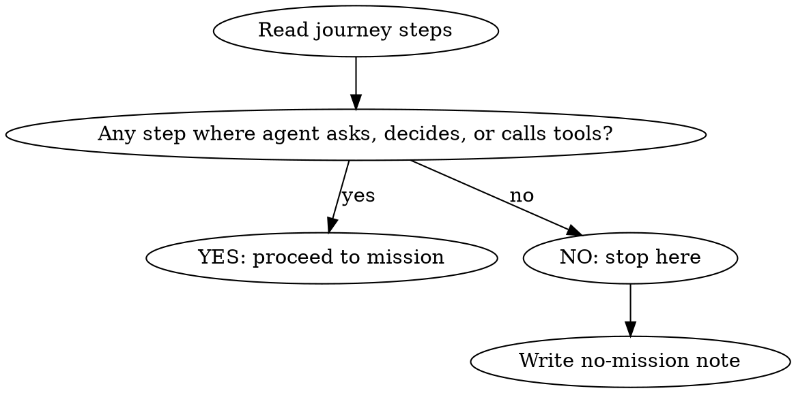

# Mission — Agent Execution Builder

## Overview

Create the Mission artifact — the agent execution contract for a journey. Defines what the agent does, decides, and tracks at every stage. Produces both a design document (Mission.md) and executable seed SQL for the Stage Engine.

**Core principle:** A mission without observability is a black box. Every mission ships with timing thresholds, failure signals, and trackability built in.

## When to Use

- After `/journey` has been completed for this journey package
- When defining agent behavior for a user workflow
- When upgrading an existing natural-language mission to full spec
- NOT for missions without a Journey (run `/journey` first)
- NOT for iterating on existing missions (use `/mission-training` instead)

## Prerequisite Check

Before anything else:

1. Check that `docs/Roadmaps/{slug}/Journey.md` exists. If not: "Run `/journey` first."
2. Check that `docs/Roadmaps/{slug}/Roadmap.md` exists. If not: "Run `/roadmap` first."
3. Read both to get: Package Identity, Actor, Platform, Steps, Tools, Events, Success Criteria.

## Triage: Does This Journey Need a Mission?

**Not every journey needs a mission.** A mission only exists when an AI agent is actively involved — asking questions, making decisions, calling tools, guiding the user through conversation.

Scan the journey steps and ask:



| Journey pattern                         | Needs mission? | Why                               |
| --------------------------------------- | :------------: | --------------------------------- |
| User taps buttons, system processes     |       No       | Pure UI + backend logic, no agent |
| User fills forms, system validates      |       No       | Form validation, no conversation  |
| Agent asks questions, collects data     |      Yes       | Agent-guided data collection      |
| Agent recommends actions, user confirms |      Yes       | Agent decision-making             |
| Agent monitors and nudges               |      Yes       | Agent observes and intervenes     |
| Mixed: some steps UI, some agent-guided |      Yes       | Mission covers agent steps only   |

**If NO agent involvement:** Tell the user: "Journey J-{NNN} is a system journey — no AI agent involvement. Mission not needed. Set Mission ID to `N/A` in the package." Save a stub Mission.md:

```markdown
---
title: "Mission: {Title}"
status: not-applicable
---

# Mission: M-{NNN} — {Title}

## Status: Not Applicable

This journey is a system journey with no AI agent involvement.
All steps are user-driven UI actions + backend processing.
No Stage Engine mission is needed.
```

**If YES:** Continue to Input Sources below.

## Input Sources

Read ALL of these before generating:

| Source                 | Path                                           | What you get                                              |
| ---------------------- | ---------------------------------------------- | --------------------------------------------------------- |
| Roadmap                | `docs/Roadmaps/{slug}/Roadmap.md`              | Scope, actor, intent, success criteria                    |
| Journey                | `docs/Roadmaps/{slug}/Journey.md`              | Steps, UI elements, data ops, events, errors              |
| Mission Training Skill | `.claude/skills/mission-training.md`           | Stage anatomy, tool categories, chain rules, SQL template |
| Stage Engine Trainer   | `docs/reference/STAGE_ENGINE_TRAINER_GUIDE.md` | Architecture, prompt builder, authority, posture          |
| Existing Missions      | `supabase/migrations/*seed*mission*.sql`       | Pattern reference for seed SQL                            |
| DB Schema              | `packages/supabase/src/database.types.ts`      | engine_missions, engine_stages columns                    |

## Confidence Assessment

| Signal                                                       | Score |
| ------------------------------------------------------------ | ----- |
| Journey deep spec exists with full steps                     | +3    |
| Similar mission seed SQL exists (e.g., onboarding-interview) | +2    |
| Tools for this domain already exist in codebase              | +1    |
| Module doc covers this workflow                              | +1    |
| Total 5+ = HIGH, 3-4 = MEDIUM, 0-2 = LOW                     |       |

**HIGH:** Generate complete Mission.md + seed SQL draft for review.
**MEDIUM:** Generate skeleton with gaps marked `[TBD]`, ask about tool availability.
**LOW:** Walk through stage by stage: "What should the agent do here? What tools does it need?"

## Knowledge Gates

ALL must be known before generating. If any is missing, ask.

### Mission-Level Gates

| #   | Gate                    | Source                | Question if missing                                  |
| --- | ----------------------- | --------------------- | ---------------------------------------------------- |
| 1   | Mission ID              | Package Identity      | "What M-NNN ID for this mission?"                    |
| 2   | Mission mode            | Journey flow type     | "Sequential, free, or hybrid?"                       |
| 3   | Agent personality       | Roadmap/Journey actor | "What tone? (warm/direct/formal/casual)"             |
| 4   | Available tools         | Codebase grep         | "Which client + engine tools exist for this domain?" |
| 5   | Stage count             | Journey steps         | "How many stages? (map from journey steps)"          |
| 6   | Session duration target | Business context      | "Expected min/max session time?"                     |
| 7   | Trigger condition       | Roadmap event motor   | "What starts this mission?"                          |

### Per-Stage Gates

| #   | Gate                 | Key fields                         | Question if missing                    |
| --- | -------------------- | ---------------------------------- | -------------------------------------- |
| 1   | **Goal**             | One-line objective                 | "What does the agent accomplish here?" |
| 2   | **Instructions**     | Full prompt text with tool calls   | "What does the agent say and do?"      |
| 3   | **Tools**            | List of client + engine tools used | "Which tools does this stage call?"    |
| 4   | **Success criteria** | Measurable completion condition    | "How do we know this stage is done?"   |
| 5   | **Timing**           | min/max seconds                    | "How long should this stage take?"     |
| 6   | **Data writes**      | Fields Guardian watches            | "What data must be collected?"         |
| 7   | **Failure signals**  | What indicates trouble             | "What goes wrong here?"                |
| 8   | **Transition**       | next_stage or NULL                 | "What comes after?"                    |

## Stage Mapping Rules

### Journey Steps to Mission Stages

Not every journey step becomes a mission stage. Apply these rules:

| Journey step type                |  Mission stage?  | Why                                  |
| -------------------------------- | :--------------: | ------------------------------------ |
| User action (tap, navigate)      |        No        | UI-only, no agent involvement        |
| System auto (background process) |        No        | No agent decision needed             |
| Agent-guided data collection     |       Yes        | Agent asks, collects, stores         |
| Agent-guided decision            |       Yes        | Agent evaluates and recommends       |
| Confirmation/validation          | Merge with prior | Don't create a stage just to confirm |
| Multi-step form with agent       |       Yes        | Agent guides through form sections   |

**Guideline:** Fewer stages = better. Merge where the agent's goal doesn't change. A 12-step journey might become a 5-stage mission.

### Agent-Added Stages

Some mission stages have NO corresponding journey step. The agent needs them but the journey doesn't show them:

| Pattern              | When to add                                 | Example                                             |
| -------------------- | ------------------------------------------- | --------------------------------------------------- |
| **Greeting/rapport** | Agent missions that start with conversation | "Hei! Hva heter du?" before any functional work     |
| **Wrapup/summary**   | Agent summarizes what was accomplished      | "Da er vi i gang! Her er hva vi satte opp..."       |
| **Context loading**  | Agent needs to read state before acting     | Call `getOnboardingState` or `fetch` before stage 1 |

Always consider adding a greeting stage for voice missions — it sets tone and collects the user's name.

### Tool Name Mapping Trap

Journey documents often use **conceptual function names** that differ from actual registered tool names. Always grep the codebase for the real `modelToolName`:

| Journey says                | Actual tool            | Why                                               |
| --------------------------- | ---------------------- | ------------------------------------------------- |
| `suggestSeason`             | `updateSeason`         | Journey describes intent, code uses mutation name |
| `getDepartmentsForIndustry` | `addDepartments`       | Journey describes source, code uses action        |
| `navigate_to`               | `advanceToNextSection` | Legacy name vs current                            |

**Rule:** Never trust tool names from the Journey. Grep `apps/web/src/` for `modelToolName` to get the real names.

### Agent Persona Check

If the Journey names an agent (e.g., "Botsson") but existing seed SQL uses a different name (e.g., "Lise"), flag the conflict. Ask: "The Journey says {X}, existing mission uses {Y} — which agent should this mission use?"

### Tool Wiring

For each stage, identify tools from two categories:

**Engine HTTP Tools** (available to ALL missions automatically):

- `store` — Save data to engine_inbox
- `fetch` — Read context, inbox, history
- `advance` — Move to next stage + rebuild prompt
- `getJourneyContext` — Check journey progress

**Client Tools** (registered per-mission in frontend):

- Check `apps/web/src/` for existing tool registrations
- If a tool doesn't exist yet, mark it `[NEW — needs implementation]`
- Every client tool must have a `modelToolName` + `registerToolImplementation`

### The Chain

Every sequential mission must have an unbroken chain:

```
stage1.next_stage → stage2.next_stage → ... → stageN.next_stage = NULL
```

Verify: no orphans, no gaps, terminal stage has `next_stage = NULL`.

### The Two-Tool Advance Pattern

For missions that drive a frontend UI, every non-terminal stage needs BOTH:

1. `advanceToNextSection` — scrolls the UI (client tool)
2. `advance` — transitions the engine (HTTP tool)

Terminal stage: calls `advanceToNextSection` but NOT `advance`.

## Three Pillars

### Results

Every mission defines:

```yaml
results:
  session_success: "{measurable definition of mission completion}"
  stage_success: "{per-stage: what data/state constitutes 'done'}"
  quality_score: "{what makes a GOOD completion vs just completion}"
```

### Trackability

Every mission defines observability signals:

```yaml
trackability:
  timing:
    session_target_seconds: [min, max]
    per_stage:
      stage-id: [min_seconds, max_seconds]
  failure_signals:
    - signal: "abandon"
      detection: "session closed before terminal stage"
      severity: warning
    - signal: "rage_quit"
      detection: "session closed within 30s of starting, or rapid repeated closes"
      severity: critical
    - signal: "stuck"
      detection: "same stage active for > max_seconds"
      severity: warning
    - signal: "loop"
      detection: "stage revisited > 2 times"
      severity: warning
    - signal: "timeout"
      detection: "session exceeds session_target_seconds max"
      severity: info
  guardian_watches:
    per_stage:
      stage-id:
        data_writes: ["field1", "field2"]
        required_confirmation: true|false
        auto_advance: true|false
```

**Guardian wiring requirement:** For Guardian to evaluate a stage, it needs `journey_step_id` on the `engine_stages` row. Without it, Guardian skips the stage entirely. See Guardian Integration below.

### Triggerability

Every mission defines how to start and test:

```yaml
triggerability:
  trigger: "{what starts this mission — route, event, user action}"
  test_invocation: "{how to start it in dev — curl command or UI path}"
  mission_training_link: "Use /mission-training to iterate on stages"
```

## Guardian Integration

The Guardian is the "second hand on the wheel" — a background process in the Stage Engine that monitors every active session, evaluates progress, and intervenes when needed. **Missions don't connect to Guardian manually** — the integration is automatic through the event bus and evaluation loop.

### How Events Flow

```
Mission session starts
  → createSession() emits "session.started" (only if workspace_id is set)
  → Guardian bus broadcasts to WebSocket clients (admin dashboard)

ALL events are also persisted to guardian_log table (fire-and-forget).

Every stage change
  → advanceStage() emits "stage.changed"

Every data store
  → POST /sessions/:id/store emits "data.collected"
  → Triggers immediate Guardian evaluation (fire-and-forget)

Every 30 seconds
  → Guardian evaluator checks ALL active sessions with journey_id
  → Per stage: checks data completeness, timing, auto-advance

Agent messages
  → chat.ts emits "user.message" + "agent.response"

Session end
  → "session.completed" or "session.abandoned"
```

### What Makes Guardian Work Per Stage

Guardian evaluates stages by reading the **linked journey step** (via `journey_step_id` on `engine_stages`). The journey step provides:

| Journey step field      | Guardian behavior                                                             |
| ----------------------- | ----------------------------------------------------------------------------- |
| `data_writes`           | Fields Guardian checks for completeness. When ALL present → stage is "done".  |
| `min_duration_seconds`  | Minimum time before auto-advance (prevents rushing).                          |
| `max_duration_seconds`  | Hard timeout. At 80% → warning whisper. At 100% → timeout whisper.            |
| `required_confirmation` | If true, Guardian nudges agent to ask user for confirmation before advancing. |

Guardian calculates elapsed time from `session.stage_started_at` (set automatically by `createSession()` and `advanceStage()`). No manual wiring needed for timing.

**Critical:** If `journey_step_id` is NULL on a stage, Guardian **skips evaluation entirely** for that stage. Agent-added stages (greeting, wrapup) intentionally have NULL — they don't need Guardian oversight.

### Guardian Interventions

Guardian intervenes by writing to `collected_data._whispers[]` on the session. The agent receives these as invisible system instructions on the next response cycle.

| Intervention            | Trigger                                                                          | What Guardian does                                |
| ----------------------- | -------------------------------------------------------------------------------- | ------------------------------------------------- |
| **Auto-advance**        | All `data_writes` collected + `min_duration` passed + no `required_confirmation` | Calls `advanceStage()` directly                   |
| **Nudge confirm**       | All data collected + `required_confirmation` + 30s elapsed                       | Whispers: "Spør bruker om bekreftelse"            |
| **Missing field nudge** | 60s elapsed + fields still missing                                               | Whispers: "Spør om: {missing fields}"             |
| **Timeout warning**     | 80% of `max_duration` elapsed                                                    | Whispers: "{N} sekunder igjen, mangler: {fields}" |
| **Hard timeout**        | 100% of `max_duration` elapsed                                                   | Whispers: "Timeout — avslutt steget"              |

### data_writes Format

Guardian uses dot-notation and array-notation to check `collected_data` on the session:

| Pattern     | Example           | What Guardian checks                              |
| ----------- | ----------------- | ------------------------------------------------- |
| Simple key  | `"company_name"`  | `collected_data.company_name` is not null/empty   |
| Nested path | `"company.name"`  | `collected_data.company.name` is not null/empty   |
| Array check | `"departments[]"` | `collected_data.departments` is a non-empty array |

**Trap:** If the agent stores data at `collected_data.company.name` but the journey step has `data_writes: ["company_name"]`, Guardian will never find it and keep nudging. Match the path exactly to how the agent stores data via the `store` endpoint.

### Wiring Checklist for Mission Authors

1. **Set `journey_step_id`** on every stage that maps to a journey step (UUID FK to `journey_step.journey_step_id`)
2. **Leave `journey_step_id` NULL** for agent-added stages (greeting, wrapup, context loading)
3. **Ensure journey steps have `data_writes`** — these are the fields Guardian watches
4. **Set timing on journey steps** — `min_duration_seconds` and `max_duration_seconds`
5. **Set `required_confirmation`** on journey steps where user must explicitly agree before advancing
6. **The mission must have `journey_id`** — set on `engine_missions` so sessions inherit it

### Admin Dashboard (Guardian Monitor)

When a mission session is active, admins can connect to `/guardian/ws` and:

- **Watch** — see all events in real-time (session started, stage changed, data collected, agent responses)
- **Subscribe** — filter events to a specific session
- **Whisper** — inject invisible instructions to the agent mid-conversation
- **Change stage** — force the agent to a different stage

The `/mission` skill doesn't need to configure any of this — it's built into the Stage Engine. But the Mission.md should document what Guardian watches per stage (data_writes, timing) so operators know what to expect on the dashboard.

### Event Types Reference

| Event                      | Actor    | When                                 |
| -------------------------- | -------- | ------------------------------------ |
| `session.started`          | system   | Session created                      |
| `stage.changed`            | system   | Stage advanced                       |
| `data.collected`           | agent    | Data stored via `/store`             |
| `user.message`             | user     | User sends message                   |
| `agent.response`           | agent    | Agent replies                        |
| `session.completed`        | system   | All stages done                      |
| `session.abandoned`        | system   | Session abandoned                    |
| `guardian.auto_advance`    | guardian | Guardian auto-advanced a stage       |
| `guardian.nudge`           | guardian | Guardian nudged for missing data     |
| `guardian.nudge_confirm`   | guardian | Guardian asked for user confirmation |
| `guardian.timeout`         | guardian | Stage timed out                      |
| `guardian.timeout_warning` | guardian | 80% of max duration reached          |
| `admin.stage_change`       | admin    | Admin forced stage change            |
| `admin.whisper`            | admin    | Admin sent whisper to agent          |

## System Prompt

The `system_prompt` on `engine_missions` is the base personality that applies to ALL stages. It is the agent's identity — tone, rules, language, available tools overview.

### Structure

```
1. Identity line ("Du er [agent name], Smartouts [role].")
2. Personality traits (2-3 sentences: tone, style, boundaries)
3. Available tools overview (list tools the agent can use across the mission)
4. Global rules (numbered, what to always/never do)
5. Language rule ("Norsk er standard — bytt kun hvis brukeren gjør det")
```

### Example (shift-assistant)

```
Du er Smartouts vaktplanleggingsassistent.
Du har DIREKTE TILGANG til vaktplanen gjennom verktøy. Bruk dem aktivt!

TILGJENGELIGE VERKTØY:
- getScheduleState — se hele uken
- createShift — opprett ny vakt
...

REGLER:
1. Svar med konkrete forslag
2. Bekreft med lederen FØR du utfører mutasjoner
3. Norsk er standard
4. Hold svarene korte og presise
```

### Creative Freedom Quick Reference

| Stage type              |  Value  | Rationale                        |
| ----------------------- | :-----: | -------------------------------- |
| Greeting/rapport        | 0.7–0.8 | Warm, natural, room to improvise |
| Data collection         | 0.5–0.7 | Structured but conversational    |
| Validation/confirmation | 0.3–0.5 | More scripted, accuracy matters  |
| Finalization            | 0.2–0.4 | Strict, no room for error        |
| Wrapup/summary          | 0.7–0.8 | Warm, celebratory, personal      |

### Per-Stage Timing Estimation

When the Journey only gives total session time, use this heuristic:

1. Divide total time by number of stages for a baseline
2. Weight by complexity:
   - Greeting/wrapup: 0.5x baseline (fast)
   - Simple data collection: 1.0x baseline
   - Complex multi-tool stages: 1.5–2.0x baseline
   - Finalization: 0.5x baseline (mostly system)
3. Round to nearest 10 seconds for min, 30 seconds for max
4. Add 50% buffer to max (users are slower than expected)

### Language Rules for Fields

| Field                  | Language  | Example                            |
| ---------------------- | --------- | ---------------------------------- |
| `instructions`         | Norwegian | "Spør: 'Hva heter stedet?'"        |
| `goal`                 | English   | "Collect business name and city"   |
| `success_criteria`     | English   | "Business name confirmed by user"  |
| `personality_override` | Norwegian | "Varm, nysgjerrig, stille glad"    |
| `tuning_notes`         | English   | "efficiency"                       |
| `system_prompt`        | Norwegian | "Du er Smartouts onboarding-guide" |

## Output: Mission.md

Save to `docs/Roadmaps/{slug}/Mission.md`. Use this format:

````markdown
---
title: "Mission: {Title}"
status: draft
updated: { YYYY-MM-DD }
created: { YYYY-MM-DD }
module: { module }
tags: [mission, agent, { module }, { actor }]
---

# Mission: M-{NNN} — {Title}

## Package Identity

- Package ID: `JP-R{NNN}-{SLUG}`
- Mission ID: `M-{NNN}`
- Roadmap ID: `R-{NNN}`
- Journey ID: `J-{NNN}`
- License ID: `L-{NNN}` (TBD)

Related package docs:

- [Roadmap](./Roadmap.md)
- [Journey](./Journey.md)
- [License](./License.md) (pending)

## Mission Goal

{1-2 sentences: what the agent accomplishes for the user}

## System Prompt

```
{Full system prompt — see System Prompt section in skill for structure}
```

## Configuration

| Field           | Value                                  |
| --------------- | -------------------------------------- |
| Mission ID (DB) | `{kebab-case-id}`                      |
| Mode            | {sequential/free/hybrid}               |
| Agent           | {agent name — e.g., Lise, Mr. Botsson} |
| Personality     | {tone description}                     |
| Channel         | {voice/chat/both}                      |
| Session target  | {min}–{max} seconds                    |

## Stage Chain

```
{stage1} → {stage2} → ... → {stageN} → NULL
```

## Stages

### Stage 1: {stage_id} — {Goal}

| Field                | Value                 |
| -------------------- | --------------------- |
| Order                | 1                     |
| Goal                 | {one-line}            |
| Creative freedom     | {0.0–1.0}             |
| Personality override | {tone for this stage} |
| Next stage           | {stage_id or NULL}    |

**Instructions:**

```
{Full instruction text — what the agent says, which tools to call, transition pattern}
```

**Success criteria:** {measurable}

**Tools used:**
| Tool | Type | Purpose |
|------|------|---------|
| {name} | client/engine | {what it does in this stage} |

**Observability:**
| Signal | Threshold | Severity |
|--------|-----------|:--------:|
| timing | {min}–{max}s | warning |
| data_writes | {fields} | — |
| stuck | > {max}s | warning |

---

{Repeat for each stage}

## Guardian Configuration

| Stage      | data_writes      | min_duration | max_duration | required_confirmation | journey_step_id    |
| ---------- | ---------------- | ------------ | ------------ | --------------------- | ------------------ |
| {greeting} | —                | —            | —            | —                     | NULL (agent-added) |
| {stage-id} | {field1, field2} | {N}s         | {N}s         | {true/false}          | {uuid}             |

> Guardian evaluates stages every 30s. Stages with `journey_step_id = NULL` are skipped.
> `data_writes` paths must match exactly how the agent stores data (dot-notation, array-notation supported).

## Guardrails

- {Rule the agent must never break}
- {Rule the agent must never break}

## Escalation Conditions

| Condition         | Agent behavior    |
| ----------------- | ----------------- |
| {what goes wrong} | {what agent does} |

## Observability Contract

### Results

- **Session success:** {definition}
- **Quality score:** {what separates good from just-done}

### Failure Signals

| Signal    | Detection                            | Severity | Action                |
| --------- | ------------------------------------ | :------: | --------------------- |
| abandon   | Session closed before terminal       | warning  | Log + notify          |
| rage_quit | Closed within 30s or 3+ rapid closes | critical | Log + flag for review |
| stuck     | Same stage > {max}s                  | warning  | Guardian nudge        |
| loop      | Stage revisited > 2x                 | warning  | Guardian intervene    |
| timeout   | Session > {max}s total               |   info   | Log                   |

### Trigger

- **Start condition:** {what starts this mission}
- **Dev test:** `{curl command or UI path to trigger}`

## Seed SQL Reference

Migration file: `supabase/migrations/{timestamp}_seed_{mission-id}_mission.sql`
````

## Output: Seed SQL

Generate an idempotent migration file. Pattern from `/mission-training`:

```sql
SET search_path TO public, extensions;

-- {timestamp}_seed_{mission-id}_mission.sql
-- Seeds {mission-name} mission into engine_missions + engine_stages.

INSERT INTO engine_missions (id, name, description, mode, workspace_id, is_active, system_prompt, journey_id)
VALUES (
  '{mission-id}',
  '{Mission Display Name}',
  '{Description}',
  '{sequential|free|hybrid}',
  NULL,  -- NULL = global template
  true,
  E'{system_prompt with \\n for newlines}',
  NULL   -- journey_id: UUID FK to journey table. REQUIRED for Guardian evaluation.
         -- If journey exists in DB, set this. If journey is doc-only, leave NULL.
)
ON CONFLICT (id) DO UPDATE SET
  name = EXCLUDED.name,
  description = EXCLUDED.description,
  mode = EXCLUDED.mode,
  is_active = EXCLUDED.is_active,
  system_prompt = EXCLUDED.system_prompt,
  journey_id = EXCLUDED.journey_id,
  updated_at = now();

-- Optional columns (uncomment if needed):
--   emotion_hint TEXT — injected into prompt builder part 3 (e.g., 'excited', 'calm')
--   deferred_templates JSONB — advanced: templates rendered after stage completes
--   inline_instructions JSONB — advanced: injected mid-stage by Guardian

-- WARNING: If reordering stages, DELETE old stages first. The schema has
-- UNIQUE(mission_id, stage_order) — inserting a new order value that conflicts
-- with an existing stage will fail. Pattern:
--   DELETE FROM engine_stages WHERE mission_id = '{mission-id}';
--   INSERT INTO engine_stages (...) VALUES (...);

INSERT INTO engine_stages (
  mission_id, stage_id, stage_order, goal, instructions, success_criteria,
  personality_override, creative_freedom, tuning_notes, next_stage,
  is_required, journey_step_id, escalation_instructions
) VALUES
('{mission-id}', '{stage-1-id}', 1,
 '{goal}',
 E'{instructions with tool calls}',
 '{success_criteria}',
 '{personality_override or NULL}',
 {creative_freedom},
 '{tuning_notes or NULL}',
 '{next-stage-id}',
 true,   -- is_required: false only for optional/skippable stages
 NULL,   -- journey_step_id: UUID FK to journey_step. SET THIS for Guardian evaluation.
         -- NULL only for agent-added stages (greeting, wrapup) with no journey step.
 NULL),  -- escalation_instructions: what to do if stage fails

-- ... more stages ...

('{mission-id}', '{terminal-stage-id}', N,
 '{goal}',
 E'{instructions — do NOT call advance}',
 '{success_criteria}',
 '{personality_override or NULL}',
 {creative_freedom},
 '{tuning_notes or NULL}',
 NULL,   -- terminal: no next stage
 true, NULL, NULL)
ON CONFLICT (mission_id, stage_id) DO UPDATE SET
  stage_order = EXCLUDED.stage_order,
  goal = EXCLUDED.goal,
  instructions = EXCLUDED.instructions,
  success_criteria = EXCLUDED.success_criteria,
  personality_override = EXCLUDED.personality_override,
  creative_freedom = EXCLUDED.creative_freedom,
  tuning_notes = EXCLUDED.tuning_notes,
  next_stage = EXCLUDED.next_stage,
  is_required = EXCLUDED.is_required,
  journey_step_id = EXCLUDED.journey_step_id,
  escalation_instructions = EXCLUDED.escalation_instructions;
```

## Verification Checklist

After generating, verify:

1. **Chain integrity** — Every `next_stage` points to an existing stage. Terminal has NULL.
2. **No phantom tools** — Every tool in instructions exists in client tools or engine tools.
3. **Two-tool advance** — Non-terminal stages with UI have both `advanceToNextSection` + `advance`.
4. **Terminal stage** — Says "do NOT call advance".
5. **Observability** — Every stage has timing thresholds and data_writes.
6. **Failure signals** — At least: abandon, rage_quit, stuck, timeout.
7. **Idempotent SQL** — Uses `ON CONFLICT ... DO UPDATE`.
8. **Norwegian instructions** — User-facing text in Norwegian, technical in English.
9. **Guardian wiring** — `journey_step_id` set on every stage that maps to a journey step. NULL only for agent-added stages.
10. **Journey link** — `journey_id` set on `engine_missions` if journey exists in DB.

## After Generation

1. Save Mission.md to `docs/Roadmaps/{slug}/Mission.md`
2. Save seed SQL to `supabase/migrations/{timestamp}_seed_{mission-id}_mission.sql`
3. Tell the user:
   - "Mission defined with {N} stages. Mission.md + seed SQL saved."
   - "Observability: {N} failure signals, timing on all stages."
   - "Next: apply migration (`npx supabase migration up`), then `/mission-training` to test and iterate."
4. If any tools are marked `[NEW — needs implementation]`, list them prominently.

## Common Mistakes

- **Building a mission for a system journey** — Not every journey needs an agent. If all steps are user taps + system processing, there's no mission. Run the triage gate first.
- **Generating without Journey** — Always check prerequisite. The Journey defines WHAT happens; the Mission defines HOW the agent does it.
- **1:1 step-to-stage mapping** — Not every journey step needs an agent stage. Merge UI-only steps.
- **Vague instructions** — "Help the user" is not an instruction. Name specific tools with specific params.
- **Missing observability** — A mission without timing thresholds and failure signals is a black box.
- **Forgetting the advance pattern** — `advanceToNextSection` (UI) + `advance` (engine) are separate. Both needed.
- **Not checking tool existence** — Grep the codebase. If the tool doesn't exist, flag it.
- **Skipping guardrails** — Every mission needs explicit "never do X" rules.
- **English instructions for user-facing text** — Norwegian for `instructions`, `personality_override`, `system_prompt`. English for `goal`, `success_criteria`, `tuning_notes`.
- **Missing system_prompt** — The base personality prompt is the foundation. Don't skip it.
- **Trusting tool names from Journey** — Journey docs use conceptual names. Always grep for real `modelToolName` in the codebase.
- **No greeting stage** — Voice missions almost always need a rapport-building opener. Check if one is needed.
- **Missing `journey_step_id`** — Without this FK on `engine_stages`, Guardian cannot evaluate the stage. It's the bridge between mission stages and Guardian's auto-advance/timing/nudge logic.
- **Missing `journey_id` on mission** — Without `journey_id` on `engine_missions`, the session won't have journey context and Guardian's 30s evaluation loop will skip it entirely.
- **Setting `journey_step_id` on greeting/wrapup stages** — Agent-added stages have no journey step. Setting a random UUID will break Guardian evaluation. Leave NULL.
- **Forgetting `data_writes` on journey steps** — Guardian checks these fields for completeness. If the journey step has no `data_writes`, Guardian has nothing to evaluate and won't auto-advance.
