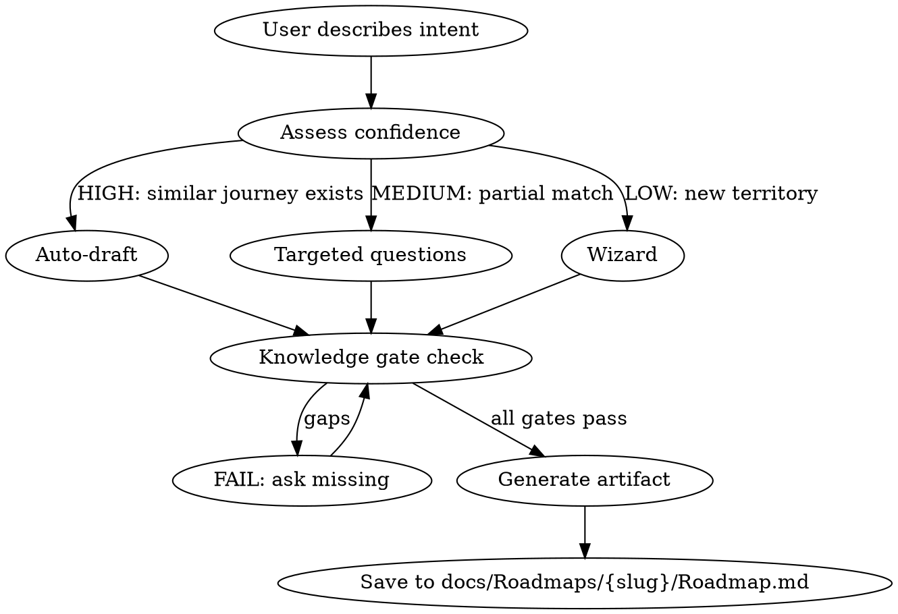

# Roadmap — Journey Package Foundation

## Overview

Create the Roadmap artifact — the first document in a Journey Package. Defines WHAT should happen, for WHOM, and WHY, before any deep specification begins.

## When to Use

- Starting a new journey package from scratch
- Defining scope before building a Journey deep spec
- NOT for editing existing roadmaps (edit the file directly)

## Process



## Step 1: Gather Context

Read these files to understand the landscape:

1. `docs/modules/journey/SMARTOUT_JOURNEY_REGISTRY.md` — All 68 journeys. Check for duplicates and related journeys.
2. `docs/modules/MODULE_0_ROADMAP.md` — Event motor pattern (start-hook, events, stop-hook).
3. `docs/engines/industri-inteligence/hospitalety/06-relevance-map/restaurant-relevance-map.md` — Which artifacts are affected.
4. `docs/engines/system-inteligence/07-journey-package-compiler.md` — The 9-artifact package contract.
5. `docs/engines/system-inteligence/09-gold-package-admin-onboarding.md` — Gold package reference (if applicable).
6. Existing roadmaps in `docs/Roadmaps/` — Format reference. If none exist yet, use the template below.

## Step 2: Assess Confidence

| Signal                                           | Score |
| ------------------------------------------------ | ----- |
| Similar journey exists in registry               | +2    |
| Module is well-documented (MODULE\_\*.md exists) | +1    |
| User provided clear actor + intent               | +1    |
| Related journeys already have packages           | +1    |
| Total 4-5 = HIGH, 2-3 = MEDIUM, 0-1 = LOW        |       |

**HIGH:** Generate a complete draft and present for review.
**MEDIUM:** Ask targeted questions about the gaps, then generate.
**LOW:** Walk through each knowledge gate one question at a time.

## Step 3: Knowledge Gate

ALL of these must be known before generating output. If any is missing, ask.

| #   | Gate                 | Question to ask if missing                                                               |
| --- | -------------------- | ---------------------------------------------------------------------------------------- |
| 1   | **Journey ID**       | "Which journey from the registry is this? (J-NNN) Or is this a new journey?"             |
| 2   | **Module**           | "Which module does this belong to? (onboarding, scheduling, operations, training, etc.)" |
| 3   | **Actor**            | "Who performs this journey? (employee, manager, admin, owner, agent)"                    |
| 4   | **Platform**         | "Where does this happen? (web, mobile, both)"                                            |
| 5   | **Business intent**  | "In 1-2 sentences, what should the user be able to do and why?"                          |
| 6   | **Scope**            | "What is IN scope and what is explicitly OUT of scope?"                                  |
| 7   | **Success criteria** | "How do we know this journey is complete? What is measurably true after?"                |
| 8   | **Related journeys** | "Which existing journeys does this require, lead to, or oppose?"                         |
| 9   | **Priority**         | "P0 (critical path), P1 (important), P2 (nice to have), or P3 (future)?"                 |

## Step 4: Generate Artifact

Use this exact format:

```markdown
---
title: "Roadmap: {Title}"
status: draft
updated: { YYYY-MM-DD }
created: { YYYY-MM-DD }
module: { module }
tags: [roadmap, { module }, { actor }]
---

# Roadmap: {Title}

## Package Identity

- Package ID: `JP-R{NNN}-{SLUG}`
- Roadmap ID: `R-{NNN}`
- Journey ID: `J-{NNN}`
- Mission ID: `M-{NNN}` (TBD)
- License ID: `L-{NNN}` (TBD)

Related package docs:

- `docs/Roadmaps/{slug}/Journey.md` (pending)
- `docs/Roadmaps/{slug}/Mission.md` (pending)
- `docs/Roadmaps/{slug}/License.md` (pending)

## Business Intent

{1-2 paragraphs: what the user should be able to do, why it matters, what problem it solves}

## Actor & Platform

| Field    | Value                          |
| -------- | ------------------------------ |
| Actor    | {employee/manager/admin/owner} |
| Platform | {web/mobile/both}              |
| Priority | {P0/P1/P2/P3}                  |
| Module   | {module name}                  |

## Scope

### In scope

- {bullet list of what this journey covers}

### Out of scope

- {bullet list of what this journey explicitly does NOT cover}

## Success Criteria

1. {Measurable criterion 1}
2. {Measurable criterion 2}
3. {Measurable criterion 3}

## Related Journeys

| Relation | Journey         | Why      |
| -------- | --------------- | -------- |
| Requires | J-{NNN} {title} | {reason} |
| Leads to | J-{NNN} {title} | {reason} |
| Opposite | J-{NNN} {title} | {reason} |

## Acceptance Criteria

These map directly to verification gates in the License:

1. {Criterion that maps to User Test}
2. {Criterion that maps to Knowledge Test}
3. {Criterion that maps to Function Test}
4. {Criterion that maps to E2E Test}

## Event Motor Pattern

- **Start-hook:** {What triggers this journey}
- **Events:** {Key events during execution}
- **Stop-hook:** {What marks completion}
```

## Step 5: Save and Confirm

1. Create directory: `docs/Roadmaps/{slug}/`
2. Write file: `docs/Roadmaps/{slug}/Roadmap.md`
3. Tell the user: "Roadmap saved. Next step: run `/journey` to build the deep spec."

## Language Convention

- Structural labels (headings, field names) in English
- Content text (business intent, scope, criteria) should match the workspace language — default Norwegian for Smartout

## Common Mistakes

- Skipping the registry check — always verify this isn't a duplicate
- Making scope too broad — one journey = one actor achieving one goal
- Vague success criteria — "user is happy" is not measurable
- Missing related journeys — check the registry for requires/leads-to links
