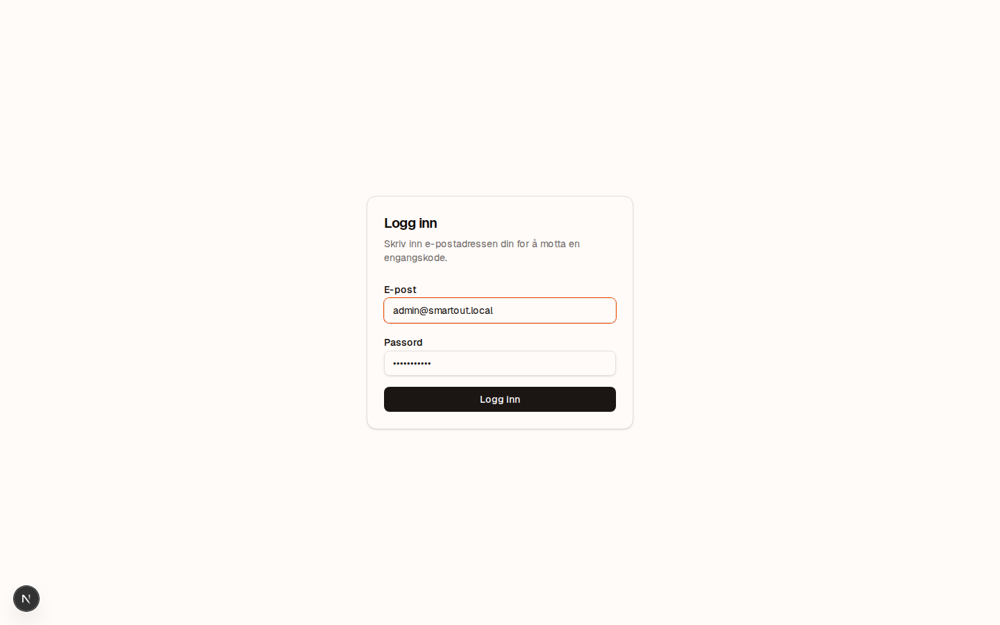
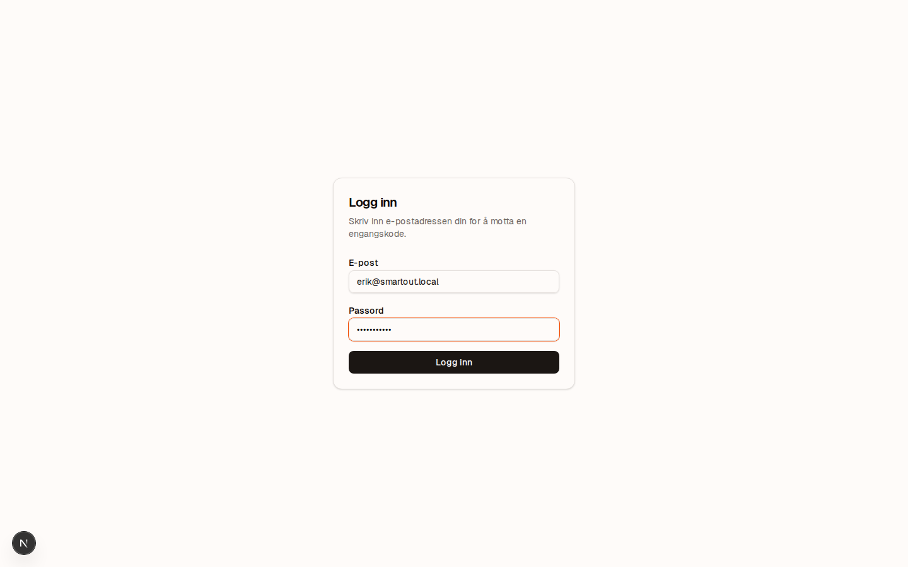
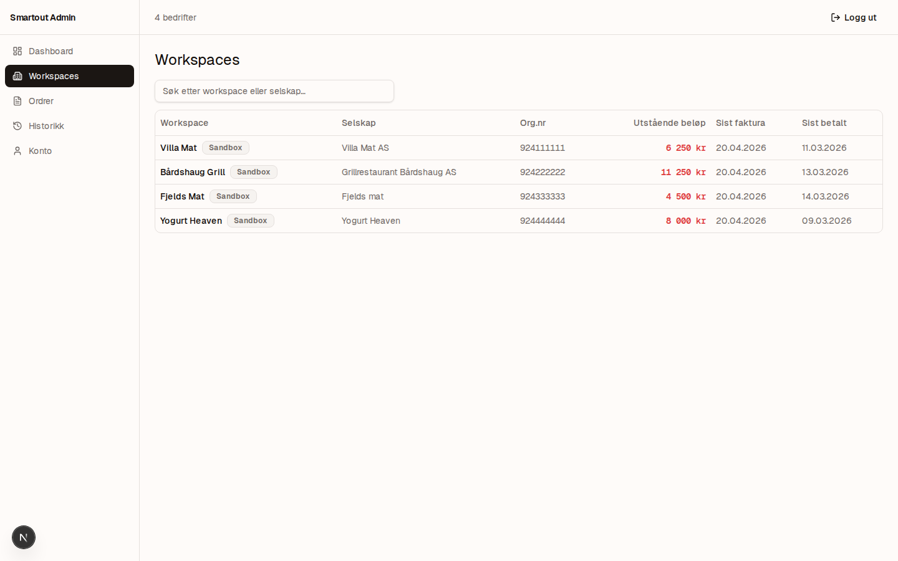
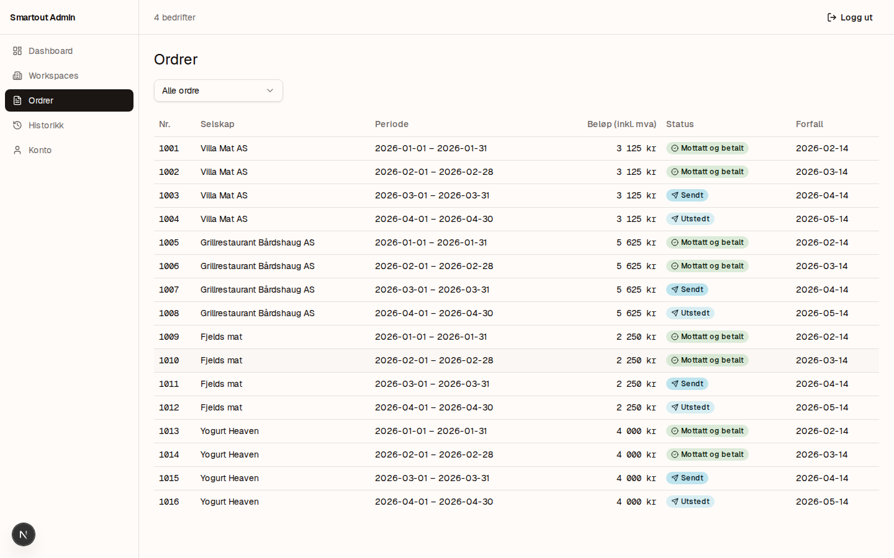
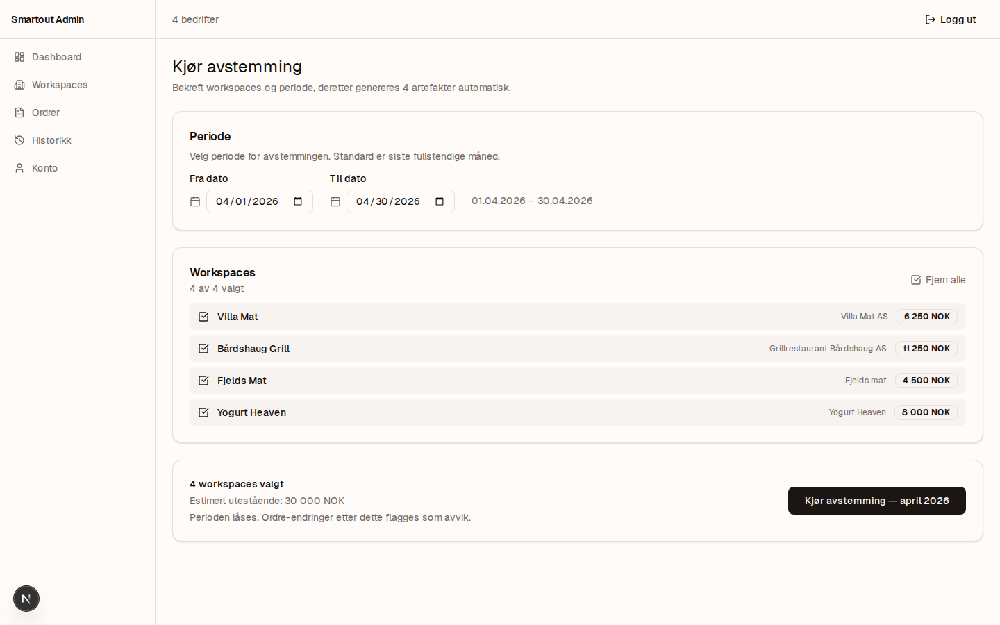
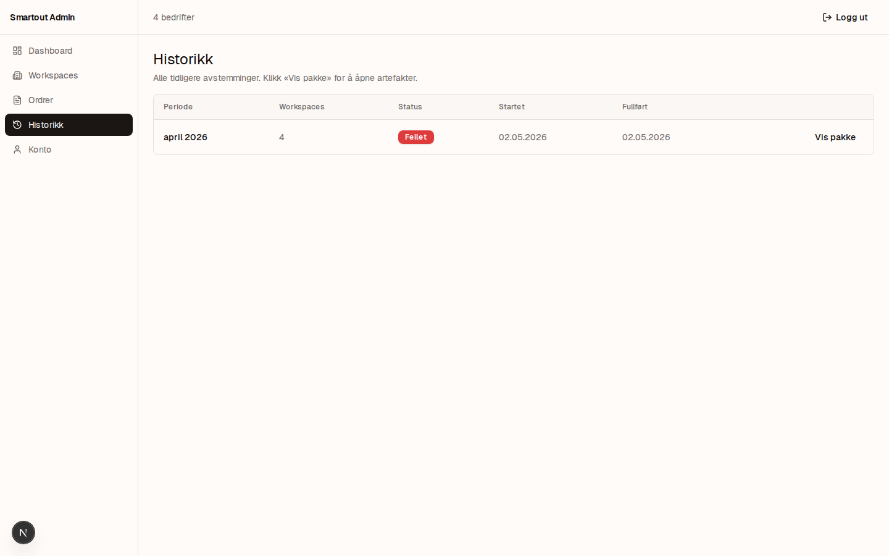
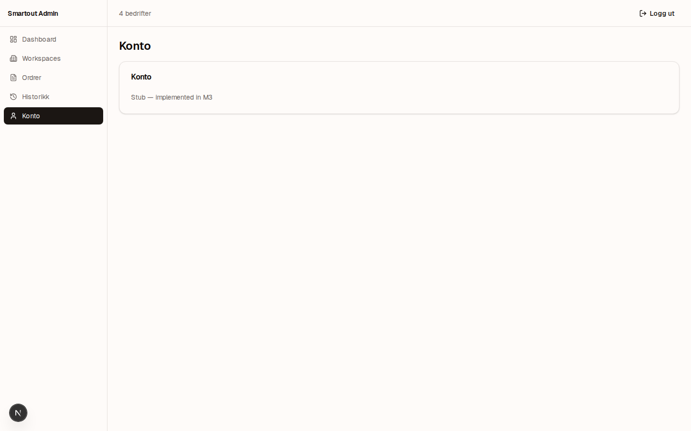

# Velkommen til admin.smartout.ai

Hei Erik. Dette er regnskapsfører-portalen din. Den lar deg se hver bedrift sine fakturaer, ordre og avstemminger på ett sted, og kjøre månedslukking når perioden er ferdig.

Denne guiden viser deg hver skjerm i samme rekkefølge du møter den.

> **Sandkasse-merke:** Hver workspace er taggat med "Sandbox" inntil produksjonsdata er aktivert. Det betyr at tallene du ser er testdata — ikke ekte fakturaer ennå.

---

## 1. Logg inn

URL: `https://admin.smartout.ai` (lokalt: `http://localhost:3070`)

Skriv inn e-post og passord. Du har ett login per regnskapsfører-konto. Tilgang til hver bedrift styres av en _grant_ som administrator gir deg — du ser bare det du har lov til å se.

Klikk **Logg inn**. Du sendes direkte videre til workspaces-listen — det er hjem-skjermen din.

---

## 2. Workspaces — alle bedrifter du har tilgang til

Tabellen viser hver bedrift du har grant for, med:

| Kolonne             | Hva det betyr                                              |
| ------------------- | ---------------------------------------------------------- |
| **Workspace**       | Internt navn (kan være kort form av bedriftsnavnet)        |
| **Selskap**         | Juridisk navn (det som står på fakturaen)                  |
| **Org.nr**          | Norsk organisasjonsnummer                                  |
| **Utstående beløp** | Sum av åpne fakturaer i NOK — dette er det du må følge opp |
| **Sist faktura**    | Datoen for den siste fakturaen som ble sendt               |
| **Sist betalt**     | Datoen for siste registrerte innbetaling                   |

**Søk** etter workspace eller selskapsnavn i feltet øverst. Klikk på en rad for å åpne bedriftens detaljside.

I venstremenyen har du også **Workspaces**, **Ordrer**, **Historikk**, **Konto**.

---

## 3. Workspaces — alternativ visning

Samme data, presentert som en sortérbar liste med utestående beløp i rødt. Beløpet i rødt er det som må kreves inn (eller avskrives) før månedsslutt.

---

## 4. Ordrer — alle fakturerbare ordre

Hver ordre er en linje med leveranse til en bestemt bedrift. Listen viser ordrene på tvers av alle bedrifter du har tilgang til. Klikk en ordre for å se linjeposter, fakturastatus og koblingen til faktura/innbetaling.

Bruk denne skjermen når en bedrift sier "vi mangler en faktura" — du kan slå opp ordren direkte, sjekke status, og se om den er fakturert eller hengt på et avvik.

---

## 5. Avstemming — månedslukking

Det er denne skjermen du bruker når en måned er ferdig. Klikk **Avstemming → Kjør** i menyen, eller gå direkte til `/avstemming/run`.

Du ser:

1. **Periode** — system foreslår siste fullførte måned. Du kan velge en annen, men under en aktiv produksjon vil dette nesten alltid være forrige måned.
2. **Workspaces** — alle bedriftene du har grant for, alle valgt som standard. Hak av/på hvis du vil ekskludere noen denne kjøringen.
3. **Estimert utestående** — sum NOK på tvers av valgte workspaces.
4. **Kjør avstemming** — den store knappen. Tar 5–30 sekunder.

### Hva skjer når du klikker "Kjør avstemming"?

Systemet **låser** perioden — etter dette flagges enhver ordre-endring i denne perioden som et **avvik**, ikke en oppdatering. Det er bevisst: regnskapsperioder må være låsbare for at revisor skal stole på dem.

Deretter genereres **fire artefakter** automatisk:

| #   | Filnavn              | Hva det er                                                       |
| --- | -------------------- | ---------------------------------------------------------------- |
| 1   | `summary.pdf`        | Sammendrag — én side per bedrift, totalbeløp                     |
| 2   | `detail.csv`         | Detalj-linjer — alle ordre, klargjort for Tripletex/Fiken-import |
| 3   | `invoice_bundle.pdf` | Faktura-bunke — alle fakturaer i perioden, samlet                |
| 4   | `discrepancy.pdf`    | Avvik-rapport — overdue, partial-payment, manglende ordre        |

Når kjøringen er ferdig sendes du til run-detaljsiden med fire nedlastings-knapper.

> **Sikkerhetsregel for kvitteringer:** Nedlastingslenkene er **engangs-lenker som varer 60 sekunder** (ADR-0262). Hvis lenken blir for gammel, gå tilbake til run-detaljen og klikk Last ned på nytt — det er trygt og audit-loggføres hver gang.

---

## 6. Historikk — tidligere månedslukkinger

Listen er tom inntil du har kjørt din første avstemming. Etter første kjøring ser du her:

- Periode (måned)
- Status (`completed` / `failed`)
- Hvem kjørte det (`Erik`)
- Tidspunkt
- Direkte-lenke til de fire artefaktene

Bruk denne skjermen når en bedrift spør "hva sendte du oss for mars?" — finn raden, klikk inn, last ned på nytt.

---

## 7. Konto — innstillinger og tilganger

Her ser du:

- E-post + display-navn
- Hvilke bedrifter du har grant for og hvilket scope (`full_kartotek` = alle ordre + faktura, `orders_only` = kun ordre)
- Logg-ut-knapp

Hvis du trenger tilgang til en ny bedrift, ta kontakt med admin — det blir gitt som en ny grant og dukker opp her.

---

## Hva gjør jeg hvis...

| Situasjon                                    | Hva du gjør                                                                                                                                          |
| -------------------------------------------- | ---------------------------------------------------------------------------------------------------------------------------------------------------- |
| Glemt passord                                | Klikk "Glemt passord" på login-skjermen — du får e-post med reset-lenke.                                                                             |
| Ser ikke en bedrift jeg burde ha tilgang til | Be admin om å sjekke `accountant_company_grant` — det betyr at granten ikke er gitt eller er trukket.                                                |
| Avstemming krasjet midt i kjøring            | Status blir `failed`. Vent 1 minutt, prøv igjen. Hvis vedvarende, ta kontakt med support.                                                            |
| Lastet ned feil periode                      | Generér en ny avstemming for riktig periode. Den gamle artefakter blir liggende — slettes ikke.                                                      |
| En bedrift mangler ordre i avstemmingen      | Sjekk Ordrer-listen først for den bedriften — er ordren der? Hvis nei, mangler grunndata. Hvis ja, sjekk dato — kanskje den havnet utenfor perioden. |

---

## Tekniske notater (kan ignoreres)

- **Periodelås:** ADR-A; en låst periode kan IKKE åpnes igjen — endring etter lås = avvik.
- **Audit-spor:** hver knappetrykk + nedlasting logges i `billing_activity_log` per bedrift (Bokføringsloven §10).
- **Cross-company grants:** ADR-0264 fan-out — én avstemmings-kjøring som spenner flere bedrifter får én audit-rad per bedrift.

---

_Generert via `apps/e2e/onboarding/erik/walkthrough.ts`. Re-kjør med `pnpm exec tsx onboarding/erik/walkthrough.ts` etter UI-endringer._
