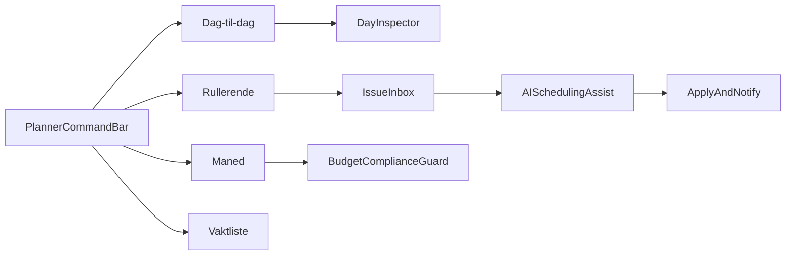

# Dashboard Schedule UX Audit and Workflow Design

Date: 2026-02-28  
Scope: `/dashboard/schedule` in `apps/web`

## 1) Current Layout and State Ownership

The schedule experience is visually rich and already has strong operational intent, but it currently behaves as a prototype surface (mock data, no persistence, duplicated controls).

### Route and component structure

- Main route: `apps/web/src/app/dashboard/schedule/page.tsx`
- Shared control context: `apps/web/src/app/dashboard/layout.tsx`
- Control ownership in context:
  - `scheduleLayout`: `daily | weekly | monthly | list`
  - `scheduleView`: `ansatt | jobb | team`
  - `activeLocation` (currently static UI control)

### Current page zones

1. Left rail
   - Modes: `Ledige vakter` and `Vaktmaler`
   - Draggable open shifts and template cards
2. Center planner surface
   - `daily`: matrix with employee/role/team grouping
   - `weekly`: rolling 1-10 column view
   - `monthly`: heatmap style strategic surface
   - `list`: printable weekly list
3. Right panel
   - Slide-in `DailyBriefingPanel` with tabs:
     - `Oversikt`, `Dagsinfo`, `Selskap / Booking`, `Oppgaver`

### Primary interaction controls today

- In `layout.tsx` action bar:
  - location selector
  - view toggle (`Ansatt`, `Jobb`, `Team`)
  - layout toggle (`Dag-til-dag`, `Rullerende`, `Måned`, `Vaktliste`)
  - date nav and `Publiser (4)` button
- In `page.tsx` schedule toolbar:
  - situation filter (`Alle`, `Selskap`, `Krise`, `Normal`)
  - guide popover
- In grid header:
  - second instance of view toggle (`Ansatt`, `Rolle`, `Team`)

### Technical quality note

- Data is mock-first in `page.tsx`: `dummyEmployees`, `dummyDays`, `dailyShifts`
- Drag-and-drop works visually, but no persistence flow is wired
- A template-string styling bug exists in `WeeklyGridContent` where escaped interpolation appears inside class names

## 2) Gap Analysis vs Module 3 + Persona/Research Needs

This section compares current implementation against:

- `docs/modules/SMARTOUT_MODULE_3_SCHEDULING.md`
- `docs/research/Seven AI Council personas for Smartout's Norwegian hospitality platform.md`
- `docs/research/Workforce management research report.md`

### What is already strong

- Multi-view planning model exists (`Ansatt`, `Jobb`, `Team`)
- Multi-horizon modes exist (`daily`, `weekly`, `monthly`, `list`)
- Open shifts and templates are represented
- Cost and workload concepts are surfaced in UI
- Day-focused operational panel exists (good base for triage)

### High-priority clarity and usability gaps

1. Fragmented command surface
   - Same decision appears in multiple places (view mode and period mode), increasing cognitive load.
2. Signal without explanation
   - Color and indicators are used heavily, but legends and explicit semantic labels are limited.
3. Decision support is implicit, not explicit
   - Risk detection (coverage, overtime, compliance) is not surfaced as a dedicated issue queue.
4. Prototype data shape
   - No server-state, no persistence, no audit-style action trail, no publish-state lifecycle on real records.
5. Persona mismatch risk
   - For low-literacy and multilingual workers, scanability and language scaffolding are currently insufficient.

### Product-fit gaps against Module 3 intent

Module 3 expects richer scheduling operations than currently wired:

- day-level context actions (`Publiser dag`, `Kopiere denne dag`, `Lagre som mal`, `Last inn mal`)
- full shift lifecycle and shift history
- stronger absence and availability flow
- integrated compliance and payroll signals
- explicit date/period chooser behaviors

### Persona/research implications not yet embedded in schedule UX

- Needs to support fast manager action under pressure (issue-first triage)
- Needs stronger mobile clarity and short-action flows for shift leaders
- Needs role-sensitive progressive disclosure (professional vs low-literacy needs)
- Needs multilingual comprehension support in critical status surfaces

## 3) Competitor Pattern Extraction (Adapted for Smartout)

### 7shifts-inspired patterns

- Open-shift bidding and fast reassignment flow
- “Find available” style gap coverage assistance
- Compliance warning surfacing while planning

### Planday-inspired patterns

- Labor cost vs forecast/revenue while building schedule
- Open shift and swap request operational loops
- Publish and communication model integrated with planner

### Teambook-inspired patterns

- Capacity heatmap for medium/long horizon planning
- Over/under-allocation visual model
- Planned-vs-actual framing for continuous tuning

### Smartout adaptation rules

- Keep Norwegian labor constraints visible in-line (hours/rest/age where relevant)
- Pair every risk signal with an immediate action path
- Add readiness/compliance context (Smartout-specific value)
- Preserve multilingual clarity and dignity-focused design

## 4) Updated Information Architecture and Control Model

### Proposed control model

Replace duplicated controls with a single top-level planner command bar:

- Period: `Dag`, `Uke`, `Rullerende`, `Måned`, `Liste`
- Grouping: `Ansatt`, `Jobb`, `Team`
- Scope: `Lokasjon`, `Avdeling`, `Kompetanse`
- State: `Draft/Publisert`, publish actions
- Time navigation: prev/next + date jump
- Filters: quick chips (`Krise`, `Selskap`, `Fravær`, `Overtid`)

### Proposed persistent status strip (always visible)

- Coverage risks
- Overtime risks
- Compliance risks
- Open shift queue
- Unpublished changes

Clicking a status chip opens filtered issues directly.

### Proposed right-side panel evolution

Rename and reframe from `DailyBriefingPanel` to `DayInspector`:

- Summary tab: key stats + decision context
- Issues tab: sorted root-cause cards
- Actions tab: `Fix coverage`, `Send message`, `Publish day`, `Save template`
- Activity tab: action log / timeline

## 5) Three Admin Workflows

## Workflow A: Monthly Setup (Admin)

Goal: build and publish a month with minimal manual correction.

1. Select `Måned` + `Lokasjon` + grouping (`Jobb` default)
2. Choose start mode:
   - `Forrige måned`
   - `Sesongmal`
   - `Forrige uke x4`
3. Apply planning overlays:
   - demand/events
   - holidays
   - contract hour boundaries
4. Run smart fill suggestions (qualified + available)
5. Resolve flagged conflicts:
   - coverage gaps
   - overtime/rest constraints
   - compliance expiration conflicts
6. Review budget preview:
   - NOK/day, NOK/week
   - labor % versus target
7. Publish in waves (`Uke 1`, then full month)
8. Monitor acceptance and unclaimed shifts in exceptions inbox

Success metrics:

- time-to-first-draft
- conflicts resolved per planning session
- publish-to-acceptance latency
- labor % variance to target

## Workflow B: Spot Issues and Get Scheduling Help (Admin)

Goal: diagnose and resolve risks fast with guided actions.

1. Open `Issues` view (or click status-strip risk chip)
2. Pick an issue card (example: Friday bar understaffed)
3. Inspect root causes:
   - availability mismatch
   - skill mismatch
   - overtime cap
   - pending absence
4. Trigger AI assist action:
   - suggest replacements
   - propose swap path
   - create open shift
   - rebalance weekly cost
5. Simulate impact before applying:
   - coverage delta
   - cost delta
   - compliance delta
6. Apply and notify affected team in one action
7. Log decision in activity trail for audit/compliance

Success metrics:

- median issue-resolution time
- first-suggestion acceptance rate
- avoided overtime incidents
- coverage SLA for critical shifts

## Workflow C: Views and Purposes Operating Model

Goal: use the right view for the right decision.

- `Ansatt`:
  - fairness, contract-hour balancing, absences, workload distribution
- `Jobb`:
  - role coverage and shortage detection by period
- `Team`:
  - operational readiness by team and cross-team balancing
- `Dag-til-dag`:
  - execution decisions in next 24-72 hours
- `Rullerende`:
  - rotation quality, fatigue prevention, medium horizon stabilization
- `Måned`:
  - strategic capacity/cost/compliance balancing
- `Vaktliste`:
  - communication, print/export, low-friction dissemination

## 6) Prioritized Implementation Backlog (File-Scoped)

This backlog is organized by execution horizon and tied to existing files/routes.

### Quick wins (1-3 days)

1. Remove duplicate view toggles and keep one source of truth
   - files:
     - `apps/web/src/app/dashboard/layout.tsx`
     - `apps/web/src/app/dashboard/schedule/page.tsx`
2. Add explicit legends and label chips for status types
   - file:
     - `apps/web/src/app/dashboard/schedule/page.tsx`
3. Improve typography/contrast for tiny schedule metadata
   - file:
     - `apps/web/src/app/dashboard/schedule/page.tsx`
4. Fix weekly view class interpolation bug
   - file:
     - `apps/web/src/app/dashboard/schedule/page.tsx`
5. Add issues summary strip on top of planner
   - file:
     - `apps/web/src/app/dashboard/schedule/page.tsx`

### Medium refactors (1-2 sprints)

1. Extract schedule into composable components:
   - command bar
   - status strip
   - planner grid
   - day inspector
   - issues drawer
   - files:
     - split from `apps/web/src/app/dashboard/schedule/page.tsx`
2. Replace mock data with server data interfaces and staged persistence hooks
   - files:
     - `apps/web/src/app/dashboard/schedule/page.tsx`
     - schedule data access layer under `apps/web/src/app/dashboard/schedule/` (new files)
3. Add publish workflow states and optimistic UI for drag-and-drop operations
   - files:
     - schedule route and supporting hooks/components

### Strategic additions (2+ sprints)

1. AI-assisted issue resolution flow with simulation step
   - route scope:
     - `apps/web/src/app/dashboard/schedule/`
2. Demand forecast overlay and labor-percentage guardrail
   - route scope:
     - `apps/web/src/app/dashboard/schedule/`
3. Action timeline/audit feed for schedule decisions
   - route scope:
     - schedule route + backend audit integration
4. Role-sensitive and multilingual UX scaffolding
   - route scope:
     - schedule route, shared i18n surfaces

## 7) Route-Boundary Guidance

- `/dashboard/schedule` should own planner interaction state and scheduling task flows.
- `dashboard/layout.tsx` should only own global shell-level context, not duplicate page-level toggles.
- As schedule capabilities grow, maintain explicit separation:
  - shell concerns (theme, nav, global mode)
  - planner concerns (period/grouping/filter/action/risk state)

## 8) Outcome

This implementation package provides:

- a full page layout understanding
- clear, prioritized UX updates for clarity and overview
- three concrete admin workflows for:
  - monthly setup
  - issue spotting/help flow
  - view-purpose operating model
- competitor-inspired but Smartout-specific design direction for the next build phase
