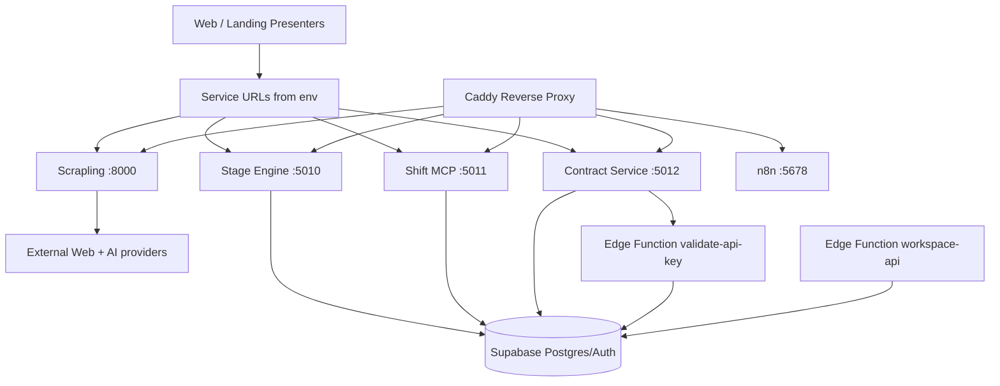

# Infra + Service + Edge Functions Architecture

This document describes the full runtime architecture for Smartout's infrastructure layer:

- Docker infra topology (`infra/`)
- service layer (`services/`)
- Edge Functions layer (`supabase/functions/`)
- presenter layer in web/landing that calls services
- key runtime connections, auth boundaries, and endpoint surfaces

Code is source of truth; this doc is a structural map.

## 1) Layer Model (Runtime)



## 2) Infra Topology (`infra/`)

### 2.1 Compose Services

| Service | Container Port | Dev Host Port | Role | Health |
|---|---:|---:|---|---|
| `caddy` | 80/443 | 80/443 | Reverse proxy + TLS/security headers | Caddy admin endpoint |
| `stage-engine` | 5010 | 5010 | Agent orchestration gateway | `GET /health` |
| `shift-mcp` | 5011 | 5011 | MCP transport + scheduling tools | `GET /health` |
| `contract-service` | 5012 | 5012 | Contracts/DocuSeal service | `GET /health` |
| `scrapling` | 8000 | 8000 | Scrape + extract + enrich + generate | `GET /health` |
| `n8n` | 5678 | 5678 | Automation (optional in dev) | `GET /healthz` |

Primary sources:
- `infra/docker-compose.yml`
- `infra/docker-compose.override.yml`
- `infra/Caddyfile`
- `infra/Caddyfile.dev`

### 2.2 Caddy Routing

#### Production hostnames

- `engine.smartout.ai` -> `stage-engine:5010`
- `schedule-mcp.smartout.ai` -> `shift-mcp:5011`
- `contract.smartout.ai` -> `contract-service:5012`
- `scrape.smartout.ai` -> `scrapling:8000`
- `n8n.smartout.ai` -> `n8n:5678`

#### Local dev ports (inside Caddy)

- `:3070` -> stage-engine
- `:3071` -> shift-mcp
- `:3072` -> contract-service
- `:3073` -> scrapling
- `:3074` -> n8n

## 3) Service Layer (`services/`)

## 3.1 Stage Engine (`services/stage-engine`)

### Endpoints

- `GET /health`
- `POST /sessions`
- `GET /sessions/:id`
- `POST /sessions/:id/abandon`
- `POST /sessions/:id/store`
- `POST /sessions/:id/fetch`
- `POST /sessions/:id/advance`
- `POST /adapters/ultravox/create-call`
- `POST /adapters/ultravox/store`
- `POST /adapters/ultravox/fetch`
- `POST /adapters/ultravox/advance`
- `POST /adapters/telegram/webhook`
- `POST /agent/chat`
- `GET /ws/:sessionId` (WS)
- `GET /guardian/ws` (WS)

### Auth + data path

- Global `authMiddleware` for most routes
- `x-api-key` (platform key hash lookup in `platform_api_key`) or JWT
- Telegram webhook has separate secret validation path
- Uses Supabase (`SUPABASE_URL`, anon + service role)
- Optional PG `LISTEN telegram_bridge` via `DATABASE_URL`

## 3.2 Shift MCP (`services/shift-mcp`)

### Endpoints

- `GET /health` (public)
- `POST /mcp` (auth required)

### Auth + transport

- Dual auth middleware (`x-api-key` or JWT)
- MCP over Streamable HTTP transport
- Uses Supabase key hash lookup against `platform_api_key`

## 3.3 Contract Service (`services/contract-service`)

### Endpoints

- Health:
  - `GET /health`
- Templates:
  - `GET /templates`
  - `GET /templates/:id`
  - `POST /templates`
  - `PUT /templates/:id`
  - `DELETE /templates/:id`
  - `POST /templates/:id/sync`
  - `POST /templates/:id/preview`
- Contracts:
  - `GET /contracts`
  - `GET /contracts/:id`
  - `POST /contracts`
  - `POST /contracts/:id/send`
  - `POST /contracts/:id/cancel`
  - `GET /contracts/:id/events`
  - `POST /contracts/:id/fetch-documents`
- Webhook:
  - `POST /webhooks/docuseal` (auth bypass for inbound webhook)

### Auth + dependency

- Requires `X-Service-Key` on non-health/non-webhook routes
- Validates via Edge Function `validate-api-key`
- If Edge Function returns 5xx/unreachable, fallback to local `SERVICE_KEY`

## 3.4 Scrapling (`services/scrapling`)

### Endpoints

- `GET /` (dashboard HTML)
- `POST /extract`
- `POST /scrape-raw`
- `POST /tripadvisor`
- `POST /extract/document`
- `POST /extract/document/batch`
- `POST /enrich`
- `POST /generate`
- `GET /health`

### Auth + behavior

- Bearer auth when `SCRAPLING_AUTH_TOKEN` is configured
- If token missing, auth check is bypassed (internal backwards compatibility)

## 4) Presenter Layer (Web/Landing callers)

These are key presenter entrypoints that proxy to services.

### 4.1 Web presenters (`apps/web`)

- `POST /api/wizard/start` -> Stage Engine `/adapters/ultravox/create-call`
- `POST /api/botsson/chat` -> Stage Engine `/agent/chat`
- `callContractService()` in `apps/web/src/lib/contract-service.ts` -> Contract Service (`X-Service-Key`)
- `POST /api/scrape/company` -> Scrapling `/extract`
- Additional presenter endpoints use:
  - `STAGE_ENGINE_URL`
  - `SHIFT_MCP_URL`
  - `CONTRACT_SERVICE_URL`
  - `SCRAPLING_SERVICE_URL`

### 4.2 Landing presenters (`apps/landing`)

- `POST /api/wizard/engine-start` -> Stage Engine `/adapters/ultravox/create-call`
- Falls back to Vault lookups when env vars are missing

## 5) Edge Function Layer (`supabase/functions/`)

All Edge Functions are mounted under:

- `/functions/v1/<function-name>`

### 5.1 Shared auth/rate-limit primitives

- `resolveAuth()` in `_shared/auth-middleware.ts`
- `validateApiKey()` in `_shared/api-key-auth.ts`
- `checkRateLimit()` in `_shared/rate-limit.ts`

Important behavior:

- `checkRateLimit()` currently fails closed when Upstash env vars are absent.
- This affects `validate-api-key` and `workspace-api` auth outcomes.

### 5.2 Core infra-connected Edge Functions

- `validate-api-key`
  - returns key validity, workspace, scopes
  - called by `contract-service`
- `workspace-api`
  - data gateway for workspace-scoped APIs
  - routes include `/v1/profiles`, `/v1/shifts`, `/v1/contracts`, etc.
  - requires workspace context; service keys without workspace are rejected

### 5.3 Full Edge Function inventory (current)

- `accept-invitation`
- `activate-workspace`
- `analyze-setup-documents`
- `analyze-workspace`
- `apply-change-proposal`
- `bootstrap-cascade`
- `call-command`
- `cleanup-api-keys`
- `cleanup-sandbox-workspaces`
- `contract-lifecycle`
- `create-invitation`
- `daily-session-replenish`
- `delete-account`
- `emma-task-trigger`
- `engine-dispatch`
- `extract-workspace-data`
- `finalize-workspace`
- `fire-delayed-triggers`
- `gather-workspace-intelligence`
- `google-places-intelligence`
- `guardian-actions`
- `guardian-notify`
- `guardian-sweep`
- `health-check`
- `identify-company`
- `ingest-workspace-knowledge`
- `journey-stuck-detector`
- `leader-pulse`
- `livekit-token`
- `livekit-webhook`
- `process-notifications`
- `process-settlement-image`
- `push-dispatch`
- `scrape-raw-data`
- `scrape-website`
- `search-brreg`
- `send-morning-digest`
- `sendgrid-webhook`
- `session-hook-executor`
- `session-lifecycle`
- `shift-clock-compliance`
- `shift-lateness-check`
- `validate-api-key`
- `validate-settlement`
- `watchdog-integrity`
- `watchdog-uptime`
- `web-search-intelligence`
- `workspace-api`

## 6) Connection Map (Critical Flows)

### Flow A: Voice onboarding

1. Presenter (`/api/wizard/start` or landing engine-start) calls Stage Engine
2. Stage Engine creates/advances session and adapter payload
3. Stage Engine uses secrets (Vault/env fallback) for providers
4. WS + guardian + cleanup loops run in-process

### Flow B: Scheduling tools

1. Client/presenter calls Shift MCP `/mcp`
2. Auth middleware validates API key hash in `platform_api_key`
3. MCP server exposes shift tools with workspace context

### Flow C: Contracts

1. Web presenter/library calls Contract Service with `X-Service-Key`
2. Contract Service calls Edge Function `validate-api-key`
3. On success, contract/template routes use Supabase + DocuSeal integration

### Flow D: Scraping/intelligence

1. Web presenter calls Scrapling `/extract` with bearer token
2. Scrapling extracts and enriches (OpenRouter/Serper where configured)
3. Presenter persists result in Supabase tables

## 7) Environment + Secret Boundaries

### Dev startup path (recommended)

- `pnpm infra:start` -> `infra/scripts/start.sh`
- Ensures `op` login
- Resolves env from `.env.template` via `op run`
- Validates required env vars
- Starts services in order and health-checks them

### Secret patterns

- Infra/service envs: from `.env.template` + 1Password (`op://...`)
- Runtime provider secrets: Vault first, env fallback in several services
- API keys in DB: hashed (`platform_api_key.key_hash`)

## 8) Known Architecture Notes

- `contract-service` depends on `validate-api-key`; auth can fail if Edge Function rate-limit layer is fail-closed and Upstash is absent.
- `stage-engine` supports degraded mode for Telegram bridge if `DATABASE_URL` is missing.
- Dev Caddy checks should use container health (not `localhost:80` app paths) due to port-based dev routing.

## 9) Operational Checks

```bash
# Start full stack with env validation
pnpm infra:start

# Service health
curl -f http://localhost:5010/health
curl -f http://localhost:5011/health
curl -f http://localhost:5012/health
curl -f http://localhost:8000/health

# Caddy internal proxy checks (from caddy container)
docker exec infra-caddy-1 wget -qO- --server-response http://127.0.0.1:3070/health
docker exec infra-caddy-1 wget -qO- --server-response http://127.0.0.1:3071/health
docker exec infra-caddy-1 wget -qO- --server-response http://127.0.0.1:3072/health
docker exec infra-caddy-1 wget -qO- --server-response http://127.0.0.1:3073/health
```

