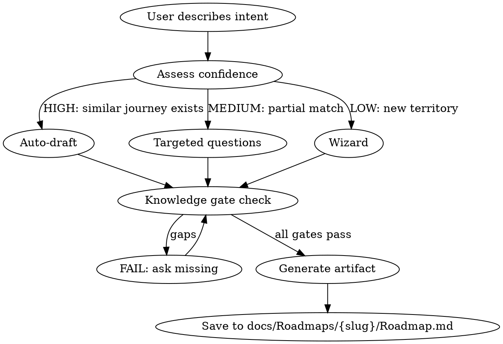

# Journey Package Skills Implementation Plan

> **For Claude:** REQUIRED SUB-SKILL: Use superpowers:executing-plans to implement this plan task-by-task.

**Goal:** Build two Claude Code skills (`/roadmap` and `/journey`) that guide users through creating journey package artifacts in deep spec format.

**Architecture:** Each skill is a markdown file in `.claude/skills/` with YAML frontmatter. Skills read engine docs, DB schema, and existing artifacts to assess confidence, then either auto-generate a draft (high confidence), ask targeted questions (medium), or run a structured wizard (low). Output goes to `docs/Roadmaps/{slug}/`.

**Tech Stack:** Claude Code skills (markdown), Smartout engine documentation, TypeScript interfaces from Deep Spec.

---

## Task 1: Create `/roadmap` skill

**Files:**

- Create: `.claude/skills/roadmap.md`

**Step 1: Write the skill file**

````markdown
---
name: roadmap
description: Use when starting a new journey package, defining business intent and scope for a user workflow. Triggers on "new roadmap", "define journey scope", "start journey package", "roadmap for X", or when beginning any journey package from scratch.
---

# Roadmap — Journey Package Foundation

## Overview

Create the Roadmap artifact — the first document in a Journey Package. Defines WHAT should happen, for WHOM, and WHY, before any deep specification begins.

## When to Use

- Starting a new journey package from scratch
- Defining scope before building a Journey deep spec
- NOT for editing existing roadmaps (edit the file directly)

## Process


````

## Step 1: Gather Context

Read these files to understand the landscape:

1. `docs/modules/journey/SMARTOUT_JOURNEY_REGISTRY.md` — All 68 journeys. Check for duplicates and related journeys.
2. `docs/modules/MODULE_0_ROADMAP.md` — Event motor pattern (start-hook, events, stop-hook).
3. `docs/engines/industri-inteligence/hospitalety/06-relevance-map/restaurant-relevance-map.md` — Which artifacts are affected.
4. `docs/engines/system-inteligence/07-journey-package-compiler.md` — The 9-artifact package contract.
5. Existing roadmaps in `docs/Roadmaps/` — Format reference.

## Step 2: Assess Confidence

| Signal                                           | Score |
| ------------------------------------------------ | ----- |
| Similar journey exists in registry               | +2    |
| Module is well-documented (MODULE\_\*.md exists) | +1    |
| User provided clear actor + intent               | +1    |
| Related journeys already have packages           | +1    |
| Total 4-5 = HIGH, 2-3 = MEDIUM, 0-1 = LOW        |       |

**HIGH:** Generate a complete draft and present for review.
**MEDIUM:** Ask targeted questions about the gaps, then generate.
**LOW:** Walk through each knowledge gate one question at a time.

## Step 3: Knowledge Gate

ALL of these must be known before generating output. If any is missing, ask.

| #   | Gate                 | Question to ask if missing                                                               |
| --- | -------------------- | ---------------------------------------------------------------------------------------- |
| 1   | **Journey ID**       | "Which journey from the registry is this? (J-NNN) Or is this a new journey?"             |
| 2   | **Module**           | "Which module does this belong to? (onboarding, scheduling, operations, training, etc.)" |
| 3   | **Actor**            | "Who performs this journey? (employee, manager, admin, owner, agent)"                    |
| 4   | **Platform**         | "Where does this happen? (web, mobile, both)"                                            |
| 5   | **Business intent**  | "In 1-2 sentences, what should the user be able to do and why?"                          |
| 6   | **Scope**            | "What is IN scope and what is explicitly OUT of scope?"                                  |
| 7   | **Success criteria** | "How do we know this journey is complete? What is measurably true after?"                |
| 8   | **Related journeys** | "Which existing journeys does this require, lead to, or oppose?"                         |
| 9   | **Priority**         | "P0 (critical path), P1 (important), P2 (nice to have), or P3 (future)?"                 |

## Step 4: Generate Artifact

Use this exact format:

```markdown
---
title: "Roadmap: {Title}"
status: draft
updated: { YYYY-MM-DD }
created: { YYYY-MM-DD }
module: { module }
tags: [roadmap, { module }, { actor }]
---

# Roadmap: {Title}

## Package Identity

- Package ID: `JP-R{NNN}-{SLUG}`
- Roadmap ID: `R-{NNN}`
- Journey ID: `J-{NNN}`
- Mission ID: `M-{NNN}` (TBD)
- License ID: `L-{NNN}` (TBD)

Related package docs:

- `docs/Roadmaps/{slug}/Journey.md` (pending)
- `docs/Roadmaps/{slug}/Mission.md` (pending)
- `docs/Roadmaps/{slug}/License.md` (pending)

## Business Intent

{1-2 paragraphs: what the user should be able to do, why it matters, what problem it solves}

## Actor & Platform

| Field    | Value                          |
| -------- | ------------------------------ |
| Actor    | {employee/manager/admin/owner} |
| Platform | {web/mobile/both}              |
| Priority | {P0/P1/P2/P3}                  |
| Module   | {module name}                  |

## Scope

### In scope

- {bullet list of what this journey covers}

### Out of scope

- {bullet list of what this journey explicitly does NOT cover}

## Success Criteria

1. {Measurable criterion 1}
2. {Measurable criterion 2}
3. {Measurable criterion 3}

## Related Journeys

| Relation | Journey         | Why      |
| -------- | --------------- | -------- |
| Requires | J-{NNN} {title} | {reason} |
| Leads to | J-{NNN} {title} | {reason} |
| Opposite | J-{NNN} {title} | {reason} |

## Acceptance Criteria

These map directly to verification gates in the License:

1. {Criterion that maps to User Test}
2. {Criterion that maps to Knowledge Test}
3. {Criterion that maps to Function Test}
4. {Criterion that maps to E2E Test}

## Event Motor Pattern

- **Start-hook:** {What triggers this journey}
- **Events:** {Key events during execution}
- **Stop-hook:** {What marks completion}
```

## Step 5: Save and Confirm

1. Create directory: `docs/Roadmaps/{slug}/`
2. Write file: `docs/Roadmaps/{slug}/Roadmap.md`
3. Tell the user: "Roadmap saved. Next step: run `/journey` to build the deep spec."

## Common Mistakes

- Skipping the registry check — always verify this isn't a duplicate
- Making scope too broad — one journey = one actor achieving one goal
- Vague success criteria — "user is happy" is not measurable
- Missing related journeys — check the registry for requires/leads-to links

````

**Step 2: Verify the skill loads**

Run: Check that the skill appears in the skill list when Claude Code starts.

Expected: `/roadmap` shows in available skills.

**Step 3: Commit**

```bash
git add .claude/skills/roadmap.md
git commit -m "feat(skills): add /roadmap skill for journey package foundation"
````

---

## Task 2: Create `/journey` skill

**Files:**

- Create: `.claude/skills/journey.md`

**Step 1: Write the skill file**

This is the most complex skill. It produces a Deep Spec artifact with up to 10 dimensions per step.

````markdown
---
name: journey
description: Use when building a journey deep spec for a Smartout user workflow. Triggers on "build journey", "journey for X", "deep spec", "define journey steps", or after completing a /roadmap. Requires a Roadmap artifact to exist first.
---

# Journey — Deep Spec Builder

## Overview

Create the Journey artifact — the executable specification of a user workflow. Every button, every event, every notification, every database write, every screen state. This IS Smartout.

Produces output in Deep Spec format (TypeScript-flavored markdown tables) following the gold standard in `docs/modules/journey/SMARTOUT_JOURNEY_DEEP_SPEC.md`.

## When to Use

- After `/roadmap` has been completed for this journey package
- When defining the step-by-step user experience
- When upgrading an existing natural-language journey to deep spec format
- NOT for journeys without a Roadmap (run `/roadmap` first)

## Prerequisite Check

Before anything else:

1. Check that `docs/Roadmaps/{slug}/Roadmap.md` exists. If not: "Run `/roadmap` first."
2. Read the Roadmap to get: Package Identity, Actor, Platform, Scope, Success Criteria, Related Journeys.

## Input Sources

Read ALL of these before generating:

| Source               | Path                                                                                                               | What you get                                         |
| -------------------- | ------------------------------------------------------------------------------------------------------------------ | ---------------------------------------------------- |
| Roadmap              | `docs/Roadmaps/{slug}/Roadmap.md`                                                                                  | Scope, actor, intent, success criteria               |
| Journey Registry     | `docs/modules/journey/SMARTOUT_JOURNEY_REGISTRY.md`                                                                | Related journeys, cross-links, module classification |
| Deep Spec Reference  | `docs/modules/journey/SMARTOUT_JOURNEY_DEEP_SPEC.md`                                                               | TypeScript interfaces, J-019 gold standard, format   |
| DB Schema            | `docs/reference/DATABASE.md` + `packages/supabase/src/database.types.ts`                                           | Tables, RLS policies, enums, indexes                 |
| Event Envelope       | `docs/engines/system-inteligence/08-event-envelope-spec.md`                                                        | Mandatory event fields, event families               |
| AI Council           | `docs/engines/industri-inteligence/hospitalety/01-ai-council/restaurant-council.md`                                | 7 personas to validate against                       |
| Default Policies     | `docs/engines/industri-inteligence/hospitalety/02-default-policies/restaurant-policy-catalog.md`                   | Policy gates per step                                |
| Role Capabilities    | `docs/engines/industri-inteligence/hospitalety/08-role-capability-profiles/restaurant-role-capability-baseline.md` | Precondition: which roles need readiness             |
| Niche Profiles       | `docs/engines/industri-inteligence/hospitalety/10-niche-profiles/`                                                 | Focus multipliers for this journey type              |
| Journey Template     | `docs/engines/industri-inteligence/hospitalety/03-templates/journey-template.md`                                   | Mandatory building blocks                            |
| Playwright Recording | User provides (optional)                                                                                           | Routes, selectors, actions from recorded UI flow     |

## Priority Tiers

Ask the user which depth tier to use:

| Tier            | When                   | Dimensions per step                                                                        |
| --------------- | ---------------------- | ------------------------------------------------------------------------------------------ |
| **P0 Full**     | Critical path journeys | All 10: action, ui, data, events, notifications, gamification, compliance, errors, expects |
| **P1 Medium**   | Important journeys     | 6: action, ui, data, events, errors, expects                                               |
| **P2 Skeleton** | Future/nice-to-have    | 3: action, data, expects                                                                   |

Default to the priority from the Roadmap. P0 roadmap = P0 depth.

## Confidence Assessment

| Signal                                             | Score |
| -------------------------------------------------- | ----- |
| Playwright recording provided                      | +3    |
| Similar journey deep spec exists (e.g., J-019)     | +2    |
| DB tables for this domain exist and are documented | +1    |
| Module doc (MODULE\_\*.md) covers this workflow    | +1    |
| User described the steps in detail                 | +1    |
| Total 5+ = HIGH, 3-4 = MEDIUM, 0-2 = LOW           |       |

**HIGH:** Generate complete deep spec draft for review.
**MEDIUM:** Generate skeleton with gaps marked `[TBD]`, ask about specific gaps.
**LOW:** Walk through step by step: "What does the user do first? What do they see?"

## Knowledge Gates

### Journey-Level Gates (must be known before generating ANY steps)

| #   | Gate                                | Source                  |
| --- | ----------------------------------- | ----------------------- |
| 1   | Trigger condition                   | Roadmap or user input   |
| 2   | Preconditions (DB state)            | Roadmap + DATABASE.md   |
| 3   | Related journeys with relation type | Registry                |
| 4   | Step count estimate                 | User or similar journey |
| 5   | Niche multipliers (if applicable)   | Niche profiles          |
| 6   | AI Council validation notes         | Council personas        |

### Per-Step Gates (P0 — all 10 required)

| #   | Dimension           | Key fields                                                                                        | Gate question if missing                                              |
| --- | ------------------- | ------------------------------------------------------------------------------------------------- | --------------------------------------------------------------------- |
| 1   | **Action**          | description, type (tap/swipe/form_submit/navigate/drag/long_press/scan/voice/system_auto), target | "What does the user DO in this step?"                                 |
| 2   | **UI Elements**     | testId, type, label (Norwegian), variant, visible when, disabled when                             | "What buttons/inputs/cards does the user see?"                        |
| 3   | **Screen States**   | name, condition, display, illustration, CTA                                                       | "What states can this screen be in? (loading, empty, success, error)" |
| 4   | **Data Operations** | table, operation, fields, condition, RLS policy, index                                            | "What data is read/written/deleted?"                                  |
| 5   | **Events**          | emitted (name, payload, consumers), listened to, side effects                                     | "What system events does this step fire or react to?"                 |
| 6   | **Notifications**   | template, channels, recipient, title (NO), body (NO), deep link, priority                         | "Who gets notified and how?"                                          |
| 7   | **Gamification**    | base points, season multiplier, conditional bonuses, achievements, streaks                        | "Are points awarded? Any achievements or streaks?"                    |
| 8   | **Compliance**      | audit entries (type, actor, target, data, retention), legal checks                                | "What must be logged for audit? Any legal requirements?"              |
| 9   | **Errors**          | trigger, code, user message (NO), recovery, severity, notify admin                                | "What can go wrong? How does the user recover?"                       |
| 10  | **Expects**         | description, assertions (type, selector, expected, timeout)                                       | "How do we verify this step worked?"                                  |

For P1: gates 1-5, 9, 10 required. Gates 6-8 optional.
For P2: gates 1, 4, 10 required. All others optional.

## Playwright Recording Integration

If the user provides a Playwright codegen recording:

1. Parse the recording for routes visited, elements clicked, forms filled
2. Map each recorded action to a journey step
3. Extract selectors as candidate `testId` values
4. Use routes as `screen` values
5. Fill in Action, UI Elements, and Screen States from recording
6. Mark remaining dimensions as `[TBD — enrich from engine docs]`

This gives steps 1-3 of each dimension nearly for free.

## Output Format

Use this exact structure (following J-019 gold standard):

```markdown
---
title: "Journey: {Title}"
status: draft
updated: { YYYY-MM-DD }
created: { YYYY-MM-DD }
module: { module }
tags: [journey, deep-spec, { module }, { actor }]
---

# Journey: J-{NNN} — {Title}

## Package Identity

- Package ID: `JP-R{NNN}-{SLUG}`
- Roadmap ID: `R-{NNN}`
- Journey ID: `J-{NNN}`
- Mission ID: `M-{NNN}` (TBD)
- License ID: `L-{NNN}` (TBD)

Related package docs:

- [Roadmap](./Roadmap.md)
- [Mission](./Mission.md) (pending)
- [License](./License.md) (pending)

## Classification

| Field          | Value                               |
| -------------- | ----------------------------------- |
| **ID**         | `j-{nnn}`                           |
| **Title**      | {Title}                             |
| **Slug**       | `{slug}`                            |
| **Module**     | {module}                            |
| **Actor**      | {actor}                             |
| **Platform**   | {platform}                          |
| **Priority**   | {P0/P1/P2/P3}                       |
| **Depth Tier** | {P0 Full / P1 Medium / P2 Skeleton} |
| **Tags**       | {comma-separated}                   |

## Trigger

{What starts this journey — user action, system event, time trigger}

## Preconditions

| #   | Precondition | Validation        |
| --- | ------------ | ----------------- |
| 1   | {condition}  | {DB/system check} |

## Related Journeys

| Relation | Journey         | Why      |
| -------- | --------------- | -------- |
| Requires | J-{NNN} {title} | {reason} |
| Leads to | J-{NNN} {title} | {reason} |

## AI Council Validation

| Persona                | Applicable | Notes             |
| ---------------------- | :--------: | ----------------- |
| Multi-site Manager     |  {yes/no}  | {validation note} |
| Back-office Admin      |  {yes/no}  | {note}            |
| External Consultant    |  {yes/no}  | {note}            |
| Career Professional    |  {yes/no}  | {note}            |
| Fast-food Entry Worker |  {yes/no}  | {note}            |
| Low-literacy Worker    |  {yes/no}  | {note}            |
| Sommelier/Specialist   |  {yes/no}  | {note}            |

## Niche Focus

| Niche dimension | Multiplier | Effect                        |
| --------------- | :--------: | ----------------------------- |
| {dimension}     | {0.7-1.5}  | {how it affects this journey} |

---

## STEP {N}: {Step Title}

### Action

| Field       | Value                                                                   |
| ----------- | ----------------------------------------------------------------------- |
| Description | {what user does}                                                        |
| Type        | {tap/swipe/form_submit/navigate/drag/long_press/scan/voice/system_auto} |
| Target      | {element or system}                                                     |

### UI Elements

| testId | Type   | Label (NO) | Variant   | Visible When | Disabled When |
| ------ | ------ | ---------- | --------- | :----------: | :-----------: |
| `{id}` | {type} | "{norsk}"  | {variant} | {condition}  |  {condition}  |

### Screen States

| State     | Condition | Display          |
| --------- | --------- | ---------------- |
| `{state}` | {when}    | {what user sees} |

### Data Operations

**Reads:**
| Table | Operation | Fields | Condition | RLS Policy | Index |
|-------|-----------|--------|-----------|-----------|-------|

**Writes:**
| Table | Operation | Fields | Notes |
|-------|-----------|--------|-------|

**Realtime:**
| Channel | Event | Payload | Subscribers |
|---------|-------|---------|-------------|

### Events

**Emitted:**
| Event | Payload | Consumers |
|-------|---------|-----------|

**Listened to:**
| Event | Source | Action |
|-------|--------|--------|

**Side Effects:**
| # | Description | Trigger | Type | Async |
|---|-------------|---------|------|:-----:|

### Notifications

| Template | Channel | Recipient | Title (NO) | Body (NO) | Deep Link | Priority | Condition |
| -------- | ------- | --------- | ---------- | --------- | --------- | :------: | --------- |

### Gamification

**Points:**
| Action | Base | Season Mult. | Category | Description |
|--------|:----:|:---:|----------|-------------|

**Conditional Bonuses:**
| Condition | Bonus | Label (NO) | Description |
|-----------|:-----:|-----------|-------------|

**Achievements:**
| ID | Name (NO) | Condition | Icon | Points | One-time |
|----|----------|-----------|------|:------:|:--------:|

**Streaks:**
| Streak | Action | Milestones |
|--------|--------|------------|

### Compliance & Audit

**Audit Trail:**
| Type | Actor | Target | Data | Retention |
|------|-------|--------|------|-----------|

**Compliance Checks:**
| Law/Policy | Check | Action | Severity |
|-----------|-------|--------|:--------:|

### Error Scenarios

| #   | Trigger | Code | User Message (NO) | Recovery | Severity | Notify Admin |
| --- | ------- | ---- | ----------------- | -------- | :------: | :----------: |

### Test Assertions

| Type | Selector | Expected | Timeout |
| ---- | -------- | -------- | :-----: |

---

{Repeat STEP sections for each step}

---

## Event Envelope Summary

All events in this journey follow `ENGINE_SYSTEM_EVENT_ENVELOPE`:

| Event Name | Family | Source Domain | Subject Kind |
| ---------- | ------ | ------------- | ------------ |

## Technical Links

| Link Type                  | References                               |
| -------------------------- | ---------------------------------------- |
| Events used                | {list}                                   |
| Hooks invoked              | start: {}, run: {}, verify: {}, stop: {} |
| Triggers listened to       | {list}                                   |
| Endpoints touched          | {list}                                   |
| Policy gates evaluated     | {list}                                   |
| Component templates        | {list}                                   |
| Role capabilities required | {list}                                   |
```
````

## After Generation

1. Save to `docs/Roadmaps/{slug}/Journey.md`
2. Tell the user:
   - "Journey deep spec saved with {N} steps at {tier} depth."
   - "Dimensions marked [TBD] need enrichment."
   - "Next: run `/mission` to define agent behavior, or `/api-contract` for endpoints."
3. If any AI Council persona has blocking concerns, flag them prominently.

## Common Mistakes

- Generating without reading the Roadmap first — always check prerequisite
- Using English for user-facing labels — all UI labels and user messages must be Norwegian
- Skipping AI Council validation — every journey must be checked against all 7 personas
- Hardcoded selectors instead of data-testid — always use `[data-testid="..."]` pattern
- Missing event envelope compliance — every event must follow canonical format
- Forgetting RLS policy in data operations — always specify which policy applies
- Not checking DATABASE.md for existing tables/enums — never invent tables that don't exist

````

**Step 2: Verify the skill loads**

Run: Check that the skill appears in the skill list when Claude Code starts.

Expected: `/journey` shows in available skills.

**Step 3: Commit**

```bash
git add .claude/skills/journey.md
git commit -m "feat(skills): add /journey skill for deep spec builder"
````

---

## Task 3: Write design doc (reference)

**Files:**

- Create: `docs/plans/2026-03-06-journey-package-skills-design.md`

**Step 1: Save the validated design**

Write the full design from the brainstorming session, including:

- The 9-skill system overview
- Corrected dependency chain (from engine architect review)
- Confidence-driven behavior model
- Knowledge gates per skill
- Priority tiers (P0/P1/P2)
- Format decisions (deep spec as canonical)
- Engine architect's risk assessment and mitigations
- Cross-linking strategy (Package Identity block, relative links, engine doc references)

This serves as the reference document for building the remaining 7 skills later.

**Step 2: Commit**

```bash
git add docs/plans/2026-03-06-journey-package-skills-design.md
git commit -m "docs: journey package skills design document"
```

---

## Task 4: Validate `/roadmap` on Admin Onboarding

**Files:**

- Modify: `docs/Roadmaps/Admin onboarding/Roadmap.md` (create — does not exist yet)

**Step 1: Run `/roadmap` skill for Admin Onboarding**

Invoke the skill with: "Create a roadmap for Admin Onboarding (J-001)"

**Step 2: Verify output**

Check that the generated Roadmap.md:

- Has correct YAML frontmatter
- Has Package Identity matching existing Journey.md/Mission.md/Lisence.md
- Has all 9 knowledge gates filled
- References correct related journeys
- Has measurable success criteria
- Follows the exact template from the skill

**Step 3: Commit**

```bash
git add docs/Roadmaps/Admin\ onboarding/Roadmap.md
git commit -m "docs: add Roadmap artifact for Admin Onboarding package"
```

---

## Task 5: Validate `/journey` on a simple journey

**Step 1: Create roadmap for a simple journey**

Pick J-016 (Check My Schedule) — simple, read-only, 2-3 steps.

Run `/roadmap` for it.

**Step 2: Run `/journey` at P2 depth**

Invoke the skill: "Build journey deep spec for Check My Schedule at P2 skeleton depth"

**Step 3: Verify output**

Check that:

- Prerequisite check passed (Roadmap exists)
- Classification table is correct
- Steps have action + data + expects dimensions
- Data operations reference real tables (schedule_shift)
- RLS policy is specified
- Norwegian labels used for UI elements

**Step 4: Commit**

```bash
git add docs/Roadmaps/check-my-schedule/
git commit -m "docs: add journey package for Check My Schedule (P2 skeleton)"
```

---

## Task 6: Validate `/journey` on J-019 Punch Into Shift

**Step 1: Create roadmap for J-019**

Run `/roadmap` for Punch Into Shift.

**Step 2: Run `/journey` at P0 full depth**

This is the ultimate validation — the output should match or exceed the existing J-019 deep spec in `docs/modules/journey/SMARTOUT_JOURNEY_DEEP_SPEC.md`.

**Step 3: Compare output against gold standard**

Diff the generated Journey.md against the J-019 section in the Deep Spec. Check:

- All 10 dimensions present per step
- All 5 steps covered
- Gamification calculations match
- Notification templates match
- Error scenarios match
- Test assertions match
- Event envelope compliance

**Step 4: Document gaps**

If the skill missed anything the gold standard has, update the skill to close the gap.

**Step 5: Commit**

```bash
git add docs/Roadmaps/punch-into-shift/
git commit -m "docs: add journey package for Punch Into Shift (P0 full depth)"
```

---

## Summary

| Task | What                                       | Effort                                     |
| ---- | ------------------------------------------ | ------------------------------------------ |
| 1    | `/roadmap` skill                           | Write skill file                           |
| 2    | `/journey` skill                           | Write skill file                           |
| 3    | Design doc                                 | Save reference                             |
| 4    | Validate roadmap (Admin Onboarding)        | Test skill on gold standard                |
| 5    | Validate journey (simple — Check Schedule) | Test at P2 depth                           |
| 6    | Validate journey (complex — Punch In)      | Test at P0 depth, compare to gold standard |

After Task 6, both skills are validated and ready for daily use. The remaining 7 skills (`/mission`, `/license`, `/user-test`, `/knowledge-test`, `/function-test`, `/e2e-test`, `/api-contract`) follow the same pattern and can be built iteratively.
