# Dashboard Sitemap + Orphan Audit

Snapshot 2026-05-15. 67 dashboard routes on `development` + 4 just-built in wt-1. Sidebar (DashboardShell.tsx) only links to 20.

## Status legend

| | Meaning |
|---|---|
| 🟢 LINKED | In sidebar nav directly |
| 🟡 CHILD | Reachable as sub-route from a linked parent |
| 🔴 ORPHAN | Page exists, NOT linked from sidebar/parent — unreachable without typing URL |
| 🆕 NEW (wt-1) | Just built this sortie, not yet merged |
| ⚠️ DUPE | Duplicates an existing route |

## Reachability matrix

### Manager / admin surfaces

| Route | Status | Notes |
|---|---|---|
| `/dashboard` | 🟢 | Hjem |
| `/dashboard/schedule` | 🟢 | Plan |
| `/dashboard/schedule/marketplace` | 🟡 | sub of schedule |
| `/dashboard/schedule/proposed-plan` | 🟡 | sub of schedule (just shipped C3) |
| `/dashboard/calendar` | 🟢 | Kalender |
| `/dashboard/people` | 🟢 | Ansatte |
| `/dashboard/people/[id]` | 🟡 | drill-in from people-list |
| `/dashboard/people/[id]/complete-data` | 🟡 | drill-in |
| `/dashboard/people/invitations` | 🟡 | tab on people |
| `/dashboard/organization` | 🟢 | Organisasjon |
| `/dashboard/organization/departments/[id]` | 🟡 | drill-in |
| `/dashboard/organization/locations/[id]` | 🟡 | drill-in |
| `/dashboard/organization/teams` | 🟡 | sub-tab |
| `/dashboard/organization/teams/[id]` | 🟡 | drill-in |
| `/dashboard/payroll` | 🟢 | Lønn |
| `/dashboard/payroll/[periodId]` | 🟡 | drill-in |
| `/dashboard/reconciliation` | 🟢 | Avstemming |
| `/dashboard/reports` | 🟢 | Rapporter |
| `/dashboard/settings` | 🟢 | Innstillinger |
| `/dashboard/settings/operations` | 🟡 | sub |
| `/dashboard/settings/operations/tips` | 🟡 | sub-sub |
| `/dashboard/komm` | 🟢 | Komm |
| `/dashboard/komm/chat` | 🟢 | sub direct |
| `/dashboard/komm/nyheter` | 🟢 | sub direct |
| `/dashboard/komm/desks` | 🔴 | exists, not linked from komm |
| `/dashboard/komm/oversikt` | 🔴 | exists, not linked from komm |
| `/dashboard/komm/thread/[channelId]` | 🟡 | drill-in from chat |

### Employee surfaces

| Route | Status | Notes |
|---|---|---|
| `/dashboard/my-schedule` | 🟢 | Min plan |
| `/dashboard/my-training` | 🟢 | Min trening |
| `/dashboard/my-cv` | 🟢 | Min CV |
| `/dashboard/my-salary` | 🟢 | Min lønn |
| `/dashboard/my-salary/[lonnsgrunnlagId]` | 🟡 | drill-in |
| `/dashboard/my-contract` | 🟢 | Min kontrakt |
| `/dashboard/my-profile/complete` | 🟡 | wizard |

### AI / Botsson

| Route | Status | Notes |
|---|---|---|
| `/dashboard/ai` | 🟢 | AI |
| `/dashboard/ai/config` | 🟡 | sub |
| `/dashboard/help` | 🟢 | Hjelp |

### ORPHANS (exist, NOT linked anywhere — unreachable without typing URL)

| Route | Status | Notes |
|---|---|---|
| `/dashboard/admin/pos-accounts` | 🔴 ORPHAN | Pre-existing platform-admin POS surface |
| `/dashboard/billing` | 🔴 ORPHAN | Workspace billing — only platform-admin/billing in nav |
| `/dashboard/billing/[invoice_id]` | 🔴 | child of orphan |
| `/dashboard/billing/settings` | 🔴 | child of orphan |
| `/dashboard/close` | 🔴 ORPHAN | Day-close surface |
| `/dashboard/contracts` | 🔴 ORPHAN | Contracts list — only my-contract in nav |
| `/dashboard/contracts/[id]` | 🔴 | child of orphan |
| `/dashboard/contracts/[id]/revise` | 🔴 | child of orphan |
| `/dashboard/contracts/awaiting-my-signature` | 🔴 | child of orphan |
| `/dashboard/contracts/new` | 🔴 | child of orphan |
| `/dashboard/cost` | 🔴 ORPHAN | Cost overview |
| `/dashboard/governance` | 🔴 ORPHAN | Governance dashboard |
| `/dashboard/handbook` | 🔴 ORPHAN | Workspace handbook |
| `/dashboard/hms` | 🔴 ORPHAN | HMS hub — 6 sub-routes orphaned |
| `/dashboard/hms/deviations` | 🔴 | child of orphan |
| `/dashboard/hms/documents` | 🔴 | child of orphan |
| `/dashboard/hms/drift` | 🔴 | child of orphan |
| `/dashboard/hms/governance` | 🔴 | child of orphan |
| `/dashboard/hms/procedure/[id]` | 🔴 | child of orphan |
| `/dashboard/hms/training` | 🔴 | child of orphan |
| `/dashboard/notifications` | 🔴 ORPHAN | Bell-icon surfaced in topbar but no sidebar link |
| `/dashboard/onboarding-assistant` | 🔴 ORPHAN | Botsson-led onboarding surface |
| `/dashboard/operations` | 🔴 ORPHAN | Operations dashboard |
| `/dashboard/policies` | 🔴 ORPHAN | Policies surface |
| `/dashboard/proposals` | 🔴 ORPHAN | Change-proposal review surface |
| `/dashboard/proposals/[proposalId]` | 🔴 | child of orphan |
| `/dashboard/season/[seasonId]` | 🔴 ORPHAN | Season detail (year-wheel drill-in?) |
| `/dashboard/setup` | 🔴 ORPHAN | Wizard setup (post-onboarding-assistant?) |
| `/dashboard/shift-clock` | 🔴 ORPHAN | Punch-in surface (mobile primary?) |
| `/dashboard/website` | 🔴 ORPHAN | Website builder hub |
| `/dashboard/website/pages/[pageId]` | 🔴 | child of orphan |
| `/dashboard/website/setup` | 🔴 | child of orphan |
| `/dashboard/year-wheel` | 🔴 ORPHAN | Cascade year-wheel — D4 surface |

### NEW IN WT-1 (this sortie, not yet merged)

| Route | Status | Notes |
|---|---|---|
| `/dashboard/marketplace` | 🆕 ⚠️ DUPE | Duplicates `/dashboard/schedule/marketplace` (already on dev) — needs reconcile |
| `/dashboard/pos-accounts` | 🆕 ⚠️ DUPE | Duplicates `/dashboard/admin/pos-accounts` (already on dev) — needs reconcile |
| `/dashboard/manuals` | 🆕 ORPHAN | Manuals browser — needs sidebar link `Veiledning` |
| `/dashboard/manuals/[slug]` | 🆕 | child of manuals |

### Platform-admin (separate area, separate sidebar)

| Route | Status |
|---|---|
| `/platform-admin` | godmode-only |
| `/platform-admin/audit` + `/billing/*` + `/communications/*` + `/content` + `/contracts` | godmode-only |

## Mermaid diagram (paste to mermaid.live or Obsidian)

```mermaid
flowchart TD
    Sidebar([Sidebar])
    Sidebar --> Hjem[/dashboard 🟢/]
    Sidebar --> Plan[/dashboard/schedule 🟢/]
    Sidebar --> Kalender[/dashboard/calendar 🟢/]
    Sidebar --> Ansatte[/dashboard/people 🟢/]
    Sidebar --> Org[/dashboard/organization 🟢/]
    Sidebar --> Lonn[/dashboard/payroll 🟢/]
    Sidebar --> Avstem[/dashboard/reconciliation 🟢/]
    Sidebar --> Rapporter[/dashboard/reports 🟢/]
    Sidebar --> Innstil[/dashboard/settings 🟢/]
    Sidebar --> Komm[/dashboard/komm 🟢/]
    Sidebar --> AI[/dashboard/ai 🟢/]
    Sidebar --> Hjelp[/dashboard/help 🟢/]

    Sidebar -.MIN.-> MinPlan[/my-schedule 🟢/]
    Sidebar -.MIN.-> MinTren[/my-training 🟢/]
    Sidebar -.MIN.-> MinCV[/my-cv 🟢/]
    Sidebar -.MIN.-> MinLonn[/my-salary 🟢/]
    Sidebar -.MIN.-> MinKontr[/my-contract 🟢/]

    Plan --> SchMarket[/schedule/marketplace 🟡/]
    Plan --> SchProp[/schedule/proposed-plan 🟡 NEW/]
    Ansatte --> PeopleId[/people/id 🟡/]
    Ansatte --> Invites[/people/invitations 🟡/]
    Org --> Dept[/organization/departments/id 🟡/]
    Org --> Loc[/organization/locations/id 🟡/]
    Org --> Teams[/organization/teams 🟡/]
    Lonn --> Period[/payroll/periodId 🟡/]
    Innstil --> Ops[/settings/operations 🟡/]
    Komm --> Chat[/komm/chat 🟢/]
    Komm --> Nyheter[/komm/nyheter 🟢/]

    Orphans([🔴 ORPHANS — exist but unreachable])
    Orphans --> O1[/billing/]
    Orphans --> O2[/close/]
    Orphans --> O3[/contracts/]
    Orphans --> O4[/cost/]
    Orphans --> O5[/governance/]
    Orphans --> O6[/handbook/]
    Orphans --> O7[/hms +6 sub/]
    Orphans --> O8[/notifications/]
    Orphans --> O9[/onboarding-assistant/]
    Orphans --> O10[/operations/]
    Orphans --> O11[/policies/]
    Orphans --> O12[/proposals/]
    Orphans --> O13[/season/seasonId/]
    Orphans --> O14[/setup/]
    Orphans --> O15[/shift-clock/]
    Orphans --> O16[/website/]
    Orphans --> O17[/year-wheel/]
    Orphans --> O18[/admin/pos-accounts/]
    Orphans --> O19[/komm/desks/]
    Orphans --> O20[/komm/oversikt/]

    NewInSortie([🆕 NEW IN WT-1])
    NewInSortie --> N1[/marketplace ⚠️ DUPE/]
    NewInSortie --> N2[/pos-accounts ⚠️ DUPE/]
    NewInSortie --> N3[/manuals ORPHAN/]
```

## Summary counts

| Bucket | Count |
|---|---|
| Sidebar-linked roots | 17 |
| Children reachable from linked parents | 19 |
| 🔴 ORPHANS (exist but unreachable) | **23** |
| 🆕 NEW (unmerged) | 4 |
| ⚠️ DUPES vs existing routes | 2 |
| **TOTAL dashboard routes** | **67 + 4 new = 71** |

## Critical findings

1. **34% of dashboard routes are unreachable orphans (23/67).** Pages exist + are routed in Next.js but no sidebar/breadcrumb/inline link exposes them.
2. **HMS hub completely orphaned** — 7 routes including documents, deviations, drift, governance, training, procedure detail. HMS is product-critical (Norway hospitality compliance) yet zero nav.
3. **Contracts orphaned** — 5 routes (list, detail, revise, awaiting-signature, new). Only `/my-contract` (employee view) is linked, manager-side contracts hidden.
4. **Year-wheel + season orphaned** — D4 cascade surfaces hidden despite being core scheduling planning UX.
5. **Two NEW duplicates from this sortie:**
   - `/dashboard/marketplace` (mine) vs `/dashboard/schedule/marketplace` (existing C2)
   - `/dashboard/pos-accounts` (mine) vs `/dashboard/admin/pos-accounts` (existing)
6. **/dashboard/manuals (mine)** needs sidebar entry — should be `Veiledning` (per shell.jsx prototype).
7. **Bell/notifications:** `/dashboard/notifications` exists but only reached via topbar bell icon — sidebar doesn't expose it.
8. **/dashboard/setup + /dashboard/onboarding-assistant** both orphaned. Setup wizard should be reachable post-`/join` flow but no in-app entry visible.

## Recommended next steps

1. **Reconcile duplicates** before merging wt-1: pick canonical path per surface (recommend keep `/dashboard/schedule/marketplace` + `/dashboard/admin/pos-accounts`, delete the wt-1 duplicates). Or vice versa — your call.
2. **Sidebar nav rebuild sortie**: 23 orphans need decisions — link OR delete OR archive. Audit pass per orphan: is page still active product? If yes → link. If no → delete.
3. **HMS sidebar entry** — add `Drift & HMS` group with sub-nav for documents/deviations/governance/training. Critical compliance surface.
4. **Contracts manager surface** — add `Kontrakter` sidebar entry (alongside `Min kontrakt` for employees).
5. **Manuals sidebar entry** — add `Veiledning` linking `/dashboard/manuals`.

## Open question for Pontus

Should this become a proper Excalidraw `.excalidraw` JSON file (for visual editing in app.excalidraw.com or Obsidian)? Current Mermaid form renders in Markdown viewers + can be exported. If you want native Excalidraw, I can generate the JSON — say the word.
