# API Client Setup and BYOK

> How Smartout customers configure integrations with their own credentials and governance controls.
> Last updated: 2026-02-28

---

## Setup goals

Customer admins must be able to:

- register an integration client per tenant/workspace,
- provide their own API credentials (BYOK),
- choose scopes and data-sharing policy,
- test safely,
- activate and monitor,
- rotate or revoke credentials immediately.

---

## Setup flow (target)

### Step 1: Create integration client

Input:

- client name
- workspace(s)
- connector type (AI provider, HRIS, POS, BI, communication, custom)

Output:

- `integration_id`
- initial status: `draft`

### Step 2: Register credentials (BYOK)

Examples:

- API key
- OAuth client ID/secret
- webhook secret

Rules:

- secrets encrypted at rest
- secrets redacted in UI and logs
- validation handshake before save where supported

### Step 3: Select scopes

Admin selects exact permission scopes.
No default broad scope grants.

### Step 4: Configure data policy

Admin defines:

- allowed data products
- denied/allowed fields
- retention windows
- destination constraints

### Step 5: Approval (if needed)

Required for sensitive scopes/fields.
Approval outcome is attached to policy record.

### Step 6: Test mode

Run connectivity + permissions checks against sandbox/test endpoint.
No production exports in this step.

### Step 7: Activate

Set integration status to `active`.
Start telemetry, audit, quota, and health monitoring.

---

## Customer roles and permissions

| Role     | Can create client | Can set credentials | Can set scopes/policy | Can approve high-risk | Can revoke |
| -------- | ----------------- | ------------------- | --------------------- | --------------------- | ---------- |
| Owner    | Yes               | Yes                 | Yes                   | Yes                   | Yes        |
| Admin    | Yes               | Yes                 | Yes                   | Optional by policy    | Yes        |
| Manager  | No                | No                  | No                    | No                    | No         |
| Employee | No                | No                  | No                    | No                    | No         |

---

## BYOK guardrails

- No plain-text secret exposure after write.
- Credential tests must not leak provider response bodies with secret content.
- Hard validation on format where possible (e.g., prefix checks).
- Auto-expiry reminders and rotation cadence policies.
- Failed auth spikes trigger automatic suspend recommendation.

---

## API keys and rotation model

Recommended lifecycle:

1. Create key (inactive)
2. Verify key (test call)
3. Activate key
4. Rotate key with overlap window
5. Revoke previous key after cutover

Emergency revoke:

- Single action revoke endpoint/UI control
- immediate access deny
- all future requests return unauthorized

---

## Operational controls for customers

Customers should be able to view:

- active integrations
- active scopes per integration
- last successful call timestamp
- recent denied requests with reason
- recent audit events
- key age and rotation due date

---

## Suggested API endpoints (target)

| Endpoint                                     | Method                   | Purpose                       |
| -------------------------------------------- | ------------------------ | ----------------------------- |
| `/v1/integrations/clients`                   | `POST`                   | Create client                 |
| `/v1/integrations/clients/{id}`              | `GET`, `PATCH`, `DELETE` | Manage client                 |
| `/v1/integrations/clients/{id}/credentials`  | `POST`                   | Register/replace credentials  |
| `/v1/integrations/clients/{id}/rotate-key`   | `POST`                   | Rotate credential             |
| `/v1/integrations/clients/{id}/revoke`       | `POST`                   | Emergency revoke              |
| `/v1/integrations/clients/{id}/scopes`       | `PUT`                    | Set granted scopes            |
| `/v1/integrations/clients/{id}/data-policy`  | `PUT`                    | Set field/data-sharing policy |
| `/v1/integrations/clients/{id}/test`         | `POST`                   | Run test-mode checks          |
| `/v1/integrations/clients/{id}/activate`     | `POST`                   | Activate integration          |
| `/v1/integrations/clients/{id}/audit-events` | `GET`                    | Integration audit trail       |

---

## Setup flow diagram

```mermaid
flowchart LR
admin[CustomerAdmin] --> client[CreateIntegrationClient]
client --> key[RegisterByokCredentials]
key --> scopes[GrantScopes]
scopes --> policy[SetDataSharingPolicy]
policy --> approval[ApprovalIfSensitive]
approval --> test[TestModeValidation]
test --> activate[ActivateIntegration]
activate --> monitor[MonitorAndAudit]
monitor --> rotate[RotateOrRevokeWhenNeeded]
```

---

## Support and incident protocol

For integration incidents:

- classify incident type (auth, schema mismatch, provider outage, policy deny)
- allow customer admin self-serve revoke/suspend
- preserve full audit trail
- provide actionable remediation hints (rotate key, adjust scopes, retry policy)
