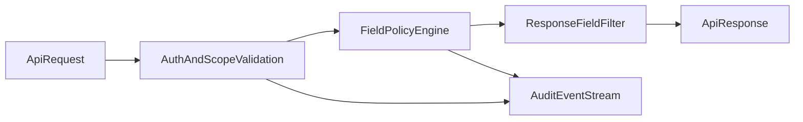

# API Governance and Data Sharing

> Governance rules for Smartout APIs and external data sharing.
> Last updated: 2026-02-28

---

## Purpose

Define a strict governance model so each tenant can:

- connect external systems safely,
- control exactly what data is shared,
- and audit/revoke access at any time.

---

## Governance principles

1. Least privilege by default
   - Every integration starts with zero scopes.
   - Tenant admin must explicitly grant scopes.

2. Default-deny for sensitive data
   - Sensitive categories are blocked unless explicitly approved.
   - High-risk fields require additional approval workflow.

3. Tenant-owned credentials
   - Credentials belong to tenant/workspace integration records.
   - No shared global customer keys.

4. Full traceability
   - Every credential/scope/policy action emits immutable audit events.

5. Revocation-first safety
   - Revoke must stop access immediately.
   - Downstream deliveries and exports stop at once after revoke.

---

## Data classification model

Every shared field must be classified:

| Class                  | Description                          | Default policy           |
| ---------------------- | ------------------------------------ | ------------------------ |
| `public_operational`   | Non-sensitive operational metadata   | Allow                    |
| `internal_operational` | Internal business operation signals  | Allow with scoped auth   |
| `personal_basic`       | Basic personal information           | Deny by default          |
| `personal_sensitive`   | High-risk personal data              | Deny + approval required |
| `security_critical`    | Secrets, credentials, auth artifacts | Never share              |

Non-negotiable rule:

- `security_critical` is never exportable through external APIs.

---

## Scope model

Scopes are explicit and additive. Recommended baseline scope namespace:

- `read:workspace`
- `read:profile.basic`
- `read:readiness.summary`
- `read:readiness.details`
- `read:operations.sessions`
- `read:training.progress`
- `read:reports.kpi`
- `write:invitations`
- `write:schedule.adjustments`
- `write:policy.assignments`
- `admin:integration.keys`
- `admin:data-sharing.policies`

Scope enforcement expectations:

- Workspace scoping in every token/claim.
- Field filtering enforced by policy engine at response level.
- Scope and field-policy checks both required (AND logic).

---

## Data sharing policy controls

Policy object should support:

- `policy_id`
- `tenant_id`, `workspace_id`
- `integration_id`
- allowed scopes
- denied fields
- approved fields (overrides)
- destination constraints (allowed endpoints/providers)
- retention/export limits
- approval metadata (who/when/why)
- status (`draft`, `active`, `suspended`, `revoked`)

Policy evaluation order:

1. Tenant/workspace active check
2. Integration status check
3. Scope check
4. Field-level allow/deny resolution
5. Destination and retention constraints
6. Audit event emission

---

## Approval workflow

Required for:

- `personal_sensitive` exports
- new high-privilege scopes
- connector destination changes to higher-risk systems

Workflow states:

- `requested`
- `security_review`
- `approved` or `rejected`
- `activated`

Minimum approval metadata:

- requester identity
- approver identity
- scope/field diff
- business justification
- expiration/revalidation date

---

## Audit and observability requirements

Must capture at minimum:

- integration created/updated/deleted
- key generated/rotated/revoked
- scope granted/revoked
- policy created/activated/suspended
- access granted/denied events
- webhook delivery outcomes (once event API exists)

Each event should include:

- `event_id`
- timestamp
- actor (user/service)
- tenant/workspace
- integration/client id
- action type
- object before/after hash (or diff reference)
- result status

Audit retention:

- 24 months minimum for enterprise governance posture.

---

## Key lifecycle and revocation controls

Lifecycle states:

- `provisioned`
- `active`
- `rotating`
- `revoked`
- `expired`

Rules:

- Keys are encrypted at rest (KMS-backed or equivalent).
- Rotation must support overlap window for zero-downtime switch.
- Revoke is immediate and blocks all token issuance/access.
- Revoke emits mandatory high-priority audit event.

---

## Enforcement architecture (target)

---

## Minimum implementation checklist

- Scope matrix defined and published.
- Field classification attached to API data dictionary.
- Policy engine integrated in all external data egress points.
- BYOK credential lifecycle implemented.
- Audit logs queryable per tenant/workspace/integration.
- Revoke tested as immediate kill-switch.
