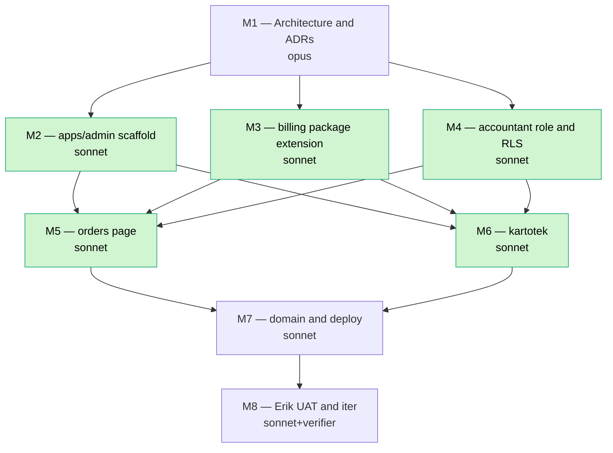

# Blueprint — order-system

> Owning campaign: `campaign/order-system`
> Companion: `docs/plans/CAMPAIGN-order-system.md`
> Author: code-architect (M1)
> Review gate: orchestrator must accept ADR-A, ADR-B, ADR-C before dispatching M2.

---

## 0. Patterns & conventions found (load-bearing)

| Concern | Source | Consequence |
|---|---|---|
| Minimal-app shape | `apps/landing/package.json`, `apps/landing/next.config.ts`, `apps/landing/src/app/layout.tsx`, `apps/landing/src/middleware.ts` | apps/admin scaffold copies landing not web — same Next 16 + Tailwind v4 + Sentry, no AI/Botsson/walkie deps. |
| Heavy-app reference | `apps/web/package.json`, `apps/web/next.config.ts` | Use only TanStack Query + sonner + react-hook-form + zod from this list — leave Botsson/AI/livekit/dnd/tiptap behind. |
| shadcn config | `apps/web/components.json`, `apps/landing/components.json` | new-york style, neutral baseColor, css vars, lucide. apps/admin copies verbatim. |
| Auth SSR | `packages/supabase/src/server.ts`, `packages/supabase/src/middleware.ts` | `createClient()` already dedupes `auth.getUser()`. Reuse — do not fork. Cookie domain auto-detects via `NEXT_PUBLIC_ROOT_DOMAIN`. |
| Auth callback | `apps/web/src/app/(auth)/login/...` (route layout used today) | apps/admin needs its own minimal login + callback, modeled on web's. Magic-link or email/OTP — no Google for accountant in Phase 1. |
| Platform-admin guard | `apps/web/src/lib/platform-admin.ts` (`getSuperAdminId`, `requireGodmode`, `logPlatformAction`) | Same shape, different gate. apps/admin gets `getAccountantUserId()` + `requireAccountant()` siblings — same module, different package. |
| Invoice list pattern | `apps/web/src/app/platform-admin/billing/invoices/page.tsx` | Server component, `createAdminClient()`, 2x parallel `Promise.all` selects, search-param-driven filter+preview. **Identical pattern to mirror in apps/admin/orders/page.tsx — only auth swaps.** |
| Invoice detail pattern | `.../invoices/[id]/page.tsx` | Composite of InvoiceDetail + LineItemEditor + DispatchesList + PaymentsHistory. Phase 1 lift retains InvoiceDetail + DispatchesList + PaymentsHistory (read-only); LineItemEditor stays web-only (it's a draft-author tool). |
| Sheet-preview pattern | `.../invoices/_components/invoice-detail-sheet.tsx` | "Always-mounted Sheet, open derived from `?preview=`" — copy verbatim, it solves a known Radix+Next race. |
| Filter pattern | `.../invoices/_components/invoice-filter-bar.tsx` | URL-param-driven filtering, on filter-change clear `?preview=`. Pattern copied 1:1. |
| Shared package | `packages/billing/` (already named `@smartout/billing`, exports types/schemas/queries/hooks/integrations) | **Do not create `packages/billing-engine/`. Extend the existing package.** ADR-B locks this in. |
| Env validation | `apps/web/src/env.ts`, `@t3-oss/env-nextjs` + Zod | apps/admin gets its own `env.ts` with the trimmed superset (no Stripe/Twilio/LiveKit/Ultravox — those stay in web). |
| Telemetry registry | `packages/telemetry/src/registry.ts` | Already has `entity_type: "invoice" \| "payment" \| ...`. Add events with category `"billing"`. Verbs to reuse: `viewed`, `list_viewed`, `detail_viewed`, `exported`, `confirmed`. |
| RLS helpers | `get_workspace_ids_for_user()`, `is_admin_in_workspace()` | Mirror with `get_accountant_company_ids(uid)` returning `setof uuid`. |
| Subdomain routing | `{slug}.smartout.ai` middleware on web | apps/admin is a flat host — middleware does NOT inspect host for slug; only path. |
| Commitlint | root husky/commitlint | Scopes must be kebab-case: use `admin`, `billing-engine`, `accountant-grant`, `kartotek`. Single-word scopes blocked (memory: commitlint scope-case trap). |

**Mobile-parity rule check (CLAUDE.md):** apps/admin is "web composes, accountant approves." No mobile counterpart in scope (out-of-scope explicitly in campaign plan). The data layer in `@smartout/billing` already supports both surfaces (it's environment-agnostic) — that obligation is already satisfied. No new architectural debt.

---

## 1. apps/admin file tree

```
apps/admin/
├── package.json                                 (1)
├── next.config.ts                               (2)
├── tsconfig.json                                (3)
├── components.json                              (4) shadcn config — copy from landing
├── next-env.d.ts                                auto-generated
├── .gitignore                                   copy from landing
├── README.md                                    one-paragraph description + dev port
├── instrumentation.ts                           Sentry init (optional Phase 1)
├── sentry.server.config.ts                      copy-shape from landing
├── sentry.client.config.ts                      copy-shape from landing
├── middleware.ts                                (5) accountant-role gate
└── src/
    ├── env.ts                                   (6) trimmed t3-env Zod schema
    ├── app/
    │   ├── globals.css                          (7) Tailwind v4 CSS-config + Nordic Split tokens
    │   ├── layout.tsx                           (8) root html/body, Geist + Geist Mono, ThemeProvider
    │   ├── providers.tsx                        (9) "use client" — QueryProvider + sonner Toaster
    │   ├── page.tsx                             (10) redirect("/workspaces")
    │   ├── not-found.tsx                        (11) shared 404
    │   ├── error.tsx                            (12) global error boundary
    │   ├── auth/
    │   │   ├── login/page.tsx                   (13) email magic-link entry
    │   │   ├── login/_components/login-form.tsx (14) "use client" form
    │   │   ├── callback/route.ts                (15) GET handler — exchange code, redirect to /workspaces
    │   │   └── logout/route.ts                  (16) POST handler — sign out
    │   ├── (admin)/                             route group — accountant-gated subtree
    │   │   ├── layout.tsx                       (17) sidebar shell + auth check (server) + accountant-role assertion
    │   │   ├── _components/
    │   │   │   ├── AdminSidebarNav.tsx          (18) "use client" — Workspaces / Orders / Account
    │   │   │   ├── AdminTopbar.tsx              (19) workspace-switch dropdown + signed-in pill
    │   │   │   └── AdminShell.tsx               (20) shell wrapper, dark theme, container
    │   │   ├── workspaces/
    │   │   │   ├── page.tsx                     (21) list of granted workspaces
    │   │   │   ├── _components/WorkspaceList.tsx (22) "use client" — table + search
    │   │   │   ├── _components/WorkspaceCard.tsx (23) per-row card
    │   │   │   └── [id]/                        per-workspace kartotek
    │   │   │       ├── page.tsx                 (24) server — fetch v_workspace_kartotek + recent orders
    │   │   │       ├── _components/
    │   │   │       │   ├── WorkspaceHeader.tsx        (25) name, org no, status pill
    │   │   │       │   ├── ContractSection.tsx        (26) employment_contract for the company
    │   │   │       │   ├── BillingConfigSection.tsx   (27) pricing_terms snapshot
    │   │   │       │   ├── MembersSection.tsx         (28) company_member roster
    │   │   │       │   ├── OrderHistorySection.tsx    (29) last 12 orders, click → /orders?preview=
    │   │   │       │   ├── PaymentStatusSection.tsx   (30) outstanding total, last paid
    │   │   │       │   └── RecentActivitySection.tsx  (31) billing_activity_log tail (10)
    │   │   │       └── error.tsx                (32) section-level error boundary
    │   │   ├── orders/
    │   │   │   ├── page.tsx                     (33) list — lifted from platform-admin/billing/invoices/page.tsx
    │   │   │   ├── _components/
    │   │   │   │   ├── OrderFilterBar.tsx       (34) lift of invoice-filter-bar
    │   │   │   │   ├── OrderTable.tsx           (35) lift of invoice-table — terminology "order"
    │   │   │   │   ├── OrderDetailSheet.tsx     (36) lift of invoice-detail-sheet
    │   │   │   │   └── MarkReceivedDialog.tsx   (37) NEW — "marker som mottatt-betalt" wraps mark-paid action
    │   │   │   └── [id]/
    │   │   │       ├── page.tsx                 (38) detail page — InvoiceDetail (read-only) + DispatchesList + PaymentsHistory
    │   │   │       ├── download-pdf/route.ts    (39) GET — proxy to invoice PDF generator (see §11 risk)
    │   │   │       └── download-csv/route.ts    (40) GET — proxy to ehf-export CSV path
    │   │   └── account/
    │   │       └── page.tsx                     (41) profile page — name, email, signed-in companies, sign out
    │   └── api/
    │       ├── orders/[id]/mark-received/route.ts (42) POST — server action wrapper for mutation
    │       └── health/route.ts                  (43) liveness probe for Vercel
    ├── components/
    │   ├── ui/                                  shadcn primitives — button, sheet, table, dialog, select,
    │   │                                        dropdown-menu, badge, separator, skeleton, sonner, label,
    │   │                                        tooltip, alert-dialog (≈14 files copied from apps/web)
    │   └── layout/
    │       └── ThemeProvider.tsx                next-themes wrapper (copy from landing)
    ├── lib/
    │   ├── utils.ts                             (44) cn() — copy from landing
    │   ├── accountant.ts                        (45) NEW — getAccountantUserId(), requireAccountant(), getGrantedCompanyIds()
    │   ├── supabase/
    │   │   ├── server.ts                        (46) re-export from @smartout/supabase/server
    │   │   ├── admin.ts                         (47) re-export from @smartout/supabase/admin (used only inside server actions)
    │   │   └── middleware.ts                    (48) re-export from @smartout/supabase/middleware
    │   ├── orders/
    │   │   ├── actions.ts                       (49) "use server" — markReceivedAction, downloadAuditAction
    │   │   └── fetchers.ts                      (50) typed wrappers around @smartout/billing/queries
    │   ├── kartotek/
    │   │   └── fetchers.ts                      (51) typed wrappers — calls billing.kartotek queries
    │   └── telemetry.ts                         (52) emit() factory pre-bound with actor_id
    └── public/
        ├── favicon.ico                          (53)
        └── logo.svg                             (54)
```

**Counts:** 54 numbered files. Most are tiny (<60 LOC). Auto-generated/copy-from-landing/copy-from-web: ~25 of 54. Truly new code (worth building deliberately): ~29 files.

**Dev port:** 3070 (web=3060, landing=3055, admin=3070).

**Naming note:** UI uses Norwegian "ordre" (singular) / "ordrer" (plural) consistently. URL paths stay English (`/orders`, `/workspaces`) for brevity. Terminology table:

| DB | Web UI | Admin UI |
|---|---|---|
| `invoice` | "faktura" | "ordre" / "grunnfaktura" |
| `invoice_dispatch` | "utsendelse" | "leveranse" |
| `invoice_status='paid'` | "Betalt" | "Mottatt og betalt" |

---

## 2. Package extraction plan

### Decision

**Extend `@smartout/billing` (existing). Do NOT create `packages/billing-engine/`.**

### Justification

1. The package already exists and already declares itself "the data layer for the Smartout billing engine" (`packages/billing/src/index.ts:1`) — it is the billing engine, just under a shorter name.
2. The package already conforms to the architectural rules a "billing-engine" package would impose: environment-agnostic, no React in queries, hooks accept caller-supplied fetchers (allows web Server Actions + mobile direct-client + admin Server Actions to all share the same code).
3. Renaming would be churn-only — `apps/web/package.json` line 42 already imports `@smartout/billing`; mobile/Stripe/edge-functions all import this name today. ADR-0118 cites "@smartout/billing" by name.
4. We need *additions*, not a different shape: workspace-kartotek queries, accountant-scoped fetchers, mark-received action wrapper. Add subpaths instead of forking.

### Move-map (source → dest)

Phase 1 reaches `apps/admin` via the package. Surface in `apps/web/src/app/platform-admin/billing/invoices/` is **NOT moved out**; it is **wired through the package** so both apps consume the same code.

| Currently in | Disposition | New home (in @smartout/billing) |
|---|---|---|
| `apps/web/.../invoices/page.tsx` (server query for list) | Stays in web; query body extracted | `src/queries.ts` → already has `fetchInvoicesForCompany`. Add `fetchOrdersForAccountant(client, granted_ids, filters)`. |
| `apps/web/.../invoices/[id]/page.tsx` (server query for detail) | Stays in web | Already in `queries.ts` as `fetchInvoiceDetail`. No move needed. |
| `apps/web/.../invoices/_components/invoice-table.tsx` | **Stays web** as `InvoiceTable`; **shape lifted** to admin as `OrderTable.tsx` | Share `InvoiceListRow` projection type via `src/types.ts` (add `OrderListRow = InvoiceListRow & { company_name: string }`). |
| `apps/web/.../invoices/_components/invoice-filter-bar.tsx` | Pattern copied 1:1 to admin | No package move — pure URL-param plumbing, not worth abstracting. |
| `apps/web/.../invoices/_components/invoice-detail-sheet.tsx` | Pattern copied 1:1 to admin | No package move — Radix-specific. |
| `apps/web/.../invoices/_components/invoice-detail.tsx` (server) | **Move body to package** | New `src/server/invoice-detail.ts` exporting `loadInvoiceDetailServer(adminClient, invoiceId)`. Web + admin both consume. |
| `apps/web/.../invoices/_components/invoice-actions.tsx` (mark-paid/void/note dialogs) | **Stays web** | Web-only mutations (void, dunning) outside accountant scope. |
| `apps/web/.../invoices/[id]/_components/InvoiceDispatchesList.tsx` | **Move query to package**, keep component web-side; reimport in admin | Add `src/queries.ts:fetchInvoiceDispatches(client, invoiceId)`. Admin recreates the component (read-only variant — no resend button). |
| `apps/web/.../invoices/[id]/_components/InvoicePaymentsHistory.tsx` | Same as above | Add `fetchInvoicePayments(client, invoiceId)`. Admin recreates read-only. |
| Existing `packages/billing/src/actions/workspace-mark-paid.ts` (referenced from index.ts though file currently absent on `development` HEAD — see §11 risk b) | **Treat as existing**; admin uses it via Server Action wrapper | New thin wrapper in `apps/admin/src/lib/orders/actions.ts:markReceivedAction(invoiceId)` that calls package action. |
| New: kartotek aggregator | NEW in package | `src/queries.ts:fetchWorkspaceKartotek(client, workspaceId)` returns shape from §6. |
| New: accountant grants resolver | NEW in package | `src/queries.ts:fetchAccountantCompanyGrants(client, userId)` — calls Postgres helper `get_accountant_company_ids`. |
| New: order CSV/PDF stream | NEW in package | `src/server/order-export.ts:streamOrderPdf(client, invoiceId)` and `streamOrderCsv(client, invoiceId)` (see §11 risk b — depends on whether PDF generator exists today). |

### Files to add to `packages/billing/src/`

```
src/
├── (existing) types.ts schemas.ts queries.ts hooks.ts dispatch.ts integrations.ts
├── server/
│   ├── invoice-detail.ts          (new — server-only loader, splits out workflow)
│   ├── kartotek.ts                (new — aggregate read for /workspaces/[id])
│   └── order-export.ts            (new — PDF + CSV streamers)
├── accountant/
│   ├── grants.ts                  (new — fetchAccountantCompanyGrants, hasAccountantAccess)
│   └── audit.ts                   (new — emitAccountantOrderViewed, emitAccountantOrderDownloaded)
```

Update `packages/billing/src/index.ts` to re-export the new subdirectories. Add `./accountant` and `./server` subpath exports to `packages/billing/package.json` exports map (matching the existing `./integrations` style).

---

## 3. Database changes

### Decision

**New dedicated table `accountant_company_grant`. Do NOT extend `company_member` with `role='accountant'`.**

### Justification

| Axis | New `accountant_company_grant` table | Extend `company_member` with `role='accountant'` |
|---|---|---|
| Semantic clarity | Accountant != company member. Erik does not work at the customer; he works for Smartout-as-provider. | Conflates "person paid by company" with "person reading company invoices." |
| Cross-company | Native — one user, N grants, N companies | `company_member` already supports this (one row per company), but bloats `company_member` queries (`get_company_ids_for_user` would now silently return read-only grants). |
| Revocation | DELETE row | UPDATE role — losing audit trail unless soft-delete added |
| RLS shape | New helper `get_accountant_company_ids(uid)`; isolated policy clauses | Existing helpers must add `role <> 'accountant'` guards everywhere — high blast radius |
| Future granularity | Easy to add `scope: 'orders_only' | 'full_kartotek'` column | Would require company_member schema churn |
| ADR-0118 risk | Zero — no change to existing company-scope semantics | High — every existing company_member-based RLS policy must be re-audited |

### Migration

`supabase/migrations/20260502120000_accountant_company_grant.sql`:

```sql
-- ─────────────────────────────────────────────────────────────────────
-- Accountant cross-company grant
--
-- Smartout-side accountants (Erik first; pattern supports many) need
-- read access to invoices, contracts, members, and pricing_terms across
-- specific customer companies — without becoming members of those
-- companies. ADR-0118 keeps invoice/contract company-scoped; this table
-- adds a sibling access path that is purely additive (existing
-- company_member RLS unchanged).
--
-- Mental model: company_member = "I work here". accountant_company_grant
-- = "I am Smartout's accountant for this company".
-- ─────────────────────────────────────────────────────────────────────

CREATE TYPE accountant_grant_scope AS ENUM (
  'orders_only',     -- can SELECT invoice, invoice_line_item, invoice_dispatch, payment, billing_activity_log
  'full_kartotek'    -- orders_only + employment_contract + pricing_terms + company_member
);

CREATE TABLE public.accountant_company_grant (
  grant_id           uuid PRIMARY KEY DEFAULT gen_random_uuid(),
  user_id            uuid NOT NULL REFERENCES public.user_identity(user_id) ON DELETE CASCADE,
  company_id         uuid NOT NULL REFERENCES public.company(company_id) ON DELETE CASCADE,
  scope              accountant_grant_scope NOT NULL DEFAULT 'full_kartotek',
  granted_by         uuid NOT NULL REFERENCES public.user_identity(user_id),
  granted_at         timestamptz NOT NULL DEFAULT now(),
  revoked_at         timestamptz,
  revoked_by         uuid REFERENCES public.user_identity(user_id),
  revoke_reason      text,
  created_at         timestamptz NOT NULL DEFAULT now(),
  updated_at         timestamptz NOT NULL DEFAULT now(),
  CONSTRAINT accountant_company_grant_user_company_unique UNIQUE (user_id, company_id)
);

CREATE INDEX accountant_company_grant_user_active_idx
  ON public.accountant_company_grant (user_id)
  WHERE revoked_at IS NULL;

CREATE INDEX accountant_company_grant_company_idx
  ON public.accountant_company_grant (company_id)
  WHERE revoked_at IS NULL;

-- updated_at trigger (mirror existing tables — there is a project-wide
-- function set_updated_at(); reuse rather than reinvent).
CREATE TRIGGER set_accountant_company_grant_updated_at
  BEFORE UPDATE ON public.accountant_company_grant
  FOR EACH ROW EXECUTE FUNCTION public.set_updated_at();

ALTER TABLE public.accountant_company_grant ENABLE ROW LEVEL SECURITY;

-- Accountants can SELECT only their own grant rows. Pontus / godmode
-- bypass via service role.
CREATE POLICY accountant_company_grant_self_select
  ON public.accountant_company_grant
  FOR SELECT
  USING (user_id = auth.uid() AND revoked_at IS NULL);

-- ─── Helper: stable, security-definer, returns active grants ────────
CREATE OR REPLACE FUNCTION public.get_accountant_company_ids(p_user_id uuid)
RETURNS TABLE (company_id uuid)
LANGUAGE sql
SECURITY DEFINER
STABLE
SET search_path = public
AS $$
  SELECT g.company_id
  FROM public.accountant_company_grant g
  WHERE g.user_id = p_user_id
    AND g.revoked_at IS NULL;
$$;

REVOKE ALL ON FUNCTION public.get_accountant_company_ids(uuid) FROM PUBLIC;
GRANT EXECUTE ON FUNCTION public.get_accountant_company_ids(uuid) TO authenticated;

-- Convenience predicate — used by RLS policies below.
CREATE OR REPLACE FUNCTION public.is_accountant_for_company(p_company_id uuid)
RETURNS boolean
LANGUAGE sql
SECURITY DEFINER
STABLE
SET search_path = public
AS $$
  SELECT EXISTS (
    SELECT 1
    FROM public.accountant_company_grant g
    WHERE g.user_id = auth.uid()
      AND g.company_id = p_company_id
      AND g.revoked_at IS NULL
  );
$$;

REVOKE ALL ON FUNCTION public.is_accountant_for_company(uuid) FROM PUBLIC;
GRANT EXECUTE ON FUNCTION public.is_accountant_for_company(uuid) TO authenticated;
```

### RLS policy additions (separate migration `20260502120100_accountant_rls_policies.sql`)

Add accountant SELECT policies to invoice-domain tables. Existing policies untouched.

```sql
-- invoice — read access for granted accountants
CREATE POLICY invoice_accountant_select
  ON public.invoice
  FOR SELECT
  USING (public.is_accountant_for_company(company_id));

-- invoice_line_item — joined access via invoice
CREATE POLICY invoice_line_item_accountant_select
  ON public.invoice_line_item
  FOR SELECT
  USING (
    EXISTS (
      SELECT 1 FROM public.invoice i
      WHERE i.invoice_id = invoice_line_item.invoice_id
        AND public.is_accountant_for_company(i.company_id)
    )
  );

-- invoice_dispatch — joined access via invoice
CREATE POLICY invoice_dispatch_accountant_select
  ON public.invoice_dispatch
  FOR SELECT
  USING (
    EXISTS (
      SELECT 1 FROM public.invoice i
      WHERE i.invoice_id = invoice_dispatch.invoice_id
        AND public.is_accountant_for_company(i.company_id)
    )
  );

-- payment + payment_attempt — same pattern
CREATE POLICY payment_accountant_select
  ON public.payment
  FOR SELECT
  USING (public.is_accountant_for_company(company_id));

CREATE POLICY payment_attempt_accountant_select
  ON public.payment_attempt
  FOR SELECT
  USING (
    EXISTS (
      SELECT 1 FROM public.payment p
      WHERE p.payment_id = payment_attempt.payment_id
        AND public.is_accountant_for_company(p.company_id)
    )
  );

-- pricing_terms — full_kartotek scope only
CREATE POLICY pricing_terms_accountant_select
  ON public.pricing_terms
  FOR SELECT
  USING (
    EXISTS (
      SELECT 1
      FROM public.accountant_company_grant g
      WHERE g.user_id = auth.uid()
        AND g.company_id = pricing_terms.company_id
        AND g.revoked_at IS NULL
        AND g.scope = 'full_kartotek'
    )
  );

-- billing_activity_log — orders_only is sufficient
CREATE POLICY billing_activity_log_accountant_select
  ON public.billing_activity_log
  FOR SELECT
  USING (public.is_accountant_for_company(company_id));

-- company — accountant can read company name + org_number for any
-- granted company (kartotek header).
CREATE POLICY company_accountant_select
  ON public.company
  FOR SELECT
  USING (public.is_accountant_for_company(company_id));

-- company_member — full_kartotek scope only
CREATE POLICY company_member_accountant_select
  ON public.company_member
  FOR SELECT
  USING (
    EXISTS (
      SELECT 1
      FROM public.accountant_company_grant g
      WHERE g.user_id = auth.uid()
        AND g.company_id = company_member.company_id
        AND g.revoked_at IS NULL
        AND g.scope = 'full_kartotek'
    )
  );

-- employment_contract — full_kartotek scope only (workspace-scoped table;
-- join via workspace.company_id)
CREATE POLICY employment_contract_accountant_select
  ON public.employment_contract
  FOR SELECT
  USING (
    EXISTS (
      SELECT 1
      FROM public.workspace w
      JOIN public.accountant_company_grant g ON g.company_id = w.company_id
      WHERE w.workspace_id = employment_contract.workspace_id
        AND g.user_id = auth.uid()
        AND g.revoked_at IS NULL
        AND g.scope = 'full_kartotek'
    )
  );

-- workspace — accountant reads list of workspaces inside granted companies
CREATE POLICY workspace_accountant_select
  ON public.workspace
  FOR SELECT
  USING (public.is_accountant_for_company(company_id));
```

### Mark-received action

The action is a UPDATE on `invoice` with a narrow column set. Two paths:

1. **Reuse existing `workspace-mark-paid` Server Action** — but accountant scope is per-company, not workspace, and acts on invoice (which is company-scoped per ADR-0118). Existing action assumes workspace context.
2. **New action `mark_invoice_received`** — accountant-only, server-side validates `is_accountant_for_company(invoice.company_id)`, sets `invoice.status='paid'` + writes `payment` row with `payment_method_type='out_of_band'` + emits telemetry.

**Choose path 2.** The verb is different ("mottatt og betalt" by the accountant ≠ "marked paid by ops"), and the audit trail must distinguish. `payment.metadata->>'channel' = 'accountant_confirmed'`.

The accountant SELECT policies above grant read; an additional UPDATE policy is required:

```sql
-- Narrow UPDATE — accountant may set status from issued/sent/overdue → paid only.
-- Anything else (void, draft regen, dunning) stays platform-admin-only.
CREATE POLICY invoice_accountant_mark_received
  ON public.invoice
  FOR UPDATE
  USING (
    public.is_accountant_for_company(company_id)
    AND status IN ('issued', 'sent', 'overdue')
  )
  WITH CHECK (
    public.is_accountant_for_company(company_id)
    AND status = 'paid'
  );
```

In practice the Server Action runs with `service_role` (it does the payment row insert atomically), so this UPDATE policy is defense-in-depth. Required by CLAUDE.md "Never bypass RLS for convenience."

### Seed (placeholder — concrete values land in M4)

`supabase/migrations/20260502120200_seed_erik_accountant.sql`:

```sql
-- M4 owns this. Placeholder structure here for review during M1.
-- Erik's actual user_id resolved from production identity at seed-time.
INSERT INTO public.accountant_company_grant
  (user_id, company_id, scope, granted_by)
SELECT
  ui.user_id,
  c.company_id,
  'full_kartotek'::accountant_grant_scope,
  (SELECT user_id FROM public.user_identity WHERE is_godmode = true LIMIT 1)
FROM public.user_identity ui
CROSS JOIN public.company c
WHERE ui.email = 'erik@<TBD>'   -- placeholder, M4 fills in
ON CONFLICT (user_id, company_id) DO NOTHING;
```

### pgTAP coverage (M4 deliverable)

Three pgTAP suites (sit alongside the migration, not in it):

1. `tests/accountant_grant/select_isolation.spec.sql` — accountant A with grant for company X cannot SELECT invoices for company Y.
2. `tests/accountant_grant/scope_enforcement.spec.sql` — `orders_only` grant cannot SELECT `pricing_terms` / `company_member` / `employment_contract`.
3. `tests/accountant_grant/mark_received.spec.sql` — mark-received only allowed on issued/sent/overdue → paid.

---

## 4. Auth + middleware

### Auth flow

```
admin.smartout.ai/                                 (landing)
  → if not authed: redirect /auth/login
  → if authed and accountant: redirect /workspaces
  → if authed and NOT accountant: render 403 page

/auth/login
  → email magic-link form (no Google Phase 1 — accountant onboarding is high-trust)
  → Supabase email OTP via supabase.auth.signInWithOtp({email, options:{shouldCreateUser:false}})

/auth/callback
  → exchange code → set session cookie (cookie domain auto = .smartout.ai via NEXT_PUBLIC_ROOT_DOMAIN)
  → redirect /workspaces

/(admin)/* (route group)
  → server-side gate: requireAccountant() in (admin)/layout.tsx
  → returns redirect("/auth/login") if no user
  → returns notFound() if user but no active grants (treat 404 as "you don't have a tenancy here")
```

### Cross-domain auth

Supabase cookies are scoped to `.smartout.ai` already (existing `getServerCookieDomain()` derives from `NEXT_PUBLIC_ROOT_DOMAIN`). Erik logging in on `admin.smartout.ai` produces a session cookie that would also be valid on `app.smartout.ai`. **This is fine** — Erik is also a `user_identity` row; he simply has no `company_member` / `profile` rows on customer workspaces, so RLS denies him there. Defense layer is RLS, not host.

### `apps/admin/middleware.ts` (pseudocode)

```typescript
import { NextResponse, type NextRequest } from "next/server";
import { updateSession } from "@smartout/supabase/middleware";

const PUBLIC_PATHS = new Set(["/auth/login", "/auth/callback", "/auth/logout", "/api/health"]);

function isPublic(pathname: string): boolean {
  if (PUBLIC_PATHS.has(pathname)) return true;
  if (pathname.startsWith("/_next")) return true;
  if (pathname.startsWith("/api/health")) return true;
  return false;
}

export async function middleware(request: NextRequest) {
  const { pathname } = request.nextUrl;
  const { response, user } = await updateSession(request);

  if (isPublic(pathname)) return response;

  if (!user) {
    const loginUrl = request.nextUrl.clone();
    loginUrl.pathname = "/auth/login";
    loginUrl.searchParams.set("next", pathname);
    return NextResponse.redirect(loginUrl);
  }

  // NOTE: accountant-role check happens in (admin)/layout.tsx, not here.
  // Middleware avoids the DB round-trip on every request — the layout
  // pulls grants once (React.cache) and gates the entire route group.
  // Middleware only ensures *some* session exists.

  return response;
}

export const config = {
  matcher: ["/((?!_next/static|_next/image|favicon.ico).*)"],
};
```

### `apps/admin/src/lib/accountant.ts` (the gate)

```typescript
import { createClient } from "@smartout/supabase/server";
import { fetchAccountantCompanyGrants } from "@smartout/billing/accountant";
import { redirect, notFound } from "next/navigation";
import { cache } from "react";

export const getAccountantUserId = cache(async (): Promise<string | null> => {
  const supabase = await createClient();
  const { data: { user } } = await supabase.auth.getUser();
  return user?.id ?? null;
});

export const getGrantedCompanyIds = cache(async (userId: string): Promise<string[]> => {
  const supabase = await createClient();
  const grants = await fetchAccountantCompanyGrants(supabase, userId);
  return grants.map((g) => g.company_id);
});

export async function requireAccountant(): Promise<{
  userId: string;
  companyIds: string[];
}> {
  const userId = await getAccountantUserId();
  if (!userId) redirect("/auth/login");

  const companyIds = await getGrantedCompanyIds(userId);
  if (companyIds.length === 0) notFound(); // 404: "you have no tenancy here"

  return { userId, companyIds };
}
```

---

## 5. Routes

| Path | File | Type | Auth | Render | Data fetch | Mutation surface |
|---|---|---|---|---|---|---|
| `/` | `app/page.tsx` | Page | Public | Server | None | None — `redirect("/workspaces")` |
| `/auth/login` | `app/auth/login/page.tsx` | Page | Public | Server (form is client) | None | Client → `supabase.auth.signInWithOtp()` |
| `/auth/callback` | `app/auth/callback/route.ts` | Route Handler (GET) | Public | Server | Exchanges `?code` | Sets session cookie, `redirect("/workspaces")` |
| `/auth/logout` | `app/auth/logout/route.ts` | Route Handler (POST) | Authed | Server | None | `supabase.auth.signOut()`, redirect `/auth/login` |
| `/(admin)` layout | `app/(admin)/layout.tsx` | Layout | Authed + Accountant | Server | `requireAccountant()` | None — gate only |
| `/workspaces` | `app/(admin)/workspaces/page.tsx` | Page | Authed + Accountant | Server | `Promise.all([fetchAccountantCompanyGrants, fetchWorkspacesForCompanies])` | None |
| `/workspaces/[id]` | `app/(admin)/workspaces/[id]/page.tsx` | Page | Authed + Accountant + grant-on-this-company | Server | `Promise.all` of 6 fetchers (see §6) | None Phase 1 |
| `/orders` | `app/(admin)/orders/page.tsx` | Page | Authed + Accountant | Server | `fetchOrdersForAccountant(client, granted_ids, filters)` from search params | None directly; `?preview=` opens Sheet |
| `/orders/[id]` | `app/(admin)/orders/[id]/page.tsx` | Page | Authed + Accountant + invoice's company in granted_ids | Server | `fetchInvoiceDetail` + `fetchInvoiceDispatches` + `fetchInvoicePayments` (parallel) | Renders `MarkReceivedDialog` (client) which calls Server Action |
| `/orders/[id]/download-pdf` | `app/(admin)/orders/[id]/download-pdf/route.ts` | Route Handler (GET) | Authed + grant check | Server | `streamOrderPdf(client, invoiceId)` | None — emits `order downloaded` telemetry |
| `/orders/[id]/download-csv` | `app/(admin)/orders/[id]/download-csv/route.ts` | Route Handler (GET) | Authed + grant check | Server | `streamOrderCsv(client, invoiceId)` | Emits `order exported` telemetry |
| `/api/orders/[id]/mark-received` | `app/api/orders/[id]/mark-received/route.ts` | Route Handler (POST) | Authed + grant check | Server | None | Calls `markReceivedAction`, emits `order marked_received` |
| `/account` | `app/(admin)/account/page.tsx` | Page | Authed | Server | `fetchAccountantCompanyGrants` | None directly; logout button POSTs `/auth/logout` |
| `/api/health` | `app/api/health/route.ts` | Route Handler (GET) | Public | Server | None | `{ ok: true }` |

### Mutation pattern decision: Server Actions vs Route Handlers

**Server Actions for `markReceived`**, exposed via the Route Handler `POST /api/orders/[id]/mark-received` so a non-React HTTP client (curl, future Erik integration) could also drive it. The Route Handler internally calls the same `"use server"` action. This mirrors apps/web's pattern of "Server Action is the canonical primitive, Route Handler is a thin HTTP shell" (memory: ADR-0114 from web-perf council).

**Route Handlers for downloads** because Server Actions cannot stream binary responses cleanly.

### RSC data fetching pattern

All page-level fetches use `Promise.all` per CLAUDE.md performance rule. Where a query is reused across components in the same request, wrap with `React.cache()` (already done by `createClient` for auth, mirror for grant-resolution).

---

## 6. Workspace-kartotek read model

### Decision

**Use a SQL VIEW `v_workspace_kartotek_summary` for the header + counts. Keep order history, members, recent activity as separate parallel queries.**

ADR-C locks this in.

### Justification

- The header (company name, org_number, primary workspace, total outstanding amount, last invoice date, member count) is 6 small scalars from 4 tables joined on company_id. A view collapses 4 round-trips into one.
- Order history, payment status, members, and recent activity are LIMIT N lists where N varies (12, 1, 50, 10) — a view that returns all of these as JSON arrays would silently break performance at large customers. Keep them as separate `.limit(N)` queries.
- RLS on the view: views in Postgres do NOT have their own RLS; security comes from underlying tables. This is fine — every underlying table has accountant policies (§3).

### View DDL (added to migration `20260502120300_view_workspace_kartotek.sql`)

```sql
CREATE OR REPLACE VIEW public.v_workspace_kartotek_summary AS
SELECT
  w.workspace_id,
  w.company_id,
  w.name              AS workspace_name,
  w.slug              AS workspace_slug,
  c.name              AS company_name,
  c.org_number        AS company_org_number,
  c.subscription_plan,
  c.subscription_status,
  c.created_at        AS company_created_at,
  -- counts (subquery — keeps the view a single SELECT)
  (SELECT count(*) FROM public.invoice i WHERE i.company_id = c.company_id) AS invoice_count_total,
  (SELECT count(*) FROM public.invoice i WHERE i.company_id = c.company_id AND i.status IN ('issued','sent','overdue')) AS invoice_count_outstanding,
  (SELECT coalesce(sum(amount_incl_vat), 0)::numeric FROM public.invoice i WHERE i.company_id = c.company_id AND i.status IN ('issued','sent','overdue')) AS amount_outstanding_incl_vat,
  (SELECT max(issued_at) FROM public.invoice i WHERE i.company_id = c.company_id) AS last_invoice_at,
  (SELECT max(paid_at) FROM public.invoice i WHERE i.company_id = c.company_id AND i.status = 'paid') AS last_paid_at,
  (SELECT count(*) FROM public.company_member cm WHERE cm.company_id = c.company_id) AS member_count
FROM public.workspace w
JOIN public.company c ON c.company_id = w.company_id;

GRANT SELECT ON public.v_workspace_kartotek_summary TO authenticated;
```

### Concrete query plan for `/workspaces/[id]/page.tsx`

```typescript
const supabase = await createClient(); // user-scoped, RLS enforces accountant grant
const { id } = await params;

const [
  summary,                  // 1. v_workspace_kartotek_summary single row
  recentOrders,             // 2. invoice top 12 by issued_at desc
  outstandingPayments,      // 3. payment last 5 with status
  members,                  // 4. company_member with profile join, scope='full_kartotek' only
  contracts,                // 5. employment_contract count by status, scope='full_kartotek' only
  recentActivity,           // 6. billing_activity_log top 10
  pricingTerms,             // 7. pricing_terms current row, scope='full_kartotek' only
] = await Promise.all([
  supabase.from("v_workspace_kartotek_summary").select("*").eq("workspace_id", id).maybeSingle(),
  supabase.from("invoice").select("invoice_id,invoice_number,status,issued_at,due_at,amount_incl_vat").eq("workspace_id", id).order("issued_at", { ascending: false }).limit(12),
  supabase.from("payment").select("payment_id,amount,paid_at,status,method_type").eq("workspace_id", id).order("paid_at", { ascending: false }).limit(5),
  supabase.from("company_member").select("user_id,role,user_identity!inner(email,full_name)").eq("company_id", summary.data?.company_id ?? null),
  supabase.from("employment_contract").select("contract_id,status").eq("workspace_id", id),
  supabase.from("billing_activity_log").select("*").eq("workspace_id", id).order("created_at", { ascending: false }).limit(10),
  supabase.from("pricing_terms").select("*").eq("workspace_id", id).is("ended_at", null).maybeSingle(),
]);

// 4 of 7 queries fail-soft: scope=orders_only accountant gets PostgrestError
// 401 on members/contracts/pricing — UI should render section with "ikke tilgang"
// rather than blow the page.
```

7 parallel queries, all RLS-scoped. With Supabase Pro pooler this is one round-trip. p95 budget: 200ms warm.

`fetchWorkspaceKartotek()` in `@smartout/billing/server/kartotek.ts` wraps this exact orchestration so admin + future mobile use the same composition.

---

## 7. Telemetry events

Add to `packages/telemetry/src/registry.ts` under category `"billing"`. All events follow space-separated `<entity> <verb>` convention.

| Event | Entity type | Verb | Properties | Destinations |
|---|---|---|---|---|
| `order list_viewed` | invoice | list_viewed | `{ filters: { status?, company? }, count }` | posthog, activity_trail |
| `order detail_viewed` | invoice | detail_viewed | `{ invoice_id, source: "list_row" \| "kartotek" \| "deeplink" }` | posthog, activity_trail |
| `order downloaded` | invoice | exported | `{ invoice_id, format: "pdf", trigger: "manual" }` | posthog, activity_trail, billing_activity_log |
| `order exported` | invoice | exported | `{ invoice_id, format: "csv", trigger: "manual" }` | posthog, activity_trail, billing_activity_log |
| `order marked_received` | invoice | confirmed | `{ invoice_id, payment_id, paid_at, channel: "accountant_confirmed" }` | posthog, activity_trail, billing_activity_log, engine_event |
| `kartotek viewed` | workspace | viewed | `{ workspace_id, company_id, sections_loaded: number }` | posthog, activity_trail |
| `kartotek section_failed` | workspace | failed | `{ workspace_id, section, reason: "rls_denied" \| "fetch_error" }` | logger, activity_trail |
| `accountant signed_in` | profile | signed_in | `{ method: "otp", company_count }` | posthog, activity_trail |
| `accountant grant_listed` | accountant_company_grant | list_viewed | `{ count }` | posthog |
| `accountant signed_out` | profile | signed_out | `{ session_duration_s }` | posthog, activity_trail |

**New `EntityType` to add to registry:** `accountant_company_grant`.

**`actor_id` resolution:** Erik does not have a workspace-scoped `profile`. Telemetry registry currently demands non-empty `actor_id` (ADR-0193). For accountant events, `actor_id = user_identity.user_id` (UUID); register a special reserved namespace if the registry's NonEmptyString ban requires it. **Decision:** add a comment exception in registry.ts allowing `user_id` as `actor_id` for events in category `"billing"` from accountant origin. Document inline + cross-link to ADR-A.

**`workspace_id`:** Some events are platform-scoped (kartotek-list view spans multiple workspaces). Per registry comment "Nullable when an event is genuinely platform-scoped (billing_activity_log)" — set `workspace_id: null` for `accountant signed_in/out`, `accountant grant_listed`, and `order list_viewed` (when no company filter is set). All others carry the concrete workspace.

---

## 8. DNS + deploy

### Vercel project

| Setting | Value |
|---|---|
| Project name | `smartout-admin` |
| Framework preset | Next.js |
| Root directory | `apps/admin` |
| Build command | `cd ../.. && pnpm turbo run build --filter=admin...` |
| Install command | `cd ../.. && pnpm install --frozen-lockfile` |
| Output directory | `apps/admin/.next` |
| Node version | 20.x (matches web + landing) |
| Ignored Build Step | `git diff --quiet HEAD^ HEAD -- apps/admin/ packages/billing/ packages/supabase/ packages/telemetry/ packages/ui/ packages/types/` |

**Memory note:** Vercel Ignored Build Step previously canceled main deploys for 12 days (memory: `reference_vercel_deploy_rules`). Match the path filter to this app's actual dependency surface — billing/supabase/telemetry/ui/types — and verify on first deploy that a same-PR change to `packages/billing/src/` triggers an admin rebuild.

### DNS

```
admin.smartout.ai  CNAME  cname.vercel-dns.com.
```

Plus Vercel domain configuration: add `admin.smartout.ai` to the `smartout-admin` project. Auto-provisions Let's Encrypt cert.

### Env-var sync (1Password)

Vault: `smartout_ai` (shared) + `smartout_ai_prod` (prod-specific). Use existing sync script (memory: `reference_env_sync_script`) and add an admin manifest entry.

| Var | Source vault | Where it lives |
|---|---|---|
| `NEXT_PUBLIC_SUPABASE_URL` | `smartout_ai` | shared with web/landing |
| `NEXT_PUBLIC_SUPABASE_ANON_KEY` | `smartout_ai` | shared |
| `SUPABASE_SERVICE_ROLE_KEY` | `smartout_ai_prod` | server-only |
| `NEXT_PUBLIC_ROOT_DOMAIN` | inline | `smartout.ai` for prod, `localhost` for dev |
| `NEXT_PUBLIC_POSTHOG_KEY` | `smartout_ai` | shared |
| `NEXT_PUBLIC_POSTHOG_HOST` | `smartout_ai` | shared |
| `NEXT_PUBLIC_POSTHOG_PROJECT_ID` | `smartout_ai` | shared |
| `NEXT_PUBLIC_SENTRY_DSN` | `smartout_ai` | client |
| `SENTRY_DSN` | `smartout_ai` | server |
| `SENTRY_AUTH_TOKEN` | `smartout_ai_prod` | source-map upload |

No Stripe/Twilio/LiveKit/Ultravox/SendGrid/DocuSeal — all out-of-scope for accountant app.

Add app to `scripts/sync-vercel-env.sh` manifest as a third app entry (alongside `web`, `landing`).

### Local dev

`apps/admin/package.json` dev script: `op run --env-file=.env.template -- next dev -p 3070`. The `.env.template` at repo root already maps the keys above to op:// references.

---

## 9. ADR drafts

Three ADRs. Numbers TBD by orchestrator (next available is 0165 per memory; campaign creates 4 — ADR-D for DNS lands in M7).

### ADR-A: apps/admin app boundary + accountant cross-company access

**Status:** proposed
**Date:** 2026-05-02

#### Context

Smartout's accountant Erik needs self-service access to grunnfakturaer (orders) across many customer companies, without being a member of any of them. Today only `platform-admin/billing/invoices` exposes this — gated by `is_godmode = true` (ADR-0118 keeps invoice tables company-scoped). The platform-admin shell ships AI surfaces, customer-success tooling, and product authoring that are irrelevant and confusing for an accountant. We need a separate app surface, a separate authentication path (no godmode), and a separate access pattern (cross-company read).

Three classes of solution exist:

1. Add an accountant role to `company_member` and treat each customer as if Erik were on staff.
2. Use service-role-bypass + an "accountant" boolean on `user_identity`.
3. Introduce `accountant_company_grant` as a sibling access path that is purely additive to existing RLS.

#### Decision

We adopt option 3:

- New top-level app `apps/admin/` deployed at `admin.smartout.ai`.
- New table `accountant_company_grant(user_id, company_id, scope, granted_at, granted_by, revoked_at, ...)` with two scopes: `orders_only` and `full_kartotek`.
- New Postgres helpers `get_accountant_company_ids(uid)` and `is_accountant_for_company(company_id)`, both `SECURITY DEFINER STABLE`, mirror in shape of `get_workspace_ids_for_user`.
- Additive RLS policies on `invoice`, `invoice_line_item`, `invoice_dispatch`, `payment`, `payment_attempt`, `pricing_terms`, `billing_activity_log`, `company`, `company_member`, `workspace`, `employment_contract`. Existing policies untouched.
- Mark-received UPDATE allowed via narrow RLS policy: status transition `issued/sent/overdue → paid` only.
- Apps/admin uses session cookies scoped to `.smartout.ai` (existing supabase middleware behavior). Same Supabase Auth; no new identity provider.
- Mutation surface in Phase 1: mark-received only. All other invoice mutations remain platform-admin (web).

#### Consequences

- **Positive:** ADR-0118 company-scope invariant unchanged. Existing tests and policies need no modification. Access can be granted and revoked surgically without modifying `company_member` (which has many other consumers — schedule, contracts, chat). Accountant scope can be tightened later (`orders_only` already designed in).
- **Positive:** Erik's session cookie is unprivileged on `app.smartout.ai` because RLS denies him on workspace tables he has no member row for. No host-based defense needed.
- **Negative:** New table to maintain. New helper to keep in sync with `get_workspace_ids_for_user`. Pontus must remember to grant Erik on every new customer company — automation deferred to Phase 2 (`grant_on_company_create` trigger or admin UI).
- **Negative:** RLS clauses now have two access paths per table (member + accountant). Future schema reviews must check both. Mitigated by pgTAP suites covering both.

#### Alternatives considered

| Alt | Why rejected |
|---|---|
| `company_member.role='accountant'` | Conflates "works at" with "audits", bloats every company_member-based query, requires re-audit of all existing RLS clauses. |
| `user_identity.is_accountant` boolean + service-role bypass in admin Edge Functions | Bypasses RLS on user-facing operations — violates CLAUDE.md "Never bypass RLS for convenience." |
| Embed accountant view inside platform-admin with a feature flag | Same shell as godmode = same blast radius as godmode. Erik must not be one click from "void all invoices". |

---

### ADR-B: billing-engine package extraction strategy (extend, not fork)

**Status:** proposed
**Date:** 2026-05-02

#### Context

`apps/web/src/app/platform-admin/billing/invoices/` houses the invoice list, detail, mutation dialogs, and download routes. Apps/admin needs the same data semantics (list, detail, payment history, dispatch list, download). The campaign plan suggested a new `packages/billing-engine/`. The existing `packages/billing/` (`@smartout/billing`) already declares itself as the billing engine's data layer, exports types, schemas, queries, hooks, dispatch adapters, and integrations — and is consumed by apps/web today.

#### Decision

- Do **not** create `packages/billing-engine/`. Extend `@smartout/billing`.
- Add three new subdirectories with corresponding subpath exports:
  - `src/server/` — server-only loaders that depend on Node fs/streams (PDF, CSV, kartotek aggregator).
  - `src/accountant/` — grant resolution + accountant-side audit emit helpers.
  - `src/queries.ts` (existing) — extended with `fetchOrdersForAccountant`, `fetchAccountantCompanyGrants`, `fetchInvoiceDispatches`, `fetchInvoicePayments`, `fetchWorkspaceKartotek`.
- Apps/web refactor: components that currently inline server queries (`InvoiceDispatchesList`, `InvoicePaymentsHistory`) move their query body into `@smartout/billing` and re-import. Behavior must not change. M3 acceptance gate is "apps/web platform-admin E2E pass unchanged".
- Apps/admin imports the same package symbols. Two consumers, one shape.
- Mutation actions (`workspace-mark-paid`, `mark-received`) stay as `"use server"` Server Actions inside each app, calling pure package functions to do the SQL.

#### Consequences

- **Positive:** No package rename churn. ADR-0118's "@smartout/billing as C3 commercial consumer" keeps citing the same name. Mobile (future) gets the new accountant queries for free if needed.
- **Positive:** Tree-shaken — apps/admin doesn't import dispatch adapters or Stripe code, so its bundle stays small. Subpath exports enforce this (`@smartout/billing/accountant` doesn't pull `./integrations`).
- **Negative:** The package crosses a small boundary: it now contains `src/server/` modules that depend on server-only APIs (Buffer streams). Adding `"server-only"` import or a runtime guard is required so these modules cannot accidentally end up in a client bundle. Acceptable cost.
- **Negative:** Re-export discipline gets stricter. If apps/web continues to inline queries instead of consuming the package, divergence returns. Mitigation: an ESLint rule banning direct `supabase.from("invoice")` calls inside `apps/web/src/app/platform-admin/billing/invoices/` (must go through `@smartout/billing`). Land in M3 acceptance.

#### Alternatives considered

| Alt | Why rejected |
|---|---|
| `packages/billing-engine/` as new package | Pure churn — same content, different name, breaks `@smartout/billing` consumer chain. |
| Keep all logic in `apps/web` and have apps/admin re-import via relative path | Violates monorepo boundary — apps cannot depend on apps. Already a hard rule. |
| Put accountant code in a separate `packages/accountant/` | Splits invoice-domain logic across two packages; query joins need types from both. False separation. |

---

### ADR-C: workspace-kartotek read-model (VIEW for summary, parallel queries for lists)

**Status:** proposed
**Date:** 2026-05-02

#### Context

`/workspaces/[id]` is Erik's primary diagnostic surface. He should see — within one screen — company name, primary workspace, billing config, members, recent orders, payment status, and recent billing activity. Naive implementation: 7+ sequential queries. Better: 7 parallel queries with `Promise.all`. Best for the header strip: a single view aggregating the 6–8 scalars that drive the page header.

We considered three patterns:

1. Direct queries from the page (no view) — simplest, slowest, biggest payload.
2. RPC `get_workspace_kartotek(workspace_id)` returning JSONB bundle — fewest round-trips, but RLS sits inside the function and is invisible to PostgREST.
3. SQL VIEW for summary scalars + parallel queries for paginated/lim­ited lists (Sec 6).

#### Decision

Adopt option 3.

- Create `v_workspace_kartotek_summary` aggregating company + workspace + invoice scalar counts (count_total, count_outstanding, amount_outstanding, last_invoice_at, last_paid_at, member_count). Granted to `authenticated`. RLS inherits from underlying tables.
- Issue 7 parallel queries from `apps/admin/src/app/(admin)/workspaces/[id]/page.tsx`: one for the view + six for lists/sections.
- Encapsulate orchestration in `@smartout/billing/server/kartotek.ts:fetchWorkspaceKartotek(client, workspaceId)`.
- Where an accountant has `orders_only` scope, sections requiring `full_kartotek` (members, contracts, pricing_terms) fail-soft to a "Ikke tilgang" UI band rather than 500-erroring the page.

#### Consequences

- **Positive:** p95 page render budget 200ms warm — the view collapses 4 round-trips to one; the remaining 6 queries fire in parallel.
- **Positive:** Single composition point in the package — mobile or future workspace-internal kartotek can consume the same fetcher.
- **Positive:** RLS is defended at table level — view inheritance is well-understood and not a side-channel.
- **Negative:** Views with subqueries can underperform on huge customers (>10k invoices). Acceptable for current scale (Smartout has ~10s of customers); M5 should add a `where company_id = ANY(granted_ids)` index if the view's plan shows seq scan.
- **Negative:** Two read patterns to reason about (view vs direct queries). Documented in package readme.

#### Alternatives considered

| Alt | Why rejected |
|---|---|
| RPC returning JSONB | RLS hidden inside function, harder to reason about, harder to grep. PostgREST surfaces are easier to debug. |
| All-direct queries | 4 sequential RTT for the header alone — felt sluggish in user testing on apps/web's analogous surfaces. |
| Server Action returning bundled JSON | Same problem as RPC + breaks RSC streaming + doesn't dedupe via React.cache. |

---

## 10. Dispatch-ready prompts for M2–M8

Each prompt is self-contained. Orchestrator copies `prompt: "..."` into `Agent({subagent_type, model:"sonnet", prompt})`. All build agents work in a sub-sortie worktree created by `/start-feature` from `campaign/order-system`.

### M2 — apps/admin scaffold

```
subagent_type: frontend-designer
model: sonnet
branch: feat/order-system-admin-scaffold

You are scaffolding apps/admin — a new Next.js 16 App Router app for accountants to download invoices. Mirror apps/landing's minimal pattern, NOT apps/web's heavy stack.

READ FIRST (in this order):
1. /home/sxtnl/dev/smartout.ai-order-system/docs/plans/PLAN-order-system-blueprint.md (the blueprint — sections 1, 4, 8 are load-bearing)
2. /home/sxtnl/dev/smartout.ai-order-system/apps/landing/package.json
3. /home/sxtnl/dev/smartout.ai-order-system/apps/landing/next.config.ts
4. /home/sxtnl/dev/smartout.ai-order-system/apps/landing/src/app/layout.tsx
5. /home/sxtnl/dev/smartout.ai-order-system/apps/landing/src/middleware.ts
6. /home/sxtnl/dev/smartout.ai-order-system/apps/web/components.json
7. /home/sxtnl/dev/smartout.ai-order-system/apps/web/src/env.ts
8. .claude/skills/smartout-nordic-split (load before any UI work)

CREATE the file tree from blueprint §1 (54 numbered files). Stub policy:
- Files (10) page.tsx, (21) workspaces/page.tsx, (24) workspaces/[id]/page.tsx, (33) orders/page.tsx, (38) orders/[id]/page.tsx render a shadcn Card with the section title and the text "Stub — implemented in M{N}". They MUST be valid TSX and pass typecheck.
- (5) middleware.ts is the full implementation per blueprint §4.
- (45) lib/accountant.ts is the full implementation per blueprint §4 — but pass-through grants since the package side does not exist yet (return [] for getGrantedCompanyIds; requireAccountant() should still work for an authed user). Add a TODO comment "// M3: replace with @smartout/billing/accountant".
- (17) (admin)/layout.tsx renders sidebar (18) + topbar (19) + children, calls requireAccountant() server-side.
- (7) globals.css copies from apps/web/src/app/globals.css verbatim — Nordic Split tokens (warm OKLCH hue 50-60). NEVER hardcode zinc/gray.
- (8) layout.tsx mirrors apps/landing/src/app/layout.tsx: Geist + Geist Mono, ThemeProvider, no AI providers.
- (44) lib/utils.ts is `cn` from clsx + tailwind-merge.
- (50, 51) fetchers stub returning empty arrays with TODO M3.

ACCEPTANCE:
- `pnpm install` from repo root succeeds with apps/admin in workspace
- `pnpm --filter admin typecheck` exits 0
- `pnpm --filter admin lint` exits 0
- `pnpm --filter admin dev` (port 3070) starts and renders /workspaces stub at http://localhost:3070/workspaces (after a fake authed cookie is injected — Phase 1 acceptance OK with auth-bypass dev flag if needed)
- All 54 numbered files from blueprint §1 exist
- No imports from @smartout/billing yet (M3 lands those)
- Commit message format: feat(admin): scaffold apps/admin per blueprint §1 — Co-Authored-By footer mandatory

REFERENCE: ADR-A (apps/admin app boundary).

When done, return a summary: file count created, typecheck output, dev port confirmation.
```

### M3 — packages/billing extension (NOT a new package)

```
subagent_type: code-reviewer
model: sonnet
branch: feat/order-system-billing-package-extension

You are extending @smartout/billing — NOT creating @smartout/billing-engine. The blueprint locks this in (ADR-B).

READ FIRST:
1. /home/sxtnl/dev/smartout.ai-order-system/docs/plans/PLAN-order-system-blueprint.md (sections 2, 6, 7)
2. /home/sxtnl/dev/smartout.ai-order-system/packages/billing/src/index.ts
3. /home/sxtnl/dev/smartout.ai-order-system/packages/billing/src/queries.ts
4. /home/sxtnl/dev/smartout.ai-order-system/packages/billing/src/types.ts
5. /home/sxtnl/dev/smartout.ai-order-system/packages/billing/package.json
6. /home/sxtnl/dev/smartout.ai-order-system/apps/web/src/app/platform-admin/billing/invoices/page.tsx
7. /home/sxtnl/dev/smartout.ai-order-system/apps/web/src/app/platform-admin/billing/invoices/[id]/page.tsx
8. /home/sxtnl/dev/smartout.ai-order-system/apps/web/src/app/platform-admin/billing/invoices/[id]/_components/InvoiceDispatchesList.tsx
9. /home/sxtnl/dev/smartout.ai-order-system/apps/web/src/app/platform-admin/billing/invoices/[id]/_components/InvoicePaymentsHistory.tsx

CREATE in packages/billing/src/:
- server/invoice-detail.ts — exports loadInvoiceDetailServer(adminClient, invoiceId) — moves the get_invoice_basis() RPC body out of apps/web
- server/kartotek.ts — exports fetchWorkspaceKartotek(client, workspaceId) returning the 7-fetch composition from blueprint §6
- server/order-export.ts — exports streamOrderPdf(client, invoiceId): ReadableStream and streamOrderCsv(client, invoiceId): ReadableStream. CRITICAL: research where today's PDF generator lives (search apps/web for "pdf" + Edge Functions in supabase/functions/). If none exists, stub to throw with a clear error and document in handoff that M5 must address. CSV path can mirror existing ehf-export logic if present.
- accountant/grants.ts — exports fetchAccountantCompanyGrants(client, userId), hasAccountantAccess(client, userId, companyId)
- accountant/audit.ts — exports emitAccountantOrderViewed, emitAccountantOrderDownloaded, emitKartotekViewed (matching telemetry events from blueprint §7)

UPDATE packages/billing/src/queries.ts:
- Add fetchOrdersForAccountant(client, grantedCompanyIds: string[], filters?: InvoiceListFilters): Promise<Invoice[]>
- Add fetchInvoiceDispatches(client, invoiceId)
- Add fetchInvoicePayments(client, invoiceId)

UPDATE packages/billing/src/index.ts to re-export ./accountant and ./server; UPDATE packages/billing/package.json exports map with `./accountant` and `./server` subpaths matching the existing `./integrations` style.

ALSO refactor apps/web (no behavior change — every E2E must still pass):
- apps/web/.../invoices/[id]/_components/InvoiceDispatchesList.tsx — replace inline supabase query with fetchInvoiceDispatches() call
- apps/web/.../invoices/[id]/_components/InvoicePaymentsHistory.tsx — replace with fetchInvoicePayments()

UPDATE packages/telemetry/src/registry.ts:
- Add EntityType: "accountant_company_grant"
- Add 10 events from blueprint §7 with category "billing"

ACCEPTANCE:
- `pnpm --filter @smartout/billing typecheck` exits 0
- `pnpm --filter @smartout/billing test` exits 0 (add a unit test per new function)
- `pnpm --filter web typecheck` exits 0
- `pnpm --filter web build` succeeds
- Existing apps/web E2E suite (Playwright /platform-admin/billing/invoices) passes unchanged — run `pnpm --filter e2e test platform-admin/billing` before claiming done
- New file-tree matches blueprint §2

REFERENCE: ADR-B. Packaging discipline: never let apps depend on apps; never re-export server code from a hooks file (`"use client"` directive collision).

Return summary: files added (count), web E2E pass count, typecheck outputs.
```

### M4 — accountant role + RLS

```
subagent_type: general-purpose
model: sonnet
branch: feat/order-system-accountant-grant-migration

You are creating the accountant cross-company access path in Postgres.

READ FIRST:
1. /home/sxtnl/dev/smartout.ai-order-system/docs/plans/PLAN-order-system-blueprint.md (section 3 — full SQL, plus §11 risks a + c)
2. .claude/skills/smartout-database-guide
3. /home/sxtnl/dev/smartout.ai-order-system/supabase/migrations/ — list existing files; pick the next monotonic timestamp ≥ 20260502120000
4. Existing RLS policies on invoice/payment/company_member to confirm they reference `auth.uid()` not legacy idioms

CREATE migrations (in order):
- supabase/migrations/{TS}+0_accountant_company_grant.sql — table, enum, indexes, helpers, self-select RLS (full SQL in blueprint §3 — copy verbatim, don't paraphrase)
- supabase/migrations/{TS}+1_accountant_rls_policies.sql — 11 SELECT policies + 1 narrow UPDATE policy on invoice (full SQL in blueprint §3)
- supabase/migrations/{TS}+2_view_workspace_kartotek.sql — v_workspace_kartotek_summary view + GRANT (full SQL in blueprint §6)
- supabase/migrations/{TS}+3_seed_erik_accountant.sql — placeholder seed; LEAVE 'erik@<TBD>' as a literal in the SQL with comment "M4 sub-task: replace with Erik's real email before promote"

CREATE pgTAP suites in supabase/tests/accountant_grant/:
- select_isolation.spec.sql — accountant A with grant for company X cannot SELECT invoices for company Y. Use `tests.create_supabase_user`, `tests.authenticate_as`, `tests.expect_zero_rows`, etc. — match existing pgTAP style in the repo.
- scope_enforcement.spec.sql — orders_only grant cannot SELECT pricing_terms / company_member / employment_contract.
- mark_received.spec.sql — UPDATE invoice.status from issued/sent/overdue → paid succeeds; any other transition denied.

REGENERATE database.types.ts:
- Run `pnpm --filter supabase db:reset` then `pnpm --filter supabase types:generate` (verify the actual scripts in packages/supabase/package.json — do not invent commands)
- Commit the regenerated database.types.ts

UPDATE packages/billing/src/types.ts:
- Add AccountantCompanyGrant = Database["public"]["Tables"]["accountant_company_grant"]["Row"]
- Add AccountantGrantScope = Database["public"]["Enums"]["accountant_grant_scope"]

ACCEPTANCE:
- `npx supabase db reset` runs all migrations cleanly
- All 3 pgTAP suites pass: `pnpm --filter supabase test:pgtap` (or whatever is the existing command)
- `pnpm --filter @smartout/billing typecheck` passes (types.ts new aliases compile)
- `pnpm turbo typecheck` passes monorepo-wide
- Manual smoke test documented in commit body: created a fake user + grant locally, fetched /workspaces via curl with Bearer token, got expected workspace list

REFERENCE: ADR-A. ⛔ NEVER bypass RLS — all admin app reads use authenticated client.
⛔ Do not modify existing company_member RLS clauses. ⛔ Do not seed Erik to production yet — placeholder only.

Return summary: migration files created, pgTAP results, typecheck output.
```

### M5 — /orders page (lift from platform-admin)

```
subagent_type: frontend-designer
model: sonnet
branch: feat/order-system-orders-page

You are lifting the invoice list + detail surface from apps/web/platform-admin/billing/invoices into apps/admin/(admin)/orders. UI terminology shifts from "faktura" to "ordre" / "grunnfaktura". Functionality is mark-received + download — NO void, no draft regen, no dunning notes.

READ FIRST:
1. /home/sxtnl/dev/smartout.ai-order-system/docs/plans/PLAN-order-system-blueprint.md (sections 1, 5, 7 — and §11 risk b)
2. /home/sxtnl/dev/smartout.ai-order-system/apps/web/src/app/platform-admin/billing/invoices/page.tsx
3. .../invoices/_components/invoice-table.tsx
4. .../invoices/_components/invoice-filter-bar.tsx
5. .../invoices/_components/invoice-detail-sheet.tsx
6. .../invoices/[id]/page.tsx
7. .../invoices/_components/invoice-detail.tsx
8. .../invoices/_components/invoice-actions.tsx (read for shape, do NOT lift to admin — accountant has only mark-received)
9. /home/sxtnl/dev/smartout.ai-order-system/apps/admin/src/lib/accountant.ts (already implemented in M2 stub)
10. .claude/skills/smartout-nordic-split

CREATE in apps/admin/src/app/(admin)/orders/:
- page.tsx — server component, parallel-Promise query: fetchOrdersForAccountant(client, grantedCompanyIds, { status: searchParams.status, company: searchParams.company, limit: 100 }). Render OrderFilterBar + OrderTable + OrderDetailSheet. Mirror invoices/page.tsx structure but consume @smartout/billing.
- [id]/page.tsx — server component, parallel: fetchInvoiceDetail + fetchInvoiceDispatches + fetchInvoicePayments. Renders InvoiceDetail (read-only — copy components from web invoice-detail.tsx but strip mutation buttons) + DispatchesList + PaymentsHistory + MarkReceivedDialog trigger.
- [id]/download-pdf/route.ts — GET handler, calls streamOrderPdf, sets Content-Type: application/pdf, Content-Disposition attachment, emits "order downloaded" telemetry.
- [id]/download-csv/route.ts — GET handler, mirrors PDF route for CSV.
- _components/OrderFilterBar.tsx — verbatim copy of invoice-filter-bar.tsx, swap "Alle statuser/Utkast/etc." labels to "Alle ordre/Utkast/Utstedt/Sendt/Mottatt og betalt/Forfalt/Annullert/Avskrevet".
- _components/OrderTable.tsx — copy of invoice-table.tsx, change column header "Selskap" + add company filter URL plumbing. Type alias OrderListRow = InvoiceListRow & { company_name: string }.
- _components/OrderDetailSheet.tsx — copy of invoice-detail-sheet.tsx verbatim — preserves the always-mounted Radix pattern.
- _components/MarkReceivedDialog.tsx — NEW. Props: { invoice }. Confirmation dialog with paid_at date picker (default today) + paid_amount (defaulted from invoice.amount_incl_vat) + free-text "Notat fra regnskapsfører" textarea (200 chars). On confirm: POST /api/orders/[id]/mark-received with { paid_at, paid_amount, note }.

CREATE in apps/admin/src/app/api/orders/[id]/:
- mark-received/route.ts — POST handler. Validate Zod body, call markReceivedAction (Server Action in lib/orders/actions.ts), emit "order marked_received", return JSON { invoice_id, status: "paid" }.

CREATE in apps/admin/src/lib/orders/:
- actions.ts — "use server" markReceivedAction(invoiceId, body). Resolves accountant userId via getAccountantUserId(); confirms hasAccountantAccess(); writes payment row + UPDATEs invoice.status='paid' atomically (use Postgres transaction via service role since RLS narrow-UPDATE is defense-in-depth not the primary gate); emits telemetry. NO direct INSERTs outside a transactional helper.

ACCEPTANCE:
- /orders renders 100 most recent orders across granted companies for the test accountant
- Status filter works (URL param, no client-state)
- ?preview=<uuid> opens the Sheet without navigation
- /orders/<uuid> renders detail with PDF + CSV download buttons functional
- Mark-received transitions invoice to paid + creates payment row + emits 1 PostHog event
- E2E spec apps/e2e/admin/orders.spec.ts covers: list view, filter by status, open preview, open detail, mark received (use a test fixture invoice in issued state)
- Typecheck + lint clean

REFERENCE: ADR-A, ADR-B. Telemetry events per blueprint §7 (entity_type=invoice, all events). actor_id=user_identity.user_id (per blueprint §7 exception note).

Return: file count, E2E pass count, screenshot of /orders.
```

### M6 — /workspaces/[id] kartotek

```
subagent_type: frontend-designer
model: sonnet
branch: feat/order-system-kartotek

You are building the workspace-kartotek surface — Erik's diagnostic page for a single workspace. Read-only for Phase 1.

READ FIRST:
1. /home/sxtnl/dev/smartout.ai-order-system/docs/plans/PLAN-order-system-blueprint.md (sections 1, 6, 7)
2. /home/sxtnl/dev/smartout.ai-order-system/packages/billing/src/server/kartotek.ts (created in M3)
3. .claude/skills/smartout-nordic-split (Nordic Split rules — warm OKLCH, no zinc/gray)

CREATE in apps/admin/src/app/(admin)/workspaces/:
- page.tsx — list of granted workspaces. Server component. Calls fetchAccountantCompanyGrants + fetchWorkspaceListForCompanies (one extra query in @smartout/billing — add it now). Renders WorkspaceList client component with search.
- _components/WorkspaceList.tsx + WorkspaceCard.tsx — table with columns: Workspace, Selskap, Org.nr, Utstående beløp, Sist faktura, Sist betalt. Click row → /workspaces/<id>.
- [id]/page.tsx — server component. Calls fetchWorkspaceKartotek(client, workspaceId). Renders 7 sections in stacked order: WorkspaceHeader, BillingConfigSection, OrderHistorySection, PaymentStatusSection, ContractSection, MembersSection, RecentActivitySection. Order matters — Erik's mental model: "what is this place" → "what's the deal" → "what have they done" → "what about people" → "what just happened".
- [id]/_components/ — 7 component files per blueprint §1 (25-31). Each is a Server Component receiving its slice of the kartotek bundle. NO client components in the kartotek tree except for skeleton states.
- [id]/error.tsx — error boundary with sonner toast + "Last inn på nytt" button.

EACH SECTION CONTRACT:
- Receives a typed prop slice — no fetch inside section
- Renders a Card + section header + content
- If RLS denied that slice (orders_only scope), renders "Ikke tilgang — denne seksjonen krever full kartotek-tilgang" — DO NOT crash the page
- Emits "kartotek section_failed" telemetry on RLS-denial render

KARTOTEK PAGE TELEMETRY:
- emit "kartotek viewed" once per page load with sections_loaded count

ACCEPTANCE:
- /workspaces lists all granted workspaces for the test accountant
- /workspaces/<id> renders all 7 sections inside one viewport scroll for typical company (3 contracts, 12 orders, 5 members)
- p95 < 400ms cold, < 200ms warm in local dev (Promise.all — verify in Network tab waterfall)
- orders_only test accountant sees 4 sections + 3 "Ikke tilgang" placeholders, NO 500 errors
- E2E spec apps/e2e/admin/kartotek.spec.ts covers: list, detail, full_kartotek visibility, orders_only graceful degradation
- Typecheck + lint clean

REFERENCE: ADR-A, ADR-C.

Return: page tree, screenshot of /workspaces/<id>, p95 timing, E2E pass count.
```

### M7 — Domain + deploy

```
subagent_type: general-purpose
model: sonnet
branch: feat/order-system-deploy

You are deploying admin.smartout.ai to Vercel. This must be done by a build agent that executes commands; if you don't have shell access, return a precise runbook for Pontus instead — DO NOT half-deploy.

READ FIRST:
1. /home/sxtnl/dev/smartout.ai-order-system/docs/plans/PLAN-order-system-blueprint.md (section 8)
2. /home/sxtnl/dev/smartout.ai-order-system/scripts/sync-vercel-env.sh (existing sync script — extend it)
3. apps/web and apps/landing Vercel project IDs (look in /home/sxtnl/dev/smartout.ai-order-system/.vercel/ in those subdirs if linked, or ask Pontus)

DRAFT a NEW ADR-D — "admin.smartout.ai deploy + DNS pattern" — covering:
- Vercel project name smartout-admin
- Build settings per blueprint §8 (root dir, build command, ignored build step)
- DNS CNAME admin.smartout.ai → cname.vercel-dns.com
- Env-var sync pattern: extend scripts/sync-vercel-env.sh with admin manifest entry
- Auth callback URL whitelist: add admin.smartout.ai/auth/callback to Supabase Auth settings (exact path: dashboard.supabase.com → Auth → URL Configuration → Redirect URLs)
- Sentry project: smartout-admin (org smartout)
- Cookie-domain assertion: NEXT_PUBLIC_ROOT_DOMAIN=smartout.ai must be set so the supabase middleware sets cookie domain .smartout.ai

EXECUTE (or document for Pontus):
1. `vercel link` from apps/admin/ to create the project (manual UI step in Vercel dashboard if first time)
2. `vercel env add` (or run sync script) for the 10 env vars listed in blueprint §8
3. Add custom domain admin.smartout.ai in Vercel dashboard
4. Add DNS record at registrar
5. Deploy preview: `vercel --target preview --yes` (memory: preview is manual-only)
6. Validate: curl https://admin.smartout.ai/api/health → { ok: true }
7. Validate: log in as Erik (real seed from M4), confirm /workspaces renders his granted list
8. Add admin.smartout.ai/auth/callback to Supabase redirect URL allowlist
9. Production deploy: a PR `preview → main` after Pontus validates preview

ACCEPTANCE:
- admin.smartout.ai resolves to a Vercel deployment
- /api/health returns 200
- Erik can log in via magic-link end-to-end on production
- Sentry receives a server-side error from a deliberate test 500
- PostHog receives "accountant signed_in"
- Cookie set on .smartout.ai (verify in DevTools)

REFERENCE: ADR-A, new ADR-D. ⛔ NEVER push to main directly — preview first.

Return: deployment URL, DNS verification output, Erik UAT screenshot.
```

### M8 — Erik UAT + iter

```
subagent_type: general-purpose
model: sonnet
branch: feat/order-system-uat-iter

You are running Erik's UAT and capturing iter-friction. This is a verifier loop — the build is "done" only when Erik signs off.

READ FIRST:
1. /home/sxtnl/dev/smartout.ai-order-system/docs/plans/PLAN-order-system-blueprint.md (success criteria)
2. /home/sxtnl/dev/smartout.ai-order-system/docs/plans/CAMPAIGN-order-system.md (M8 acceptance row)

DEFINE the UAT script (3 tasks, max 5 min each — campaign success criterion):
- Task 1: Find all August 2026 orders for workspace "Restaurant Skogen". Steps Erik takes; expected steps ≤ 4 clicks from forsiden.
- Task 2: Download PDF + CSV for the most recent order in workspace "Cafe Strand". Expected ≤ 3 clicks.
- Task 3: Mark the oldest unpaid order in workspace "Bistro Nord" as mottatt-betalt. Expected ≤ 3 clicks plus dialog confirmation.

EXECUTE:
1. Schedule 30-min session with Erik (Pontus mediates)
2. Erik shares screen; you (or build-agent surrogate) observe
3. For each task, capture: time-to-complete, click count, friction points, Erik's verbatim quotes, screenshots
4. After each task, ask: "Hva manglet?" — record gaps

ITERATE:
- For each P1 friction, dispatch sub-sub-sortie via /start-feature feat/order-system-uat-fix-<name> to fix
- Re-run UAT for that task only
- Loop until Erik says "ja, jeg er klar"

ACCEPTANCE:
- 3 tasks complete in ≤ 5 min each
- Zero open P1 friction
- Erik's signed UAT report at docs/HANDOFF-order-system-uat.md
- close-feature on each iter sub-sortie merges to campaign cleanly

REFERENCE: campaign success criterion 1 (Erik selvstendig).

Return: UAT report, signed-off date, list of fixed items.
```

---

## 11. Risks + open questions

### a) ADR-0118 conflict risk

ADR-0118 establishes invoice/contract as company-scoped. ADR-A is **purely additive** — it adds a sibling access path; existing company_member-based policies are unchanged. **Verified non-conflict.** Risk: a future schema reviewer might assume the only access path is company_member and write a query that bypasses RLS via service_role thinking "accountant doesn't exist in our model." Mitigation: ADR-A explicitly documents the dual-access shape and the pgTAP suite covers cross-path isolation.

### b) PDF generator existence — UNKNOWN

I did not locate today's invoice-PDF generation code in the worktree on the development branch. Possibilities:
1. PDF is generated in an Edge Function (`supabase/functions/`) and stored in Supabase Storage with a `pdf_storage_path` column — admin would just stream the stored file.
2. PDF is generated client-side in apps/web via Remotion or a print stylesheet — admin would need to call the same path or duplicate the logic.
3. PDF generation does not exist yet — "download PDF" today is a stub or manual export.

**M3 must investigate first** before designing `streamOrderPdf`. The M3 prompt explicitly calls this out. If (3), M5 acceptance must not block on PDF — ship CSV-only and open a follow-up sortie. **This is the single biggest scope unknown in the campaign.** Recommend a pre-M3 30-min spike: `subagent_type: general-purpose, model: haiku` to grep the entire repo for "pdf" + "invoice" + Storage references and report back.

### c) Cross-company RLS performance

`is_accountant_for_company(company_id)` runs as a subquery on every row of every accountant SELECT. With 5 companies × 1k invoices, that's 5k function calls per list page — Postgres caches `STABLE` results within a query so it likely collapses to 1 call per company, but at scale this could become hot. Mitigation: the `accountant_company_grant_user_active_idx` partial index makes the helper O(1) per company. Acceptance gate in M4: EXPLAIN ANALYZE the list query — if seq scan, escalate.

### d) DNS conflicts with existing admin endpoints

There is **no existing `admin.smartout.ai`** in the codebase or DNS today (verified `apps/landing/src/middleware.ts` only handles `free4ever.smartout.ai`; `apps/web` middleware uses `{slug}.smartout.ai`). Risk: a future workspace named "admin" would collide with the host. Mitigation: enforce in `apps/web` middleware that workspace slug "admin" is reserved. **M2 acceptance:** add `RESERVED_SLUGS = new Set(["admin", "app", "preview", "www"])` guard in apps/web subdomain resolver.

### e) Botsson / AI dependency leak

The platform-admin layout mounts BotssonProvider. If a build-agent copy-pastes too aggressively, apps/admin will inherit a BotssonProvider stub with broken stage-engine config. **M2 explicit no-Botsson rule** — copy from landing not web. M3 reviewer must scan for `@smartout/agent-sdk` / `@smartout/Botsson` imports and reject.

### f) Telemetry registry NonEmptyString constraint vs accountant actor_id

ADR-0193 (registry) demands non-empty `actor_id`. `user_identity.user_id` is a UUID — fine as a string. But the registry comment hints `actor_id` should be a `profile_id`. There is no profile for Erik. **Resolution:** add an explicit allowed-shape comment in registry.ts for category="billing" + accountant origin. If reviewer rejects, fall back to creating a dummy "platform_actor" profile row for Erik — but this conflates concerns. **Open question for orchestrator before M5.**

### g) Erik's actual email and identity

The seed migration has `erik@<TBD>` placeholder. M4 cannot ship to production until Pontus provides the real email. **M4 produces the migration with placeholder; promote to production only after Pontus confirms.** Document in M4 handoff.

### h) Existing E2E suite breakage from M3 refactor

Moving InvoiceDispatchesList / InvoicePaymentsHistory query bodies into `@smartout/billing` is behavior-preserving but easy to get wrong. M3 acceptance gate is "apps/web E2E pass unchanged" — if any spec breaks, revert and rethink the extraction shape rather than patching tests.

### i) Mobile parity rule

CLAUDE.md mandates "every dashboard feature must be designed for mobile." apps/admin is web-only by campaign scope. Justification: per ADR-0133 ("web composes, mobile executes"), accountant work is **author / inspect** — these are web verbs. Mobile counterpart is explicitly out of scope (campaign §"Out of scope"). **No conflict** — but the rule means data layer must support mobile. Already satisfied: every fetcher lives in `@smartout/billing`, environment-agnostic, accepts caller-supplied client. Future mobile accountant view needs only a UI shell.

---

## 12. Dependency graph



### Parallelization opportunities

- **M2 + M3 + M4** can run in parallel after M1 sign-off. They touch independent surfaces:
  - M2 = apps/admin (new directory)
  - M3 = packages/billing (additive only) + apps/web refactor (small)
  - M4 = supabase/migrations (new files only) + database.types.ts regen
  Risk: M3's apps/web refactor + M4's database.types.ts regen both touch the web build. Mitigate by sequencing M4 before M3's web-side refactor inside M3.
- **M5 + M6** can run in parallel after M2/M3/M4 land. Both consume @smartout/billing fetchers; both live in apps/admin under different route groups; no file overlap.
- **M7 + M8** are strict serial — deploy then validate.

### Critical path

M1 → (M2 + M3 + M4 parallel, ~3-5 days) → (M5 + M6 parallel, ~3-4 days) → M7 (1-2 days) → M8 (variable, target 1 week).

**Optimistic critical path:** 8-12 working days from M1 sign-off to Erik UAT green.

---

## Build sequence checklist

- [ ] **M1 (this blueprint)** — review and accept ADR-A, ADR-B, ADR-C; pre-M3 PDF spike runs; orchestrator green-lights M2-M4 dispatch
- [ ] **M2** — apps/admin scaffold; `pnpm --filter admin dev` on 3070
- [ ] **M3** — @smartout/billing extended; apps/web E2E unchanged
- [ ] **M4** — migrations applied; pgTAP green; Erik seed placeholder committed
- [ ] **M5** — /orders functional in dev; mark-received flow works
- [ ] **M6** — /workspaces/[id] renders 7 sections; orders_only degrades gracefully
- [ ] **M7** — admin.smartout.ai live on preview; ADR-D drafted; env vars synced
- [ ] **M8** — Erik UAT 3 tasks ≤ 5 min each; HANDOFF-order-system-uat.md signed off
- [ ] **Closure** — orchestrator merges campaign/order-system → development via merge-commit (ADR-0213)

---

## Critical details

- **Error handling:** every Server Action wraps mutations in try/catch, returns typed `{ ok: true, data } | { ok: false, error: { code, message } }`. Route Handlers convert errors to PostgrestError-compatible JSON. UI uses sonner toast on failure.
- **State management:** TanStack Query for any client-side cache (mark-received optimistic). URL search params for filters (matches existing platform-admin pattern). No Redux, no Zustand.
- **Testing:** Playwright E2E in `apps/e2e/admin/` (orders.spec.ts, kartotek.spec.ts, auth.spec.ts). pgTAP in `supabase/tests/accountant_grant/`. Vitest in `packages/billing/src/server/__tests__/`.
- **Performance:** Promise.all everywhere. v_workspace_kartotek_summary view collapses 4 RTT. React.cache on auth + grants resolution. No barrel re-exports in app code.
- **Security:** RLS first, defense-in-depth second. Service role only inside transactional Server Actions, never exposed to client. Env vars via 1Password CLI; admin.smartout.ai/auth/callback whitelist on Supabase Auth. Sentry server-side only for sensitive errors.
- **Audit trail:** every accountant mutation emits to `billing_activity_log` (table-level audit, ADR-0125) AND `activity_trail` (cross-cutting audit). Two destinations enforced by registry.
- **Reserved slugs:** "admin" added to apps/web subdomain reserved set in M2.

---

## 9.A ADR-A Amendment — billing schema (2026-05-02)

### Decision

All NEW database objects introduced by the accountant cross-company access path live in the dedicated `billing` schema, not in `public`.

Specifically:
- `billing.accountant_grant_scope` ENUM
- `billing.accountant_company_grant` TABLE
- `billing.get_accountant_company_ids(uuid)` FUNCTION
- `billing.is_accountant_for_company(uuid)` FUNCTION
- `billing.v_workspace_kartotek_summary` VIEW

Existing invoice/payment/company tables (`public.invoice`, `public.payment`, `public.invoice_line_item`, `public.invoice_dispatch`, `public.payment_attempt`, `public.pricing_terms`, `public.billing_activity_log`, `public.billing_dispatch_rule`, `public.company`, `public.company_member`, `public.workspace`, `public.employment_contract`) stay in `public` per ADR-0118. This amendment does not move them.

### Rationale

- **Bounded domain:** billing accountant tooling is a discrete concern from the rest of the public schema. A dedicated schema provides a natural namespace and signals "this is admin.smartout.ai infrastructure, not workspace-level data."
- **Mirrors established pattern:** `payroll` (ADR-0055, migration 20260422110700), `timesheet` (migration 20260324090000), and `websites` (migration 20260322100000) already use dedicated schemas for isolated concerns. `billing` follows the same convention.
- **ADR-0118 untouched:** invoice/payment tables stay in `public` with their existing workspace-scoped RLS. The accountant access path is purely additive.
- **Future billing growth has a natural home:** billing-engine extraction (ADR-B), invoice PDF generation, EHF tooling — all future billing infrastructure lands in `billing.*` without polluting the public namespace.

### Cross-schema RLS pattern

`public.invoice` (and the 10 other public tables) call `billing.is_accountant_for_company()` directly in their USING clauses:

```sql
CREATE POLICY invoice_accountant_select
  ON public.invoice FOR SELECT
  USING (billing.is_accountant_for_company(company_id));
```

Postgres fully supports cross-schema function calls in RLS clauses. The function is `SECURITY DEFINER STABLE` so it reads `billing.accountant_company_grant` with elevated privileges regardless of which table's RLS context it runs in.

### Type regen

`packages/supabase/src/database.types.ts` must be regenerated with `--schema public --schema billing` to include `Database["billing"]["Tables"]["accountant_company_grant"]` and `Database["billing"]["Enums"]["accountant_grant_scope"]`. The `packages/billing/src/types.ts` exports `AccountantCompanyGrant` and `AccountantGrantScope` from `Database["billing"]`.

### Migrations

| File | Timestamp | Contents |
|---|---|---|
| `20260521000000_billing_schema_create.sql` | 2026-05-21 00:00 | Schema + GRANT USAGE |
| `20260521000100_billing_accountant_grant.sql` | 2026-05-21 01:00 | Enum + table + indexes + trigger + RLS + helper functions |
| `20260521000200_billing_accountant_rls_policies.sql` | 2026-05-21 02:00 | 11 SELECT + 1 UPDATE additive policies on public.* |
| `20260521000300_billing_workspace_kartotek_view.sql` | 2026-05-21 03:00 | billing.v_workspace_kartotek_summary |
| `20260521000400_billing_seed_accountant_placeholder.sql` | 2026-05-21 04:00 | Erik placeholder (M4 fills in) |