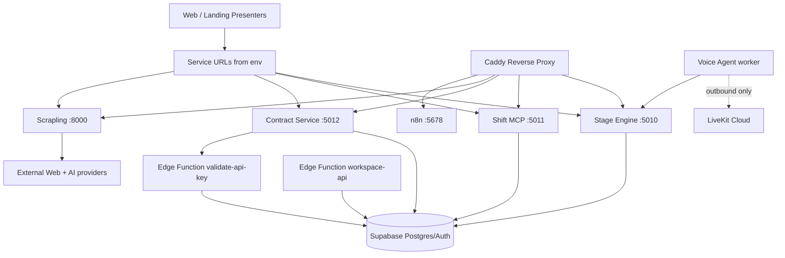

# Infra Runtime Map

Living reference. Updated whenever a service, port, endpoint, or auth boundary changes. Code is source of truth — this doc is the structural map onto it.

Covers:

- Docker infra topology (`infra/`)
- service layer (`services/`)
- Edge Functions layer (`supabase/functions/`)
- presenter layer in web/landing that calls services
- key runtime connections, auth boundaries, and endpoint surfaces

## 1) Layer Model (Runtime)



`voice-agent` runs in Compose but has **no Caddy route** — it connects outbound to LiveKit Cloud and joins rooms via automatic dispatch (ADR-0135).

## 2) Infra Topology (`infra/`)

### 2.1 Compose Services

| Service | Container Port | Dev Host Port | Role | Health |
|---|---:|---:|---|---|
| `caddy` | 80/443 | 80/443 | Reverse proxy + TLS/security headers | Caddy admin endpoint (`:2019/config/`) |
| `stage-engine` | 5010 | 5010 | Agent orchestration gateway | `GET /health` |
| `shift-mcp` | 5011 | 5011 | MCP transport + scheduling tools | `GET /health` |
| `contract-service` | 5012 | 5012 | Contracts/DocuSeal service | `GET /health` |
| `scrapling` | 8000 | 8000 | Scrape + extract + enrich + generate | `GET /health` |
| `voice-agent` | — | — | LiveKit Agents worker (Mr. Botsson voice on mobile, ADR-0135) | no HTTP — outbound LiveKit only |
| `n8n` | 5678 | 5678 | Automation (optional in dev) | `GET /healthz` |

Primary sources:
- `infra/docker-compose.yml` — base definitions
- `infra/docker-compose.override.yml` — dev (auto-applied, exposes ports, mounts `Caddyfile.dev`)
- `infra/docker-compose.prod.yml` — prod overlay (restart=always, resource caps, JSON log rotation, ports bound to `127.0.0.1`)
- `infra/Caddyfile` — production reverse proxy
- `infra/Caddyfile.dev` — local port-based routing

### 2.2 Caddy Routing

#### Production hostnames

- `engine.smartout.ai` → `stage-engine:5010` (streaming-aware: `flush_interval -1`, 300s read/write timeouts)
- `schedule-mcp.smartout.ai` → `shift-mcp:5011`
- `contract.smartout.ai` → `contract-service:5012`
- `scrape.smartout.ai` → `scrapling:8000`
- `n8n.smartout.ai` → `n8n:5678`

#### Local dev ports (inside Caddy)

- `:3070` → stage-engine
- `:3071` → shift-mcp
- `:3072` → contract-service
- `:3073` → scrapling
- `:3074` → n8n

## 3) Service Layer (`services/`)

Two classes of services live here:

1. **Compose-managed** — long-running HTTP/WS servers behind Caddy (`stage-engine`, `shift-mcp`, `contract-service`, `scrapling`, `voice-agent`, `n8n`).
2. **Local MCP / tooling** — process-level tools that don't run in Compose (`strike-mcp`, `interview-mcp` anchor, the four `lovsen-*-mcp` Python stdio servers).

### 3.1 Stage Engine (`services/stage-engine`)

#### Endpoints

- `GET /health`
- `POST /sessions`, `GET /sessions/:id`, `POST /sessions/:id/abandon`, `POST /sessions/:id/store`, `POST /sessions/:id/fetch`, `POST /sessions/:id/advance`
- `POST /adapters/ultravox/create-call`, `POST /adapters/ultravox/store`, `POST /adapters/ultravox/fetch`, `POST /adapters/ultravox/advance`
- `POST /adapters/telegram/webhook`
- `POST /agent/chat`
- `POST /agent/dispatch` (mission dispatch)
- `GET /ws/:sessionId` (WS — session bus)
- `GET /guardian/ws` (WS — Guardian/recorder fanout)
- `GET /recorder/metrics`

#### Auth + data path

- Global `authMiddleware` for most routes; `/ws/*` and `/adapters/telegram/*` skip it (handled in-route)
- Auth: `x-api-key` (platform key hash lookup in `platform_api_key`) or JWT
- Telegram webhook validates `x-telegram-bot-api-secret-token`
- Uses Supabase (`SUPABASE_URL`, anon + service role)

#### In-process subsystems (started at boot)

- **Session Recorder** (ADR-0184) — ring-buffer hook bridged into `@smartout/ai`, persists turns to `agent_session_recording`.
- **PG `LISTEN telegram_bridge`** — relays `channel_message` inserts to Telegram admin (degraded mode if `DATABASE_URL` missing).
- **Guardian event bus** (ADR-0186) — `pg LISTEN/NOTIFY guardian_events` fanout so every instance receives every event.
- **Mission pool slot** — `LISTEN mission_dispatch`, runs mission, flips `engine_state.status`. Toggle: `ENABLE_MISSION_POOL=false`.
- **Sixten orchestrator** — polls `engine_event` for `sixten.pulse_received`, runs 5 health checks. Toggle: `ENABLE_SIXTEN_ORCHESTRATOR=false`.
- **Cleanup interval** — `expireStaleSession()` + `cleanExpiredMemories()`, every `CLEANUP_INTERVAL_MINUTES`.
- **Guardian eval loop** — `evaluateAllActiveSessions()`, every `GUARDIAN_INTERVAL_MS` (default 120 s).
- **Calendar guardian** — `evaluateCalendarTriggers()`, every `CALENDAR_INTERVAL_MS` (default 300 s).
- **Graceful shutdown** — drains intervals → HTTP server → recorder → pg client → mission-pool/sixten → Sentry, on SIGTERM/SIGINT.

### 3.2 Shift MCP (`services/shift-mcp`)

#### Endpoints

- `GET /health` (public)
- `POST /mcp` (auth required)

#### Auth + transport

- Dual auth middleware (`x-api-key` or JWT)
- MCP over Streamable HTTP transport
- Supabase key hash lookup against `platform_api_key`

### 3.3 Contract Service (`services/contract-service`)

#### Endpoints

- Health: `GET /health`
- Templates: `GET|POST /templates`, `GET|PUT|DELETE /templates/:id`, `POST /templates/:id/sync`, `POST /templates/:id/preview`
- Contracts: `GET|POST /contracts`, `GET /contracts/:id`, `POST /contracts/:id/send`, `POST /contracts/:id/cancel`, `GET /contracts/:id/events`, `POST /contracts/:id/fetch-documents`
- Webhook: `POST /webhooks/docuseal` (auth bypass — inbound webhook)

#### Auth + dependency

- Requires `X-Service-Key` on non-health/non-webhook routes
- Validates via Edge Function `validate-api-key`
- If Edge Function returns 5xx/unreachable, fallback to local `SERVICE_KEY`

### 3.4 Scrapling (`services/scrapling`)

Python FastAPI service — droplet-hosted at `scrape.smartout.ai`. Powers the live `/join` wizard Step 3 content pipeline (workspace intelligence). Stack: FastAPI + `scrapling.Fetcher` + `aiohttp` + provider clients (OpenRouter, Serper, Google Places, BRREG).

#### Endpoints

| Method | Path | Purpose |
|---|---|---|
| GET | `/` | Dashboard HTML (`dashboard.html`) |
| GET | `/health` | Liveness |
| POST | `/extract` | Workspace data: company → locations → departments + about-page deep-scrape, mailto/tel/socials extraction |
| POST | `/scrape-raw` | Raw page scrape — title/description/text/images/files |
| POST | `/tripadvisor` | TripAdvisor reviews (best/worst, multi-page) |
| POST | `/extract/document` | Single-file extract (PDF/DOCX/CSV/XLSX/image/text via `extractors/`) |
| POST | `/extract/document/batch` | Batched file extract |
| POST | `/hospitality-search` | Hospitality lead research via `lead_research.py` (Google Places aggregation, GDPR-noted public data only) |
| POST | `/enrich` | `WorkspaceIntelligence` merge pipeline — combines BRREG, scrape, web search; safe merge (no overwrites, list dedup) |
| POST | `/generate` | LLM content generation off curated `WorkspaceIntelligence` context |
| POST | `/brreg-search` | Smart BRREG lookup |
| POST | `/brreg-lookup` | BRREG by org-number |
| GET | `/logs` | Recent log lines (auth required) |
| GET | `/logs/raw` | Raw rotating log file (auth required) |
| GET | `/places-cost` | Google Places API spend snapshot (auth required) |

#### Auth + behavior

- Bearer auth when `SCRAPLING_AUTH_TOKEN` is configured. Token-less = bypass (internal Docker network backwards compat).
- Request middleware logs every call (method, path, status, latency, client IP) — `Authorization` header redacted.
- Logs persist to `SCRAPLING_LOG_DIR` (default `/data`) — rotating file handler, 10 MB × 5 files. Mounted as named volume `scrapling_logs` in compose.
- BRREG fetch has SSL fallback (try alternate `www.` prefix on cert failure).
- Provider keys: `OPENROUTER_API_KEY`, `SERPER_API_KEY`, `GOOGLE_PLACES_API_KEY`.

#### Modules

- `main.py` — FastAPI app, route handlers.
- `extractors/` — `pdf`, `docx`, `csv`, `xlsx`, `image`, `text`, `jsonld`, `ogtags`, `validation`.
- `intelligence.py` — `WorkspaceIntelligence` model, `merge_partial`, `compute_gaps`, `build_context`, `build_query_candidates`, BRREG smart-search.
- `lead_research.py` — hospitality business search (Google Places, public data only).
- `dashboard.html` — operator UI.

### 3.5 Voice Agent (`services/voice-agent`) — Mr. Botsson

LiveKit Agents worker for Mr. Botsson voice. Replaces Ultravox on mobile **and** is the path of record for any LiveKit-routed Botsson voice surface (ADR-0135). Ultravox path remains for legacy `/api/wizard/start` web onboarding only.

#### Topology

- **No HTTP server, no Caddy route.** Outbound-only — connects to LiveKit Cloud (`LIVEKIT_URL`) and joins rooms via automatic dispatch.
- One worker process per Compose instance; horizontal scale = scale Compose service.
- Tools call back into Stage Engine at `STAGE_ENGINE_URL` using `BOTSSON_SERVICE_JWT` (ADR-0132 — mobile is a thin client; AI traffic routes via BFF/stage-engine, never direct to capabilities).

#### Stack

- `@livekit/agents` 1.3 + `@livekit/agents-plugin-openai` (Realtime model `voice="verse"`, modalities text + audio, snappy 250 ms silence threshold) + `@livekit/agents-plugin-silero` (VAD).
- Entry: `src/agent.ts`.
- Tool surface (`buildAllBotssonTools()` in `adapter.ts`):
  - `tools-orb.ts` — `expand_orb`, `collapse_orb`, `set_orb_state` (Arena UX control via `botsson-activity` data channel).
  - `tools-personal.ts` — `get_my_shifts`, `get_my_missions`, etc.
  - `tools-capability.ts` — capability-routed queries through `/agent/chat`.
  - `tools-mission.ts` — mission lookup/dispatch.
  - Generic fallback: `query_smartout`.
- `src/context.ts` — listens for browser-published data messages (`context_init`, `context_route`) on the LiveKit Room; sets workspace_id / profile_id / route per session.
- `src/adapter-internal.ts` — Room reference plumbing for orb tools to publish back to clients.

#### Channel + PII discipline (ADR-0078)

- Voice instructions explicitly forbid asking for personnummer, bankkontonummer, hjemmeadresse, lønn over voice.
- On Høy-PII request, agent says "Av sikkerhetshensyn må dette gjøres i chat" and triggers `expand_orb` to surface chat.
- Chat-only capability tools (payroll, AML validation, contract mutations) are still permitted to be **called** — Stage Engine's Layer 3 channel guard rejects them gracefully when `channel="voice"`.

#### Trust boundaries (ADR-0151, ADR-0220)

- `workspace_id` / `profile_id` resolved via JWT at BFF token-mint (`livekit-token` Edge Function); `context_init` carries trusted values into the worker. Worker does NOT accept body-supplied IDs.
- Botsson is the sole conversational front door (ADR-0220) — voice surfaces declare ownership via context route so the Orb suppresses to passive mode (ADR-0238).

#### Caveats

- `tools-orb` + `tools-personal` are wired and live; `tools-capability` and `tools-mission` are spike-quality and not yet hooked into the same `gatedMutation` discipline that capability tools enforce in chat (ADR-0204). Track before any mutation surface lights up over voice.
- Channel gate against `channel_ai_policy.voice_participation` is enforced at the Edge Function `livekit-token` (token mint) — worker trusts the token. Token-mint must reject when policy says no-voice.
- Activity events (`tool_call`, `tool_response`) publish to `botsson-activity` data channel for Arena LogView observability.
- `node:slim` base image: `ca-certificates` MUST be installed (Rust binding `@livekit/rtc-node` fails TLS otherwise — see §8 trap).

### 3.6 Out-of-Compose services (anchors and local MCPs)

These services live in `services/` but **do not run in Docker Compose**. They are local stdio MCP servers, CLI tooling, or anchor docs for externally hosted services.

| Service | Type | Purpose |
|---|---|---|
| `interview-mcp` | Anchor | Service hosted at `https://intervju-mcp.vercel.app`. This folder holds config + integration docs only. Mission registry actually lives in `packages/ai/src/missions/`. |
| `strike-mcp` | Local MCP (Node) | Bubble.io → Supabase migration SQL generator. Generate-only — never writes to Supabase. Output: `supabase/bubble-data/<workspace-slug>/`. See `docs/superpowers/specs/2026-04-07-strike-mcp-design.md`. |
| `lovsen-lovdata-mcp` | Local MCP (Python stdio) | Norwegian law text (Aml., ferielov, OTP). Tools: `fetch_paragraph`, `search_law`, `get_law_metadata`. ADR-0256/0258. |
| `lovsen-nho-reiseliv-mcp` | Local MCP (Python stdio) | Riksavtalen (NHO Reiseliv / LO) tariff data. Tools: `fetch_riksavtalen`, `lookup_tariff_supplement`. |
| `lovsen-arbeidstilsynet-mcp` | Local MCP (Python stdio) | Arbeidstilsynet — labour inspectorate data source for the Lovsen agent. |
| `lovsen-mattilsynet-mcp` | Local MCP (Python stdio) | Mattilsynet — food safety data source for the Lovsen agent. |

The four `lovsen-*-mcp` servers are part of the P1.S1 Lovsen Agent campaign and are loaded as MCP servers by Claude Code / agent runtimes — not as HTTP services.

## 4) Presenter Layer (Web/Landing callers)

These are key presenter entrypoints that proxy to services.

### 4.1 Web presenters (`apps/web`)

- `POST /api/wizard/start` → Stage Engine `/adapters/ultravox/create-call`
- `POST /api/botsson/chat` → Stage Engine `/agent/chat`
- `callContractService()` in `apps/web/src/lib/contract-service.ts` → Contract Service (`X-Service-Key`)
- `POST /api/scrape/company` → Scrapling `/extract`
- `POST /api/workspace-intelligence` (`/join` wizard Step3) → Scrapling `/extract` (NOT Edge Functions)
- Additional presenter endpoints use:
  - `STAGE_ENGINE_URL`
  - `SHIFT_MCP_URL`
  - `CONTRACT_SERVICE_URL`
  - `SCRAPLING_SERVICE_URL`

### 4.2 Landing presenters (`apps/landing`)

- `POST /api/wizard/engine-start` → Stage Engine `/adapters/ultravox/create-call`
- Falls back to Vault lookups when env vars are missing

## 5) Edge Function Layer (`supabase/functions/`)

All Edge Functions are mounted under `/functions/v1/<function-name>`.

### 5.1 Shared auth/rate-limit primitives

- `resolveAuth()` in `_shared/auth-middleware.ts`
- `validateApiKey()` in `_shared/api-key-auth.ts`
- `checkRateLimit()` in `_shared/rate-limit.ts`

Important behavior:

- `checkRateLimit()` currently fails closed when Upstash env vars are absent.
- This affects `validate-api-key` and `workspace-api` auth outcomes.

### 5.2 Core infra-connected Edge Functions

- `validate-api-key` — returns key validity, workspace, scopes; called by `contract-service`.
- `workspace-api` — data gateway for workspace-scoped APIs. Routes include `/v1/profiles`, `/v1/shifts`, `/v1/contracts`. Service keys without workspace are rejected.

### 5.3 Edge Function inventory (current — 60 functions)

Grouped by purpose. List sourced from `supabase/functions/` on 2026-05-04.

#### Identity / workspace lifecycle
- `accept-invitation`
- `activate-workspace`
- `analyze-setup-documents`
- `analyze-workspace`
- `bootstrap-cascade`
- `cleanup-sandbox-workspaces`
- `delete-account`
- `extract-workspace-data`
- `finalize-workspace`
- `gather-workspace-intelligence` (legacy `/onboarding` wizard path)
- `google-places-intelligence`
- `identify-company`
- `ingest-workspace-knowledge`
- `scrape-raw-data`
- `scrape-website`
- `search-brreg`
- `send-login-code`
- `web-search-intelligence`

#### Auth / API key plane
- `cleanup-api-keys`
- `validate-api-key`
- `workspace-api`

#### Contracts
- `contract-lifecycle`

#### Engine / mission / session orchestration
- `apply-change-proposal`
- `call-command`
- `emma-task-trigger`
- `engine-dispatch`
- `fire-delayed-triggers`
- `journey-stuck-detector`
- `process-notifications`
- `push-dispatch`
- `session-hook-executor`
- `session-lifecycle`
- `session-watchdog-demoter`

#### Guardian / governance
- `guardian-actions`
- `guardian-notify`
- `guardian-sweep`

#### Cascade / scheduling
- `daily-session-replenish`
- `process-settlement-image`
- `shift-clock-compliance`
- `shift-lateness-check`
- `validate-settlement`
- `tariff-amendment-sweep`

#### Ops / heartbeat
- `health-check`
- `heartbeat-dispatcher`
- `leader-pulse`
- `ops-day-brief`
- `ops-learn`
- `ops-monitor`
- `ops-predict`
- `ops-triage`
- `send-morning-digest`
- `watchdog-integrity`
- `watchdog-uptime`

#### Obligations
- `obligation-due-soon-cron`
- `obligation-overdue-cron`

#### Voice / realtime
- `livekit-token`
- `livekit-webhook`

#### Billing / external webhooks
- `generate-monthly-invoices`
- `sendgrid-webhook`
- `stripe-webhook`

> Removed since 2026-04-10 snapshot: `create-invitation` (replaced by `accept-invitation` flow).

## 6) Connection Map (Critical Flows)

### Flow A: Voice onboarding (web/landing — Ultravox)

1. Presenter (`/api/wizard/start` or landing engine-start) calls Stage Engine.
2. Stage Engine creates/advances session and adapter payload.
3. Stage Engine resolves provider secrets (Vault → env fallback).
4. WS + guardian + cleanup loops run in-process.

### Flow A.bis: Voice agent (LiveKit — mobile + voice surfaces, ADR-0135)

1. Client calls BFF `/api/botsson/voice/token` (or `/api/channels/[id]/call/token` for channel calls).
2. BFF proxies to Edge Function `livekit-token` — validates `channel_ai_policy.voice_participation` + scopes, mints JWT.
3. Client joins LiveKit room via SDK.
4. `voice-agent` worker auto-joins via LiveKit automatic dispatch (no inbound HTTP).
5. Browser publishes `context_init` data message → worker `setSessionContext()` (workspace_id, profile_id, route — JWT-trusted at mint time).
6. Worker dialog loop runs OpenAI Realtime; tool calls fan out to Stage Engine `/agent/chat` (chat-only tools rejected by Layer 3 guard when `channel="voice"`).
7. `tool_call` / `tool_response` events publish on `botsson-activity` data channel for Arena LogView.
8. `livekit-webhook` Edge Function receives LiveKit room lifecycle events (participant joined/left, room finished).

### Flow B: Scheduling tools

1. Client/presenter calls Shift MCP `/mcp`.
2. Auth middleware validates API key hash in `platform_api_key`.
3. MCP server exposes shift tools with workspace context.

### Flow C: Contracts

1. Web presenter/library calls Contract Service with `X-Service-Key`.
2. Contract Service calls Edge Function `validate-api-key`.
3. On success, contract/template routes use Supabase + DocuSeal integration.

### Flow D: Scraping / workspace intelligence (`/join` Step 3)

1. Web presenter (`/api/workspace-intelligence`) calls Scrapling at `scrape.smartout.ai` with `Authorization: Bearer ${SCRAPLING_AUTH_TOKEN}`.
2. Scrapling pipeline:
   a. `/extract` — page + about-page deep-scrape, mailto/tel/socials, image/menu link extraction.
   b. `/brreg-search` / `/brreg-lookup` — official org data.
   c. `/enrich` — `merge_partial` over `WorkspaceIntelligence`; `compute_gaps` decides what to web-search next; `build_query_candidates` generates queries; Serper executes; merge again.
   d. `/generate` — LLM generates the wizard draft from `build_context()`.
3. Presenter persists `WorkspaceIntelligence` snapshot + draft in Supabase.
4. **Backend split** — `/join` (live) uses Vercel Route Handler → Scrapling. Legacy `/onboarding` wizard uses Supabase Edge Functions (`gather-workspace-intelligence`, `search-brreg`, `scrape-website`). When `/join` Step 3 fails, check Vercel Functions logs + droplet scrapling logs (`/logs`, `/logs/raw`) — NOT Supabase Edge Function logs.

### Flow E: Telegram bridge

1. Telegram → `POST /adapters/telegram/webhook` (validates secret token).
2. Inbound message inserts `channel_message`.
3. PG NOTIFY `telegram_bridge` fans out to every Stage Engine instance.
4. `relayToTelegram` echoes the message to the admin chat (with admin-relay echo guard via `system_data.source='telegram_admin'`).

### Flow F: Guardian fanout (ADR-0186)

1. Anywhere `emitGuardianEvent` runs → INSERT into `guardian_log`.
2. DB fires `pg_notify('guardian_events', payload)`.
3. Every Stage Engine instance LISTENs and broadcasts via `/guardian/ws` (workspace-filtered).

## 7) Environment + Secret Boundaries

### Dev startup path (recommended)

- `pnpm infra:start` → `infra/scripts/start.sh`
- Ensures `op` login.
- Resolves env from `.env.template` via `op run`.
- Validates required env vars.
- Starts services in order and health-checks them.

### Secret patterns

- Infra/service envs: from `.env.template` + 1Password (`op://...`).
- Runtime provider secrets: Vault first, env fallback in several services.
- API keys in DB: hashed (`platform_api_key.key_hash`).

## 8) Known Architecture Notes

- `contract-service` depends on `validate-api-key`; auth can fail if Edge Function rate-limit layer is fail-closed and Upstash is absent.
- `stage-engine` supports degraded mode for the Telegram bridge if `DATABASE_URL` is missing.
- Dev Caddy checks should use container health (not `localhost:80` app paths) due to port-based dev routing.
- `voice-agent` is **live** for orb + personal tools (ADR-0135). `tools-capability` and `tools-mission` are spike-quality — not yet under the same `gatedMutation` discipline as chat capability tools (ADR-0204). Channel gate against `channel_ai_policy.voice_participation` is enforced at token mint (`livekit-token`) — worker trusts the JWT.
- `node:slim` Dockerfiles for services using native bindings (e.g. `@livekit/rtc-node`) MUST install `ca-certificates` — Node `fetch` masks missing OS CA store but native Rust bindings fail TLS without it.

## 9) Operational Checks

```bash
# Start full stack with env validation
pnpm infra:start

# Service health
curl -f http://localhost:5010/health    # stage-engine
curl -f http://localhost:5011/health    # shift-mcp
curl -f http://localhost:5012/health    # contract-service
curl -f http://localhost:8000/health    # scrapling

# Caddy internal proxy checks (from caddy container)
docker exec infra-caddy-1 wget -qO- --server-response http://127.0.0.1:3070/health
docker exec infra-caddy-1 wget -qO- --server-response http://127.0.0.1:3071/health
docker exec infra-caddy-1 wget -qO- --server-response http://127.0.0.1:3072/health
docker exec infra-caddy-1 wget -qO- --server-response http://127.0.0.1:3073/health

# Voice-agent (no HTTP — check container + LiveKit registration in logs)
docker logs --tail 50 infra-voice-agent-1 | grep -i "registered\|connected"

# Production overlay
docker compose -f infra/docker-compose.yml -f infra/docker-compose.prod.yml up -d
```
