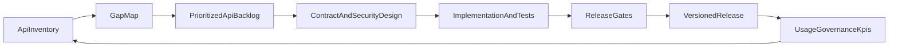

# Smartout API Roadmap

> Strategic and operational control plan for Smartout APIs.
> Last updated: 2026-02-28

---

## Why this roadmap exists

This document is the single control point for Smartout API work:

- what API capabilities already exist,
- what capabilities are missing,
- what we build next and in which order,
- and what governance/security gates must pass before release.

This roadmap is intentionally forward-looking for AI-market readiness and partner integrations.

---

## Related API documentation

- `docs/reference/API_INVENTORY_AND_COVERAGE.md`
- `docs/reference/API_REFERENCE_OVERVIEW.md`
- `docs/reference/API_ENDPOINT_REFERENCE.md`
- `docs/reference/openapi.smartout.v1.yaml`
- `docs/reference/API_VISIBILITY_AND_RELEASE_PROFILES.md`
- `docs/reference/API_DATA_DICTIONARY.md`
- `docs/reference/API_VERSIONING_AND_LIFECYCLE.md`
- `docs/cross-cutting/API_GOVERNANCE_AND_DATA_SHARING.md`
- `docs/cross-cutting/API_CLIENT_SETUP_AND_BYOK.md`
- `docs/cross-cutting/API_RELEASE_GATES_AND_COMPLIANCE.md`
- `docs/roadmaps/API_KPI_AND_REVIEW_CADENCE.md`

---

## API landscape model

Smartout should manage APIs as five distinct surfaces:

| Surface                      | Audience                        | Examples                                            | Contract expectation                     |
| ---------------------------- | ------------------------------- | --------------------------------------------------- | ---------------------------------------- |
| Internal Product API         | Web + Landing apps              | Next.js route handlers                              | Stable for internal clients, documented  |
| Internal Platform API        | Jobs, automation, orchestrators | Supabase Edge Functions                             | Documented + governed, can evolve faster |
| Service API                  | Internal microservices          | `services/scrapling`                                | Versioned and monitored                  |
| Public Customer API (target) | Smartout customers              | Readiness, people, scheduling, governance endpoints | Strict semantic versioning + OpenAPI     |
| Partner/Event API (target)   | HRIS, POS, AI, BI, comms tools  | Webhooks + scoped OAuth APIs                        | Strict contracts + signed delivery       |

---

## Current state summary

The current implemented API surface is concentrated in:

- `apps/web/src/app/api/**`
- `apps/landing/src/app/api/**`
- `supabase/functions/**`
- `services/scrapling/main.py`

Current strengths:

- Health and uptime endpoints exist.
- Onboarding intelligence pipeline APIs exist.
- Platform-admin content APIs exist.
- Webhook intake pattern exists (DocuSeal).

Current gaps:

- No unified public `/v1` API surface yet.
- No tenant-facing API key/OAuth management endpoints yet.
- No standardized webhook subscription and delivery logs.
- No central API catalog with lifecycle status in-repo (added now by this roadmap set).

See `docs/reference/API_INVENTORY_AND_COVERAGE.md` for detailed have-vs-missing inventory.

---

## Target API landscape (what Smartout should have)

### 1) Public API (customer-facing, versioned)

- Domain groups: identity, organization, readiness, operations, training, reporting.
- Path shape: `/v1/{domain}/{resource}`.
- Auth: OAuth 2.1/OIDC + service accounts for server-to-server.
- Required: OpenAPI source-of-truth and strict deprecation policy.

### 2) Partner API

- Higher-trust capabilities for approved partners.
- Signed requests and explicit partner scopes.
- Separate credentials and quotas from public customer API.

### 3) Event/Webhook API

- Webhook subscription management per tenant/workspace.
- Signed events, replay protection, idempotency keys.
- Delivery status + retries + dead-letter queue visibility.

### 4) Admin/Governance API

- API client registration, key rotation, revoke, scope change, and audit export.
- Data-sharing policy controls (field-level deny/allow).
- Approval workflows for high-risk categories.

### 5) Integration Connectors (managed)

- Identity: Microsoft Entra ID, Google Workspace, Okta.
- HRIS/payroll: Tripletex, Visma, SAP SuccessFactors, Workday.
- Workforce/schedule/POS: Planday, Quinyx, 7shifts, Lightspeed, Toast.
- AI model providers: OpenAI, Anthropic, Azure OpenAI, Google Gemini, OpenRouter.
- BI/data: Power BI, Looker, Tableau, Snowflake/BigQuery exports.

---

## Have vs don’t have overview

| Capability                              | Current status | Notes                                             |
| --------------------------------------- | -------------- | ------------------------------------------------- |
| Internal route handlers (web/landing)   | Implemented    | Multiple domain-specific endpoints already active |
| Supabase Edge Function APIs             | Implemented    | Strong onboarding + watchdog pipeline             |
| Internal microservice API (`scrapling`) | Implemented    | FastAPI extraction endpoints                      |
| Public `/v1` customer API               | Not started    | Must be introduced with versioning + scopes       |
| Tenant API client management API        | Not started    | Needed for BYOK/OAuth governance model            |
| Field-level data sharing policy API     | Planned        | Required for enterprise governance                |
| Webhook subscription + delivery API     | Not started    | Required for partner ecosystem                    |
| API lifecycle governance process        | Partial        | Defined here; must be operationalized             |
| API KPI and review cadence              | Partial        | Defined here; monthly governance required         |

---

## Ownership and control model

| Responsibility                         | Primary owner           | Secondary owner            | Decision authority        |
| -------------------------------------- | ----------------------- | -------------------------- | ------------------------- |
| API domain contract design             | Product Engineering     | Platform Engineering       | API Architecture Review   |
| Auth, scopes, credential model         | Platform/Security       | Product Engineering        | Security approval gate    |
| Data classification and sharing policy | Product + Security      | Legal/Compliance           | Governance board approval |
| Docs quality and catalog completeness  | API owners              | Tech writing (if assigned) | Release gate blocker      |
| Versioning/deprecation approval        | API Architecture Review | Product leadership         | Required before release   |

Minimum control rules:

- No new externally consumed endpoint without owner + domain + lifecycle state.
- No production release without schema contract and security review.
- No high-risk data sharing without explicit policy and audit trail.

---

## Readiness gates (definition of done)

An API change is releasable only when all gates pass:

1. Contract Gate
   - Request/response schema defined.
   - Error model defined.
   - Backward compatibility validated for non-major changes.

2. Security Gate
   - Authentication and authorization model explicit.
   - Scope matrix documented.
   - Sensitive fields tagged and policy-tested.

3. Governance Gate
   - Audit events defined for create/update/delete/access.
   - Data-sharing policy linkage confirmed.
   - Revoke/rotate/disable behavior specified.

4. Operability Gate
   - Health checks and monitoring signals defined.
   - Rate limiting and abuse protections defined.
   - Runbook and on-call ownership clear.

5. Documentation Gate
   - API inventory entry present.
   - Endpoint reference updated.
   - Data dictionary and versioning references linked.

---

## Phased roadmap

### Phase 0 — Inventory and normalization (Now)

- Publish canonical API inventory and coverage status.
- Normalize endpoint metadata fields (owner, status, auth, governance).
- Baseline current docs quality and missing pieces.

### Phase 1 — Documentation control plane

- Publish classical API documentation suite.
- Add release-gate checklist to engineering workflow.
- Define API lifecycle labels and state transitions.

### Phase 2 — AI market readiness

- Introduce target public `/v1` API blueprint.
- Define tenant API client management and BYOK flows.
- Define connector strategy and event API baseline.

### Phase 3 — Operationalization

- Enforce gates in CI/review workflows.
- Start monthly API architecture and governance review.
- Track KPI dashboard and deprecation burn-down.

---

## KPI framework

Track monthly at platform level:

- API coverage: `% domain capabilities with an API contract`.
- Documentation completeness: `% implemented endpoints documented`.
- Governance coverage: `% implemented endpoints with policy + audit mapping`.
- Security compliance: `% endpoints with explicit auth/scope model`.
- Deprecation hygiene: `count of deprecated endpoints past sunset date`.
- Partner readiness: `% priority connectors with working integration playbook`.

Target thresholds (initial):

- Documentation completeness >= 95%
- Governance coverage >= 90%
- Security compliance = 100%
- Deprecated-past-sunset = 0

---

## Review cadence

- Weekly engineering review: endpoint-level updates and blockers.
- Monthly API Architecture Review: versioning, gaps, cross-domain standards.
- Monthly Governance Review: data-sharing policy, audit exceptions, key events.
- Quarterly strategy review: connector tier reprioritization vs market demand.

---

## Core roadmap flow

