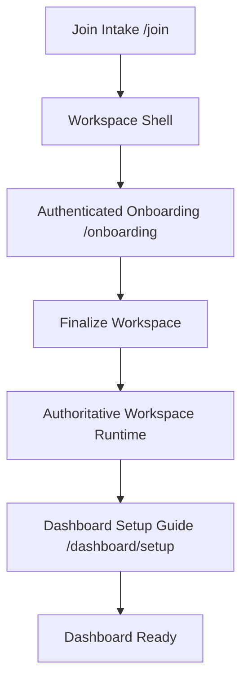

# Workspace Creation & Onboarding Guide Architecture

> Current repo truth for onboarding ownership and route boundaries.

## 1. Contract

Smartout has three related but different onboarding surfaces:

| Surface                    | Route              | Responsibility                                                             | Truth ownership                        |
| -------------------------- | ------------------ | -------------------------------------------------------------------------- | -------------------------------------- |
| Public intake              | `/join`            | Collect raw business input, create account, capture provisional setup data | Never authoritative runtime truth      |
| Authenticated bootstrap    | `/onboarding`      | Confirm structure, apply bootstrap, finalize workspace records             | Canonical bootstrap/finalization owner |
| Post-bootstrap setup guide | `/dashboard/setup` | Help the admin complete operational setup after runtime truth exists       | Consumer of runtime truth, not owner   |

### Hard rules

1. `/join` input is provisional.
2. `/onboarding` owns finalization through `finalize-workspace` and `finalize_onboarding_workspace`.
3. `/dashboard/setup` is routed by real setup completeness, not by `workspace.onboarding_completed`.
4. `workspace.onboarding_completed` is a bootstrap/finalization signal, not the dashboard-guide visibility switch.
5. Legacy compatibility paths such as `activate-workspace` may remain in code, but they must not be described as the canonical cascade-first contract.

## 2. End-to-End Sequence

## 3. Public Intake (`/join`)

### Purpose

- Capture account and business intake.
- Store scraped and manually confirmed business context.
- Preserve provisional setup material until authenticated bootstrap continues.

### What `/join` may write

- Auth/account records
- Provisional business metadata
- Raw opening-hours intake
- Intelligence payloads used to prefill later setup
- Compatibility-path workspace shell records where needed

### What `/join` must not own

- Final department runtime truth
- Final operating-hours runtime truth
- Final framework/rate binding
- Final season/runtime setup
- Any parallel workflow that bypasses authenticated bootstrap

## 4. Authenticated Bootstrap (`/onboarding`)

### Purpose

`/onboarding` is the authenticated wizard that turns provisional input into authoritative workspace runtime records.

### Active finalization path

1. Resume or locate the onboarding workspace shell.
2. Merge business intelligence, admin confirmations, department choices, locations, procedures, season, and contract context.
3. Call `finalize-workspace`, which wraps `finalize_onboarding_workspace`.
4. Persist the finalized workspace records.
5. Emit telemetry for wizard progression and completion.
6. Hand the user off to the dashboard setup guide for remaining completion work.

### Current repo notes

- `useOnboardingState` resumes from an onboarding workspace when `workspace.onboarding_completed = false`.
- `finalize-workspace` is the authenticated Edge Function wrapper around `finalize_onboarding_workspace`.
- `activate-workspace` still exists as a compatibility path for older activation flow. Treat it as legacy-compatible, not canonical.

## 5. Dashboard Setup Guide (`/dashboard/setup`)

### Purpose

The dashboard setup guide is a post-bootstrap completion flow. It helps the admin finish governance, payroll, employment, team, shift-template, season, and handbook work after runtime truth exists.

### Trigger

The guide routes from a dedicated post-bootstrap completion flag (`workspace.setup_guide_completed`), which is entirely separate from `workspace.onboarding_completed`:

- When `setup_guide_completed = false` → DashboardShell redirects to `/dashboard/setup` on page load
- The admin can dismiss the redirect per session (sessionStorage `setup_dismissed`)
- Manual access to `/dashboard/setup` is always available regardless of flag state
- The flag is set to `true` when the admin completes the wizard — it is never auto-reverted

This flag does NOT replace or duplicate `workspace.onboarding_completed`. The bootstrap flag controls `/onboarding` → `/dashboard` routing. The setup-guide flag controls `/dashboard` → `/dashboard/setup` routing. They are independent lifecycle signals.

### State

- Progress may be persisted in `workspace.onboarding_guide_progress`.
- Completion of the guide must not rewrite the bootstrap contract.
- Revisit mode is allowed, but it does not roll bootstrap status backward.

## 6. Canonical Meanings

| Field or function                     | Canonical meaning                                                     |
| ------------------------------------- | --------------------------------------------------------------------- |
| `workspace.onboarding_completed`      | Bootstrap/finalization status                                         |
| `finalize-workspace`                  | Authenticated finalization entry point                                |
| `finalize_onboarding_workspace`       | Canonical RPC that materializes finalized workspace records           |
| `activate-workspace`                  | Legacy-compatible activation path                                     |
| `workspace.onboarding_guide_progress` | Dashboard setup-guide progress only                                   |
| `workspace.setup_guide_completed`     | Dashboard setup-guide completion flag (explicit, never auto-reverted) |

## 7. What Is Stale

The following narratives are explicitly obsolete and must not be repeated:

- `/create-workspace` as the active route
- `workspace.onboarding_completed = false` as the setup-guide trigger
- Dashboard setup as the owner of workspace runtime truth
- Any description where onboarding guide completion is what creates the real workspace model

## 8. Cross-References

- `docs/STATE.md`
- `docs/superpowers/specs/2026-03-21-cascade-scheduling-system-design.md`
- `docs/architecture/AI_RUNTIME_SYSTEM_DEFINITION_V1.md`
- `docs/decisions/0056-cascade-core-foundation-schema.md`
