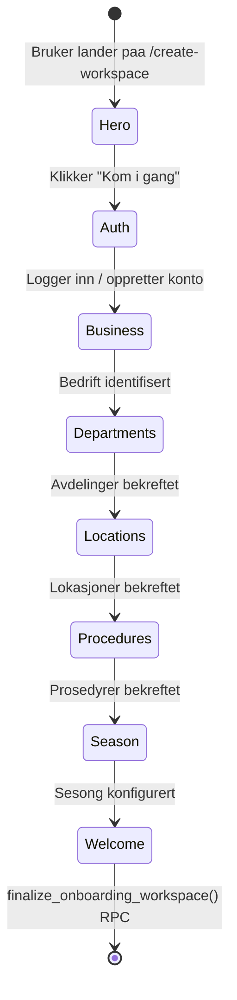
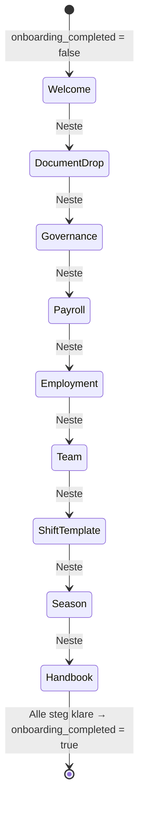

# Workspace Creation & Onboarding Guide Architecture

> Two systems. Two purposes. One after the other.

---

## 1. Oversikt

Smartout har to systemer som kjorer sekvensielt:

|                | System A: Workspace Creation           | System B: Onboarding Guide                           |
| -------------- | -------------------------------------- | ---------------------------------------------------- |
| **Rute**       | `/create-workspace`                    | Inline i dashboard                                   |
| **Formaal**    | Identifiser bedrift, opprett workspace | Konfigurer drift steg-for-steg, laer admin produkten |
| **Livssyklus** | Engaangs. Del av registrering.         | Progressiv. Auto-vist foerste gang, kan revisitas.   |
| **Filosofi**   | "Confirm, don't create"                | "Guided onboarding"                                  |
| **Trigger**    | Bruker har inget workspace             | `workspace.onboarding_completed = false`             |

**Sekvens:**

```
Kontoregistrering (/signup)
        |
        v
  Har bruker workspace?
  - NEI → Workspace Creation (/create-workspace)
           - Identifiser bedrift (orgnr, scraping)
           - Bekreft struktur (avdelinger, lokasjoner)
           - Opprett alt i DB
           - Workspace opprettes med onboarding_completed = false
        |
        v
  Dashboard (foerste gang)
  - onboarding_completed = false
  - Onboarding Guide visas automatisk (persistent)
  - Admin gaar gjennom stegene
        |
        v
  Onboarding Guide (inline)
  - Document drop
  - Governance, payroll, employment
  - Team, shift templates, season
  - Handbook
  - Alle steg klare → onboarding_completed = true
```

---

## 2. System A: Workspace Creation (`/create-workspace`)

### Trigger

Bruker har inget workspace:

```typescript
// auth-callback eller layout.tsx
const workspaces = await getWorkspacesForUser(userId);
if (workspaces.length === 0) {
  redirect("/create-workspace");
}
```

- Sjekker om bruker har minst ett workspace
- `onboarding_completed` har INGENTING med denne redirecten aa gjoere
- Bruker uten workspace faar aldri se dashboard

### Flow



**Steg:**

| #   | Steg        | Hva skjer                                                                                           |
| --- | ----------- | --------------------------------------------------------------------------------------------------- |
| 1   | Hero        | Velkomst, "Kom i gang"-knapp                                                                        |
| 2   | Auth        | Innlogging/registrering (inline i wizarden)                                                         |
| 3   | Business    | Identifiser bedrift: orgnr -> Bronnysund API + URL -> scraping. System pre-fyller. Admin bekrefter. |
| 4   | Departments | Foreslaaatte avdelinger (basert paa bransje). Admin bekrefter/justerer.                             |
| 5   | Locations   | Foreslaaatte lokasjoner (basert paa scraping). Admin bekrefter/justerer.                            |
| 6   | Procedures  | Foreslaaatte prosedyrer (basert paa bransje). Admin bekrefter/justerer.                             |
| 7   | Season      | Sesongkonfigurasjon (navn, datoer).                                                                 |
| 8   | Welcome     | Oppsummering + "Aktiver workspace"                                                                  |

### State

- **Primaer:** `onboarding_session`-tabell i Supabase (overlever refresh)
- **Sekundaer:** Workspace sin `intelligence_data` JSONB-kolonne (scrape-resultater)
- **Klient:** React state for UI-tilstand (synkes til DB via debounced save)
- **Resume:** Bruker som kommer tilbake faar state fra DB. Hook `useOnboardingState` sjekker paagaaende session og gjenoppretter.

### Exit

Naar admin klikker "Aktiver workspace" i siste steg:

1. `finalize_onboarding_workspace(p_workspace_id, p_data)` RPC kjoerer
2. RPC-en oppretter/oppdaterer: company, workspace metadata, season, departments, teams, locations, zones, policies, protocols, procedures, agent_profile
3. RPC-en setter `workspace.onboarding_completed = false` (workspace opprettet, men onboarding guide gjenstaar)
4. Klient emitter `workspace.created` telemetri-event
5. Redirect til dashboard → Onboarding Guide vises automatisk

### Re-entry

- Admin kan navigere til `/create-workspace` fra Settings for aa endre organisasjonsstruktur
- Hvis workspace allerede eksisterer, viser `/create-workspace` en redigeringsmodus (ikke fullstendig wizard)
- MANGLER: Denne funksjonaliteten er ikke implementert ennaa

---

## 3. System B: Onboarding Guide (inline i dashboard)

### Trigger

**Automatisk naar `onboarding_completed = false`.**

Onboarding Guide ER onboardingen — den inneholder information admin behover. Den er ikke valgfri foerste gang.

- Vises automatisk og persistent naar `workspace.onboarding_completed = false`
- Blockerer IKKE dashboard — admin kan navigere fritt
- Men guiden forsvinner ikke foer alle steg er klare
- Naar alle steg er klare → `onboarding_completed = true` → guiden forsvinner fra auto-visning

**Re-visit mode:**

- Admin kan ALLTID aapne guiden igjen via Settings
- I re-visit mode kjoerer den som referanse, men setter IKKE `onboarding_completed` tilbake til false

Eksponeres via:

- Auto-visning paa dashboard (naar `onboarding_completed = false`)
- "Onboarding Guide"-lenke i Settings-menyen (alltid tilgjengelig)
- Direkte rute: `/dashboard/onboarding-guide`

### Flow



**Steg:**

| #   | ID             | Steg                  | DB-write                      | emit()                       |
| --- | -------------- | --------------------- | ----------------------------- | ---------------------------- |
| 0   | welcome        | Velkommen             | Ingen                         | Nei                          |
| 1   | document-drop  | Last opp dokumenter   | Storage upload                | Nei                          |
| 2   | governance     | Retningslinjer        | policy + protocol + procedure | Ja: `policy_created`         |
| 3   | payroll        | Loenn/satser          | payroll_tier                  | Ja: `payroll_saved`          |
| 4   | employment     | Ansettelseskontrakter | employment_contract_template  | Ja: `employment_saved`       |
| 5   | team           | Team/invitasjoner     | invitation + profile          | Ja: `team_invited`           |
| 6   | shift-template | Vaktmaler             | schedule_shift_template       | Ja: `shift_template_created` |
| 7   | season         | Sesong/budsjett       | season + season_budget        | Ja: `season_created`         |
| 8   | handbook       | Personalhaandbok      | Ingen (visning)               | Nei                          |

### State

**Naavaerende (FEIL):** React `useState` — forsvinner ved refresh.

**Nytt:** `workspace.onboarding_guide_progress` JSONB-kolonne paa workspace-tabellen:

```typescript
type OnboardingGuideProgress = {
  current_step: number; // Siste aktive steg
  completed_steps: string[]; // IDs: ["welcome", "document-drop", "governance"]
  started_at: string; // ISO timestamp
  last_activity: string; // ISO timestamp
};
```

- Skrives til DB naar admin navigerer mellom steg
- Leses fra DB naar guiden aapnes (resume)
- Null = guiden aldri startet

### Rendering

Onboarding Guide rendras som et **persistent kort/panel** paa dashboard-sidan. Ikke en overlay, ikke en modal — et kort som er del av dashboard-layouten.

- Rendras **varje gang dashboard laddas** saa lenge `onboarding_completed = false`
- Ingen dismiss-knapp som skjuler kortet. Ingen timer. Ingen "kom tillbaka om X".
- Kortet er bare der. Det forsvinner naar alle steg er fullfoert (`onboarding_completed = true`).
- Admin kan klikke inn i kortet for aa jobbe med steg, og navigere fritt ellers.
- Ingen localStorage-hack. Ingen TTL.
- Fremgang bevares i DB. Guiden gjenopptas fra der admin slapp.

### Re-entry

- **Foerste gang (`onboarding_completed = false`):** Persistent kort paa dashboard. Alltid synlig. Viser "Steg 4/9" med fremgang.
- **Etter onboarding (`onboarding_completed = true`):** Kortet forsvinner. Guiden tilgjengelig via Settings-lenke i revisit-mode (referanse, ikke re-onboarding).
- Settings-lenke alltid synlig
- Ingen tidsfrister, ingen utloep

---

## 4. Kobling mellom systemene

```
Workspace Creation (/create-workspace)     Onboarding Guide (dashboard)

Skapar workspace, avdelningar,   ------>   Konfigurerar drift, laer admin
lokasjoner, organisationsstruktur          produkten steg-for-steg

Workspace existerar              ------>   onboarding_completed = false
                                           → guiden visas automatiskt

Engaangs, del av registrering    ------>   Progressiv, kan revisitas
```

Workspace Creation oppretter skjelettet. Onboarding Guide fyller det med innhold og laerer admin produkten.

---

## 5. Hva som rives

### Filer som SLETTES

| Fil                                                        | Grunn                                                   |
| ---------------------------------------------------------- | ------------------------------------------------------- |
| `apps/web/src/app/dashboard/_hooks/use-workspace-setup.ts` | 4-modul-sjekk erstattes av `onboarding_completed`-flagg |

### Kode som FJERNES (i eksisterende filer)

| Fil                                                     | Hva fjernes                                                                                                                                                                | Grunn                                                                                  |
| ------------------------------------------------------- | -------------------------------------------------------------------------------------------------------------------------------------------------------------------------- | -------------------------------------------------------------------------------------- |
| `apps/web/src/components/dashboard/DashboardShell.tsx`  | `useWorkspaceSetup()` import og bruk, `isSetupMode`/`isSetupLoading`/`setupDismissed` state, auto-overlay rendering blokk (linje ~895)                                     | Erstattes av `onboarding_completed`-basert Onboarding Guide                            |
| `apps/web/src/components/dashboard/DashboardShell.tsx`  | `DashboardContext` feltene: `isSetupMode`, `isSetupLoading`, `setupModules`, `dismissSetup`                                                                                | Erstattes av Onboarding Guide state                                                    |
| `apps/web/src/components/dashboard/AdminDashboard.tsx`  | `isSetupMode`/`isSetupLoading`/`dismissSetup` logikk, fullscreen wizard rendering                                                                                          | Onboarding Guide er inline, ikke fullscreen overlay                                    |
| `apps/web/src/components/dashboard/OnboardingGuide.tsx` | `wasRecentlySkipped()`, `getSkipKey()`, localStorage-logikk (linje 124-137), `useLayoutEffect` skip-sjekk (linje 213-217), `handleSkip` localStorage-write (linje 267-275) | Erstattes av DB-state                                                                  |
| `apps/web/src/app/dashboard/_data/queries.ts`           | `isWorkspaceEmpty()` funksjon                                                                                                                                              | Ikke relevant — workspace creation trigges av "inget workspace", ikke "tomt workspace" |
| `apps/web/src/app/dashboard/layout.tsx`                 | `isWorkspaceEmpty` import og bruk                                                                                                                                          | Erstattes av workspace-eksistens-sjekk                                                 |

### Kode som ENDRES

| Fil                                                     | Endring                                                                                                                                                   |
| ------------------------------------------------------- | --------------------------------------------------------------------------------------------------------------------------------------------------------- |
| `apps/web/src/app/dashboard/layout.tsx`                 | Redirect-betingelse: fjern `isWorkspaceEmpty`, legg til Onboarding Guide auto-visning basert paa `!workspace.onboarding_completed`                        |
| `apps/web/src/components/dashboard/OnboardingGuide.tsx` | Omdoept fra `WorkspaceSetupWizard.tsx`. State flyttes fra useState til DB JSONB (`onboarding_guide_progress`). Rendras som persistent kort, ikke overlay. |
| `apps/web/src/app/dashboard/_hooks/dashboard-keys.ts`   | Fjern `workspaceSetupStatus` key (brukes av slettet hook)                                                                                                 |
| Auth-flow / layout                                      | Redirect til `/create-workspace` naar bruker har 0 workspaces                                                                                             |

### Filer som OPPRETTES

| Fil                                                                    | Formaal                                                                         |
| ---------------------------------------------------------------------- | ------------------------------------------------------------------------------- |
| `supabase/migrations/YYYYMMDDHHMMSS_add_onboarding_guide_progress.sql` | `ALTER TABLE workspace ADD COLUMN onboarding_guide_progress JSONB DEFAULT NULL` |
| `apps/web/src/app/dashboard/_hooks/use-onboarding-guide.ts`            | Hook som leser/skriver `onboarding_guide_progress` fra workspace                |

---

## 6. Trigger-regler (tre tilstander)

| Tilstand                                         | Vad som skjer                                                                  | Kilde                                    |
| ------------------------------------------------ | ------------------------------------------------------------------------------ | ---------------------------------------- |
| Bruker har inget workspace                       | → `/create-workspace` (registrering, identifiser bedrift, opprett workspace)   | Workspace-oppslag paa bruker             |
| Workspace finnes, `onboarding_completed = false` | → Dashboard med Onboarding Guide auto-vist. Persistent til alle steg er klare. | `workspace.onboarding_completed` kolonne |
| Workspace finnes, `onboarding_completed = true`  | → Normalt dashboard. Onboarding Guide tilgjengelig via Settings.               | `workspace.onboarding_completed` kolonne |

**Hva setter `onboarding_completed`?**

| Handling                              | Resultat                                               |
| ------------------------------------- | ------------------------------------------------------ |
| `finalize_onboarding_workspace()` RPC | Oppretter workspace med `onboarding_completed = false` |
| Alle Onboarding Guide-steg fullfoert  | Setter `onboarding_completed = true`                   |

Ingen andre mekanismer. Ingen tellesjekker. Ingen localStorage. Ingen timing.

---

## 7. State-tracking

### System A (Workspace Creation)

Allerede i DB:

- `onboarding_session` tabell (session-fremgang)
- `workspace.intelligence_data` JSONB (scrape-data)

Ingen endring noedvendig.

### System B (Onboarding Guide)

**Ny kolonne:** `workspace.onboarding_guide_progress JSONB DEFAULT NULL`

```sql
ALTER TABLE workspace ADD COLUMN onboarding_guide_progress JSONB DEFAULT NULL;
```

**Eksempel-verdi:**

```json
{
  "current_step": 3,
  "completed_steps": ["welcome", "document-drop", "governance"],
  "started_at": "2026-03-10T14:30:00Z",
  "last_activity": "2026-03-10T15:45:00Z"
}
```

**Hook:** `useOnboardingGuide()`

```typescript
// Pseudokode
function useOnboardingGuide() {
  // Les progress fra workspace
  const { data: progress } = useQuery(/* workspace.onboarding_guide_progress */);

  // Skriv progress til workspace
  const updateProgress = useMutation(/* UPDATE workspace SET onboarding_guide_progress = ... */);

  return {
    progress, // null = aldri startet
    currentStep, // fra progress.current_step
    completedSteps, // fra progress.completed_steps
    isComplete, // alle 9 steg fullfoert
    markStepComplete, // oppdater DB
    resetProgress, // sett null
  };
}
```

---

## Decisions

| #   | Beslutning                                                                             | Grunn                                                                                              |
| --- | -------------------------------------------------------------------------------------- | -------------------------------------------------------------------------------------------------- |
| 1   | To systemer er ikke duplikater — de er workspace-oppretting og onboarding              | Workspace Creation oppretter struktur, Onboarding Guide konfigurerer drift og laerer admin         |
| 2   | `useWorkspaceSetup` 4-modul-sjekk fjernes                                              | Feil mekanisme — teller DB-rader for aa bestemme om wizard skal vises                              |
| 3   | localStorage skip-hack fjernes                                                         | Erstattes av DB-persistert state                                                                   |
| 4   | `isWorkspaceEmpty()` fjernes                                                           | Workspace Creation trigges av "inget workspace", ikke "tomt workspace"                             |
| 5   | Onboarding Guide state flyttes til JSONB-kolonne                                       | Overlever refresh, enable resume                                                                   |
| 6   | Onboarding Guide eksponeres som kort paa dashboard + Settings-lenke                    | Synlig og persistent, men blokkerer ikke navigering                                                |
| 7   | Onboarding Guide kan revisitas via Settings                                            | Admin kan vilja gaa gjennom stegene igjen, f.eks. ved ny sesong                                    |
| 8   | Ingen auto-flip av eksisterende workspaces                                             | Har man ikke gjort onboardingen har man ikke gjort onboardingen                                    |
| 9   | Omdoept "Setup Gate" → "Workspace Creation" og "Dashboard Wizard" → "Onboarding Guide" | Namnen beskriver vad systemen faktiskt gjoer                                                       |
| 10  | Workspace Creation trigges av "inget workspace", IKKE av `onboarding_completed`        | Flagget styrer onboarding, ikke workspace-skapande                                                 |
| 11  | Onboarding Guide vises automatisk, ikke manuelt                                        | Den ER onboardingen — inneholder information admin behover                                         |
| 12  | Onboarding Guide blokkerer ikke dashboard men er persistent kort                       | Rendras varje gang dashboard laddas saa lenge `onboarding_completed = false`. Ingen dismiss-timer. |
